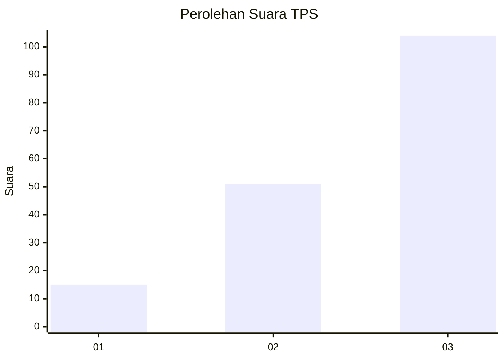
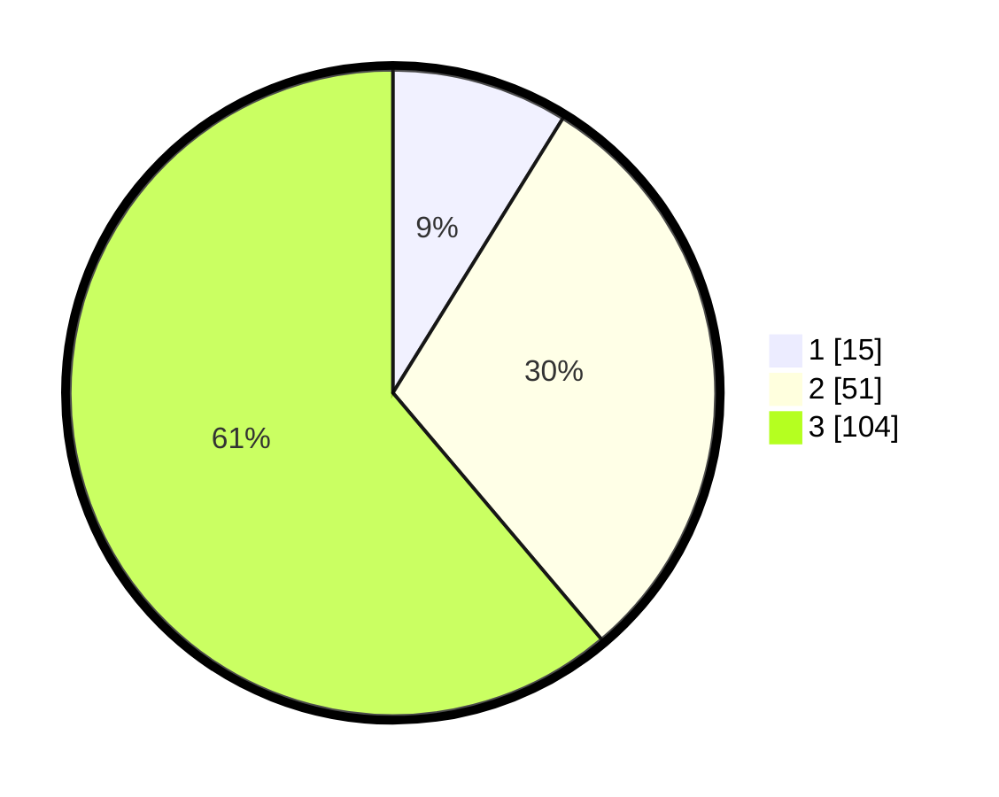

# Hasil

## Grafik

## Tabel

| No. | Nama Paslon    | Suara | Suara (raw) | Persentase |
|:--- |:-------------- | -----:| -----------:| ----------:|
| 1   | ANIES MUHAIMIN | 15    | [15][p-1]   | 8,82       |
| 2   | PRABOWO GIBRAN | 51    | [51][p-2]   | 30,00      |
| 3   | GANJAR MAHFUD  | 104   | [104][p-3]  | 61,18      |

[p-1]: https://github.com/gigit-pemilu/pemilu-2024/blob/main/pilpres/hitung-suara/sub/33-jawa-tengah/sub/07-wonosobo/sub/02-kepil/sub/2004-gadingsukuh/sub/001-tps/sub/paslon-1.txt
[p-2]: https://github.com/gigit-pemilu/pemilu-2024/blob/main/pilpres/hitung-suara/sub/33-jawa-tengah/sub/07-wonosobo/sub/02-kepil/sub/2004-gadingsukuh/sub/001-tps/sub/paslon-2.txt
[p-3]: https://github.com/gigit-pemilu/pemilu-2024/blob/main/pilpres/hitung-suara/sub/33-jawa-tengah/sub/07-wonosobo/sub/02-kepil/sub/2004-gadingsukuh/sub/001-tps/sub/paslon-3.txt

## Foto C Plano

https://sirekap-obj-formc.kpu.go.id/0302/pemilu/ppwp/33/07/02/20/04/3307022004001-20240218-093322--a2aa5c1d-c84e-4b3d-a709-4179fd2754fb.jpg

https://sirekap-obj-formc.kpu.go.id/0302/pemilu/ppwp/33/07/02/20/04/3307022004001-20240218-083403--acf881b5-4e21-4d6d-8edf-7acfaf795114.jpg

https://sirekap-obj-formc.kpu.go.id/0302/pemilu/ppwp/33/07/02/20/04/3307022004001-20240218-093517--b3f86389-4a0c-491e-9d6c-e0d07efddb4b.jpg

## Metadata

| Key        | Value               |
| ---------- | ------------------- |
| Time Stamp | 2024-02-25 11:00:00 |

