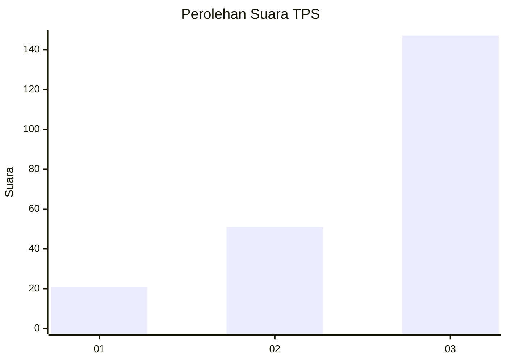
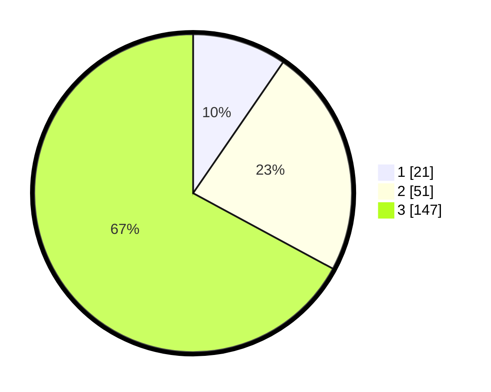

# Hasil

## Grafik

## Tabel

| No. | Nama Paslon    | Suara | Suara (raw) | Persentase |
|:--- |:-------------- | -----:| -----------:| ----------:|
| 1   | ANIES MUHAIMIN | 21    | [21][p-1]   | 9,59       |
| 2   | PRABOWO GIBRAN | 51    | [51][p-2]   | 23,29      |
| 3   | GANJAR MAHFUD  | 147   | [147][p-3]  | 67,12      |

[p-1]: https://github.com/gigit-pemilu/pemilu-2024-33-jawa-tengah/blob/main/pilpres/hitung-suara/sub/33-jawa-tengah/sub/07-wonosobo/sub/02-kepil/sub/2005-burat/sub/001-tps/sub/paslon-1.txt
[p-2]: https://github.com/gigit-pemilu/pemilu-2024-33-jawa-tengah/blob/main/pilpres/hitung-suara/sub/33-jawa-tengah/sub/07-wonosobo/sub/02-kepil/sub/2005-burat/sub/001-tps/sub/paslon-2.txt
[p-3]: https://github.com/gigit-pemilu/pemilu-2024-33-jawa-tengah/blob/main/pilpres/hitung-suara/sub/33-jawa-tengah/sub/07-wonosobo/sub/02-kepil/sub/2005-burat/sub/001-tps/sub/paslon-3.txt

## Foto C Plano

https://sirekap-obj-formc.kpu.go.id/4077/pemilu/ppwp/33/07/02/20/05/3307022005001-20240214-225709--22a34537-50ec-4620-9d5d-c02fa495160b.jpg

https://sirekap-obj-formc.kpu.go.id/4077/pemilu/ppwp/33/07/02/20/05/3307022005001-20240215-032655--e4848008-9d29-45ce-ab8d-78f67199a635.jpg

https://sirekap-obj-formc.kpu.go.id/4077/pemilu/ppwp/33/07/02/20/05/3307022005001-20240214-225719--1f3bdcf5-7d1b-48ca-82cf-0a90eadd3aa6.jpg

## Metadata

| Key        | Value               |
| ---------- | ------------------- |
| Time Stamp | 2024-02-15 15:00:29 |

