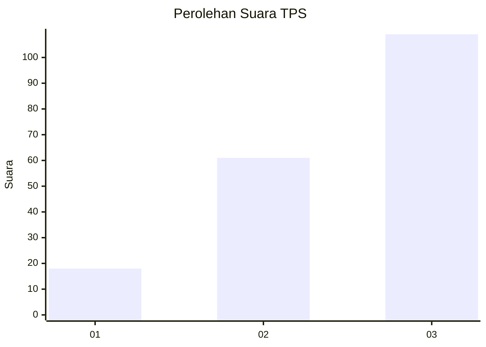
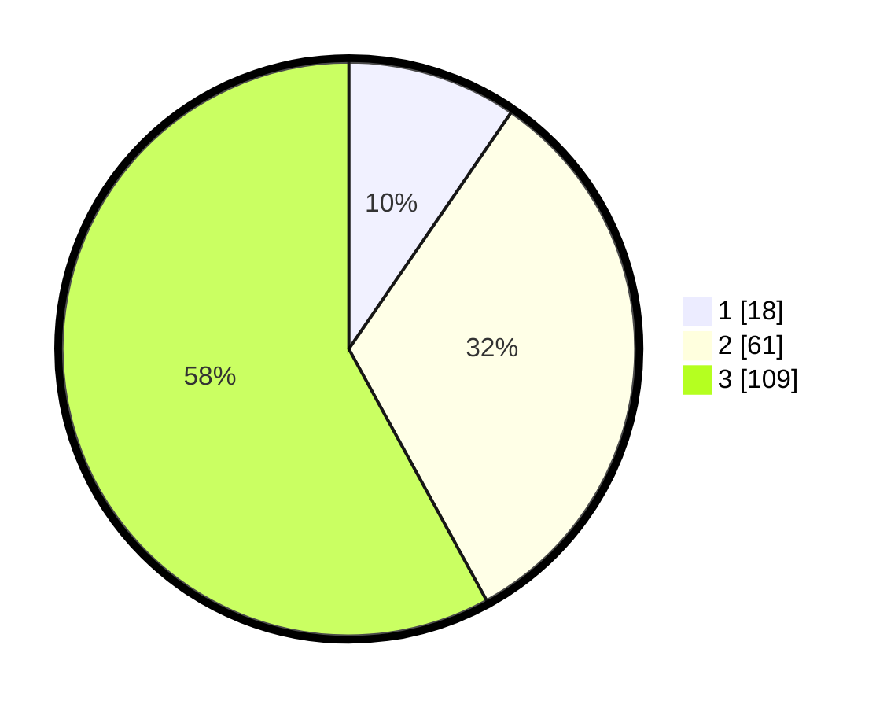

# Hasil

## Grafik

## Tabel

| No. | Nama Paslon    | Suara | Suara (raw) | Persentase |
|:--- |:-------------- | -----:| -----------:| ----------:|
| 1   | ANIES MUHAIMIN | 18    | [18][p-1]   | 9,57       |
| 2   | PRABOWO GIBRAN | 61    | [61][p-2]   | 32,45      |
| 3   | GANJAR MAHFUD  | 109   | [109][p-3]  | 57,98      |

[p-1]: https://github.com/gigit-pemilu/pemilu-2024/blob/main/pilpres/hitung-suara/sub/33-jawa-tengah/sub/07-wonosobo/sub/02-kepil/sub/2005-burat/sub/006-tps/sub/paslon-1.txt
[p-2]: https://github.com/gigit-pemilu/pemilu-2024/blob/main/pilpres/hitung-suara/sub/33-jawa-tengah/sub/07-wonosobo/sub/02-kepil/sub/2005-burat/sub/006-tps/sub/paslon-2.txt
[p-3]: https://github.com/gigit-pemilu/pemilu-2024/blob/main/pilpres/hitung-suara/sub/33-jawa-tengah/sub/07-wonosobo/sub/02-kepil/sub/2005-burat/sub/006-tps/sub/paslon-3.txt

## Foto C Plano

https://sirekap-obj-formc.kpu.go.id/4704/pemilu/ppwp/33/07/02/20/05/3307022005006-20240215-070939--3ac33bb1-8aad-4e2d-a008-2c72127fa468.jpg

https://sirekap-obj-formc.kpu.go.id/4704/pemilu/ppwp/33/07/02/20/05/3307022005006-20240215-070757--8398b565-bf1e-4398-bc65-c284382b9dbc.jpg

https://sirekap-obj-formc.kpu.go.id/4704/pemilu/ppwp/33/07/02/20/05/3307022005006-20240215-070847--5332c7d0-48da-4e39-899e-67e21bb04b70.jpg

## Metadata

| Key        | Value               |
| ---------- | ------------------- |
| Time Stamp | 2024-02-24 22:31:28 |

