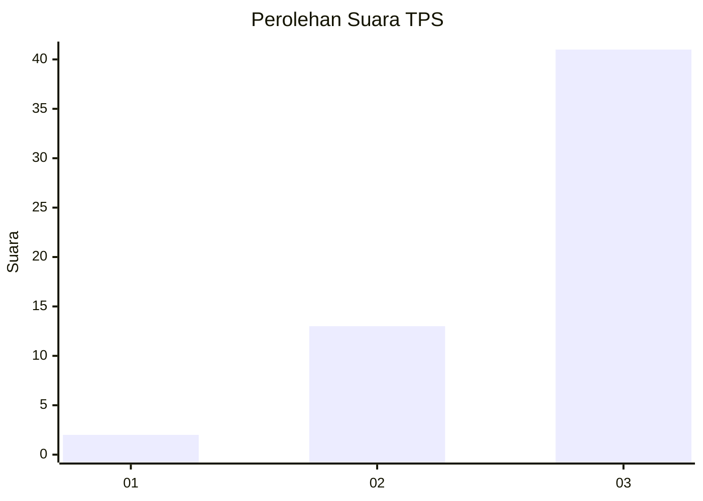
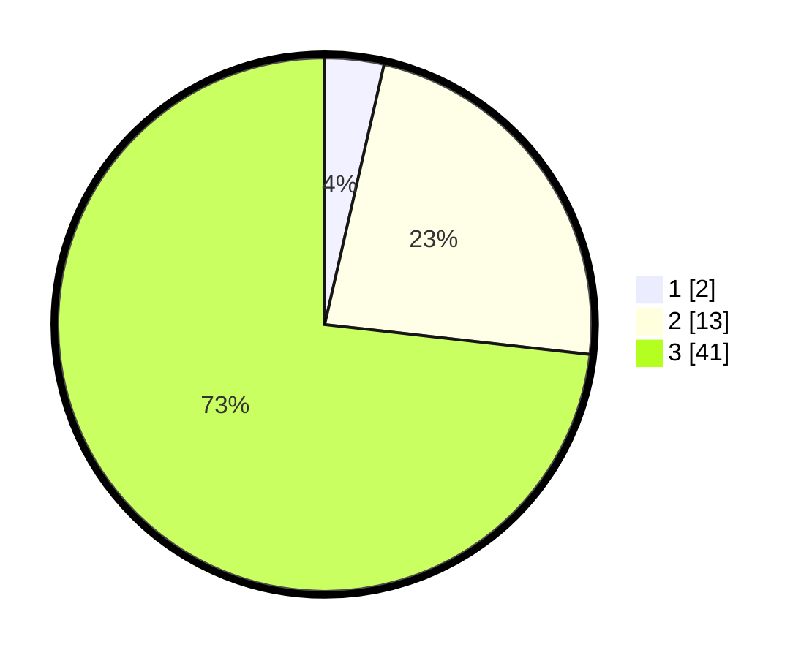

# Hasil

## Grafik

## Tabel

| No. | Nama Paslon    | Suara | Suara (raw) | Persentase |
|:--- |:-------------- | -----:| -----------:| ----------:|
| 1   | ANIES MUHAIMIN | 2     | [2][p-1]    | 3,57       |
| 2   | PRABOWO GIBRAN | 13    | [13][p-2]   | 23,21      |
| 3   | GANJAR MAHFUD  | 41    | [41][p-3]   | 73,21      |

[p-1]: https://github.com/gigit-pemilu/pemilu-2024-33-jawa-tengah/blob/main/pilpres/hitung-suara/sub/33-jawa-tengah/sub/07-wonosobo/sub/02-kepil/sub/2005-burat/sub/010-tps/sub/paslon-1.txt
[p-2]: https://github.com/gigit-pemilu/pemilu-2024-33-jawa-tengah/blob/main/pilpres/hitung-suara/sub/33-jawa-tengah/sub/07-wonosobo/sub/02-kepil/sub/2005-burat/sub/010-tps/sub/paslon-2.txt
[p-3]: https://github.com/gigit-pemilu/pemilu-2024-33-jawa-tengah/blob/main/pilpres/hitung-suara/sub/33-jawa-tengah/sub/07-wonosobo/sub/02-kepil/sub/2005-burat/sub/010-tps/sub/paslon-3.txt

## Foto C Plano

https://sirekap-obj-formc.kpu.go.id/cfad/pemilu/ppwp/33/07/02/20/05/3307022005010-20240214-235904--b75f48d2-8848-41db-82f8-befbd77407a0.jpg

https://sirekap-obj-formc.kpu.go.id/cfad/pemilu/ppwp/33/07/02/20/05/3307022005010-20240215-020632--f89d66f4-b2b1-473b-8e02-e8a265cc79c5.jpg

https://sirekap-obj-formc.kpu.go.id/cfad/pemilu/ppwp/33/07/02/20/05/3307022005010-20240215-020828--6a9f5496-7e0e-4d9b-a29d-7e1ed997a61f.jpg

## Metadata

| Key        | Value               |
| ---------- | ------------------- |
| Time Stamp | 2024-02-15 12:00:28 |

