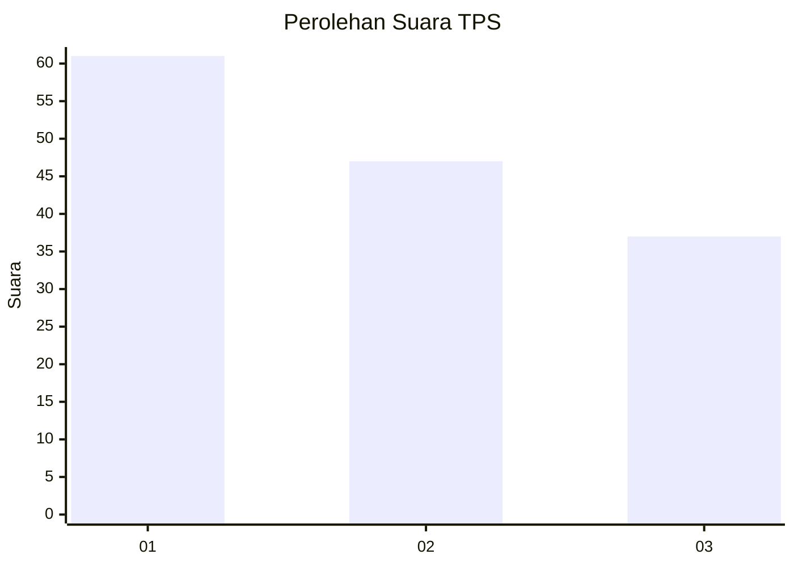
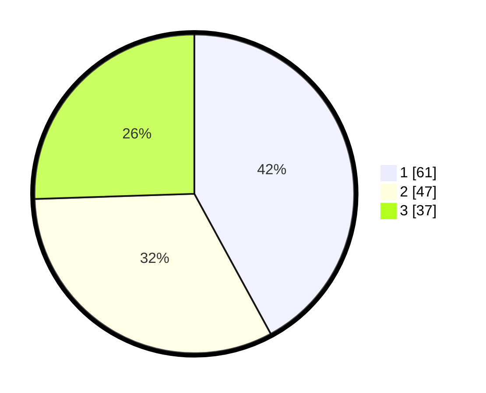

# Hasil

## Grafik

## Tabel

| No. | Nama Paslon    | Suara | Suara (raw) | Persentase |
|:--- |:-------------- | -----:| -----------:| ----------:|
| 1   | ANIES MUHAIMIN | 61    | [61][p-1]   | 42,07      |
| 2   | PRABOWO GIBRAN | 47    | [47][p-2]   | 32,41      |
| 3   | GANJAR MAHFUD  | 37    | [37][p-3]   | 25,52      |

[p-1]: https://github.com/gigit-pemilu/pemilu-2024-33-jawa-tengah/blob/main/pilpres/hitung-suara/sub/33-jawa-tengah/sub/07-wonosobo/sub/02-kepil/sub/2006-bener/sub/001-tps/sub/paslon-1.txt
[p-2]: https://github.com/gigit-pemilu/pemilu-2024-33-jawa-tengah/blob/main/pilpres/hitung-suara/sub/33-jawa-tengah/sub/07-wonosobo/sub/02-kepil/sub/2006-bener/sub/001-tps/sub/paslon-2.txt
[p-3]: https://github.com/gigit-pemilu/pemilu-2024-33-jawa-tengah/blob/main/pilpres/hitung-suara/sub/33-jawa-tengah/sub/07-wonosobo/sub/02-kepil/sub/2006-bener/sub/001-tps/sub/paslon-3.txt

## Foto C Plano

https://sirekap-obj-formc.kpu.go.id/21b4/pemilu/ppwp/33/07/02/20/06/3307022006001-20240214-214326--f7cc9b37-7937-4141-9dc5-01012007c063.jpg

https://sirekap-obj-formc.kpu.go.id/21b4/pemilu/ppwp/33/07/02/20/06/3307022006001-20240215-005938--90396537-ba5b-4771-a79a-2c107d73771a.jpg

https://sirekap-obj-formc.kpu.go.id/21b4/pemilu/ppwp/33/07/02/20/06/3307022006001-20240215-010020--494c2c3c-7301-4db7-97be-716201ad4ad3.jpg

## Metadata

| Key        | Value               |
| ---------- | ------------------- |
| Time Stamp | 2024-02-15 12:00:28 |

