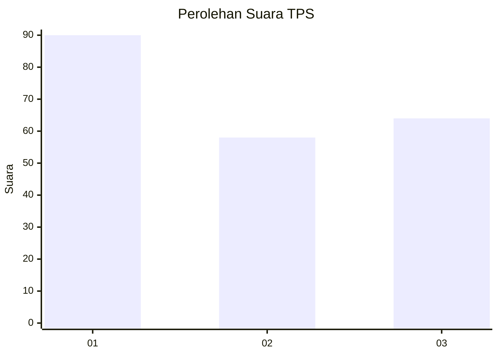
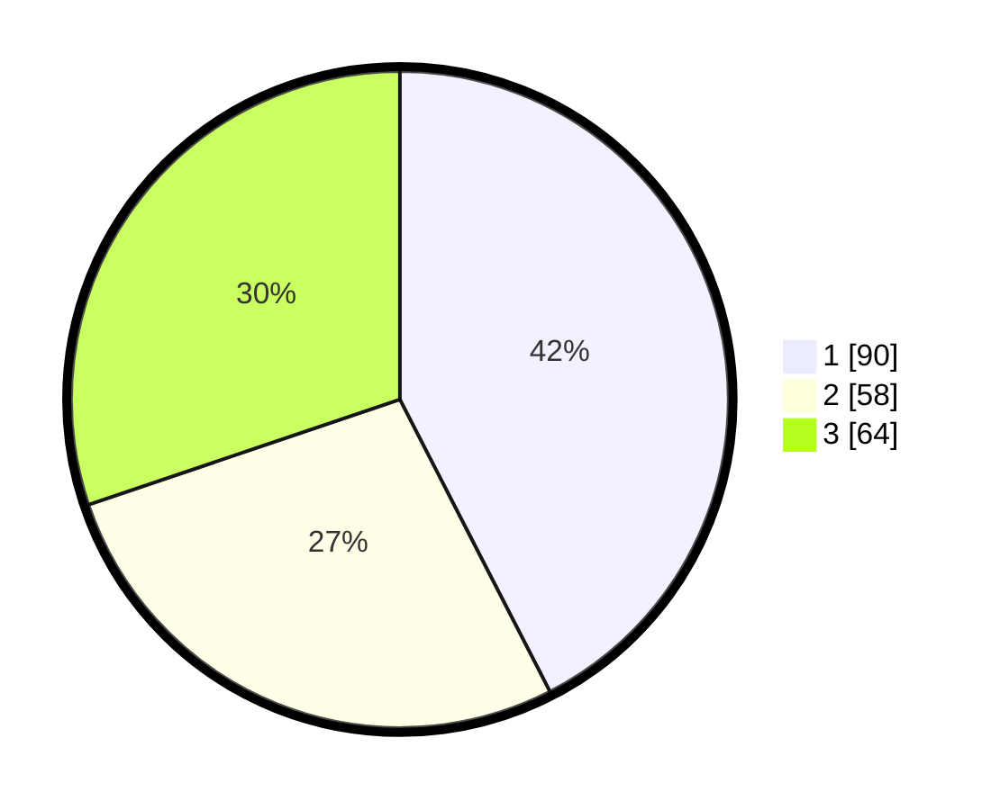

# Hasil

## Grafik

## Tabel

| No. | Nama Paslon    | Suara | Suara (raw) | Persentase |
|:--- |:-------------- | -----:| -----------:| ----------:|
| 1   | ANIES MUHAIMIN | 90    | [90][p-1]   | 42,45      |
| 2   | PRABOWO GIBRAN | 58    | [58][p-2]   | 27,36      |
| 3   | GANJAR MAHFUD  | 64    | [64][p-3]   | 30,19      |

[p-1]: https://github.com/gigit-pemilu/pemilu-2024/blob/main/pilpres/hitung-suara/sub/33-jawa-tengah/sub/07-wonosobo/sub/02-kepil/sub/2006-bener/sub/003-tps/sub/paslon-1.txt
[p-2]: https://github.com/gigit-pemilu/pemilu-2024/blob/main/pilpres/hitung-suara/sub/33-jawa-tengah/sub/07-wonosobo/sub/02-kepil/sub/2006-bener/sub/003-tps/sub/paslon-2.txt
[p-3]: https://github.com/gigit-pemilu/pemilu-2024/blob/main/pilpres/hitung-suara/sub/33-jawa-tengah/sub/07-wonosobo/sub/02-kepil/sub/2006-bener/sub/003-tps/sub/paslon-3.txt

## Foto C Plano

https://sirekap-obj-formc.kpu.go.id/c465/pemilu/ppwp/33/07/02/20/06/3307022006003-20240215-010048--9c9bfdc1-2929-4183-9038-1ba23df0be4d.jpg

https://sirekap-obj-formc.kpu.go.id/c465/pemilu/ppwp/33/07/02/20/06/3307022006003-20240215-010516--c1b6e595-0e6e-492f-9ec4-2071b6d2cb33.jpg

https://sirekap-obj-formc.kpu.go.id/c465/pemilu/ppwp/33/07/02/20/06/3307022006003-20240215-010820--d76ead38-92a6-443b-9ae6-1bb1f62a2f70.jpg

## Metadata

| Key        | Value               |
| ---------- | ------------------- |
| Time Stamp | 2024-02-15 15:00:29 |

