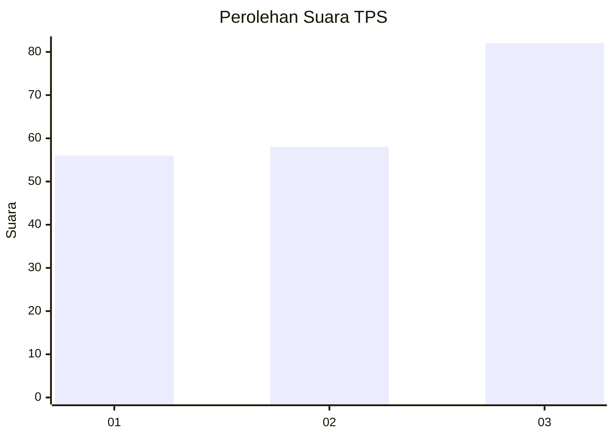
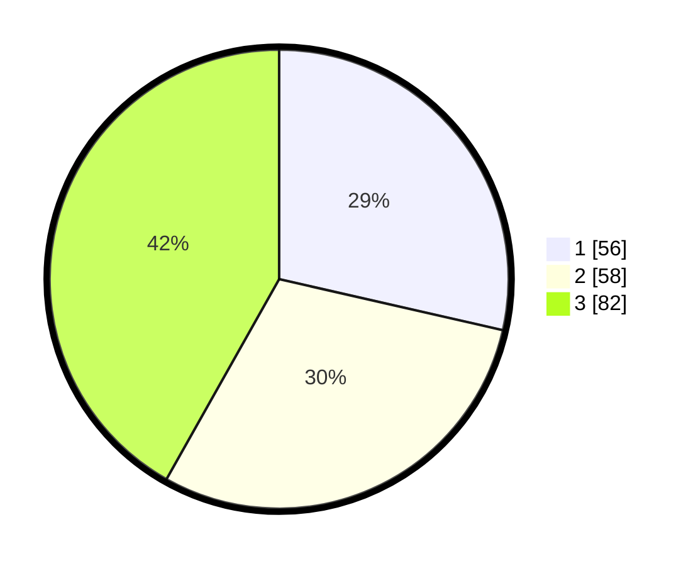

# Hasil

## Grafik

## Tabel

| No. | Nama Paslon    | Suara | Suara (raw) | Persentase |
|:--- |:-------------- | -----:| -----------:| ----------:|
| 1   | ANIES MUHAIMIN | 56    | [56][p-1]   | 28,57      |
| 2   | PRABOWO GIBRAN | 58    | [58][p-2]   | 29,59      |
| 3   | GANJAR MAHFUD  | 82    | [82][p-3]   | 41,84      |

[p-1]: https://github.com/gigit-pemilu/pemilu-2024/blob/main/pilpres/hitung-suara/sub/33-jawa-tengah/sub/07-wonosobo/sub/02-kepil/sub/2006-bener/sub/004-tps/sub/paslon-1.txt
[p-2]: https://github.com/gigit-pemilu/pemilu-2024/blob/main/pilpres/hitung-suara/sub/33-jawa-tengah/sub/07-wonosobo/sub/02-kepil/sub/2006-bener/sub/004-tps/sub/paslon-2.txt
[p-3]: https://github.com/gigit-pemilu/pemilu-2024/blob/main/pilpres/hitung-suara/sub/33-jawa-tengah/sub/07-wonosobo/sub/02-kepil/sub/2006-bener/sub/004-tps/sub/paslon-3.txt

## Foto C Plano

https://sirekap-obj-formc.kpu.go.id/53cf/pemilu/ppwp/33/07/02/20/06/3307022006004-20240215-002344--3ec54ab3-93e4-46df-a639-fd0315aab0e6.jpg

https://sirekap-obj-formc.kpu.go.id/53cf/pemilu/ppwp/33/07/02/20/06/3307022006004-20240215-005310--a409bfb1-688f-4eb5-8aee-de0545583daf.jpg

https://sirekap-obj-formc.kpu.go.id/53cf/pemilu/ppwp/33/07/02/20/06/3307022006004-20240215-005329--35c4f019-f9e6-442c-a4ca-ad4383b76ef7.jpg

## Metadata

| Key        | Value               |
| ---------- | ------------------- |
| Time Stamp | 2024-02-15 15:00:29 |

