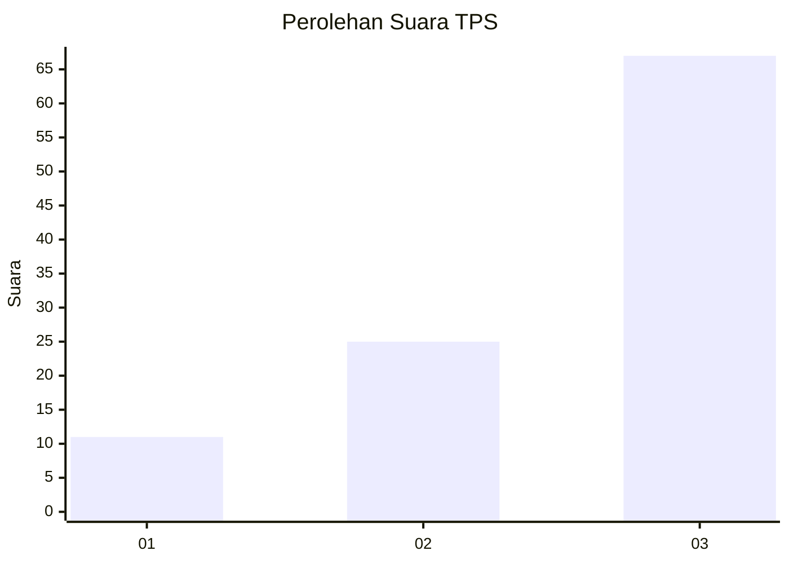
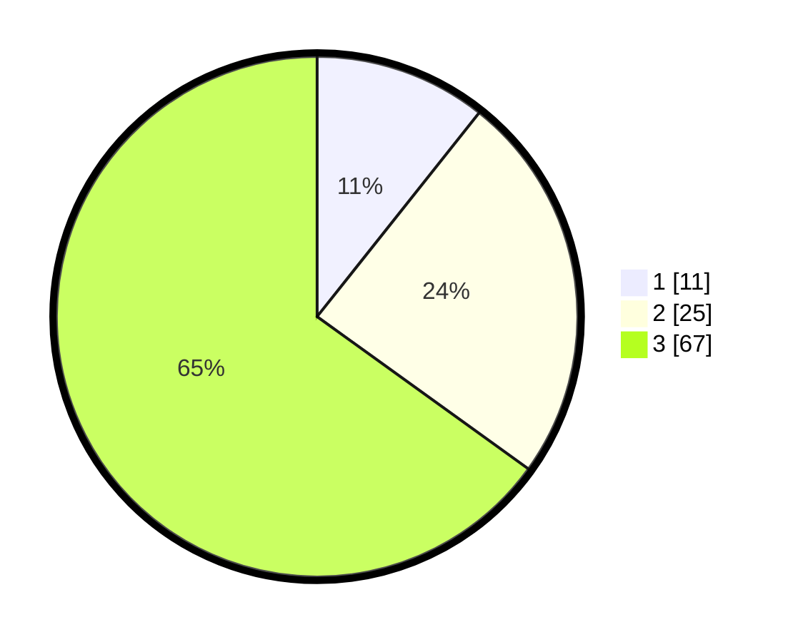

# Hasil

## Grafik

## Tabel

| No. | Nama Paslon    | Suara | Suara (raw) | Persentase |
|:--- |:-------------- | -----:| -----------:| ----------:|
| 1   | ANIES MUHAIMIN | 11    | [11][p-1]   | 10,68      |
| 2   | PRABOWO GIBRAN | 25    | [25][p-2]   | 24,27      |
| 3   | GANJAR MAHFUD  | 67    | [67][p-3]   | 65,05      |

[p-1]: https://github.com/gigit-pemilu/pemilu-2024/blob/main/pilpres/hitung-suara/sub/33-jawa-tengah/sub/07-wonosobo/sub/02-kepil/sub/2006-bener/sub/011-tps/sub/paslon-1.txt
[p-2]: https://github.com/gigit-pemilu/pemilu-2024/blob/main/pilpres/hitung-suara/sub/33-jawa-tengah/sub/07-wonosobo/sub/02-kepil/sub/2006-bener/sub/011-tps/sub/paslon-2.txt
[p-3]: https://github.com/gigit-pemilu/pemilu-2024/blob/main/pilpres/hitung-suara/sub/33-jawa-tengah/sub/07-wonosobo/sub/02-kepil/sub/2006-bener/sub/011-tps/sub/paslon-3.txt

## Foto C Plano

https://sirekap-obj-formc.kpu.go.id/855f/pemilu/ppwp/33/07/02/20/06/3307022006011-20240214-212837--632d69dc-71b1-46b9-9247-519fb6cc4a3a.jpg

https://sirekap-obj-formc.kpu.go.id/855f/pemilu/ppwp/33/07/02/20/06/3307022006011-20240214-213114--88f88cb6-62c3-46b2-aaa8-ced560e206d1.jpg

https://sirekap-obj-formc.kpu.go.id/855f/pemilu/ppwp/33/07/02/20/06/3307022006011-20240214-213243--3ce9a47b-e06b-4141-b79f-efa7a7cec406.jpg

## Metadata

| Key        | Value               |
| ---------- | ------------------- |
| Time Stamp | 2024-02-15 15:00:29 |

