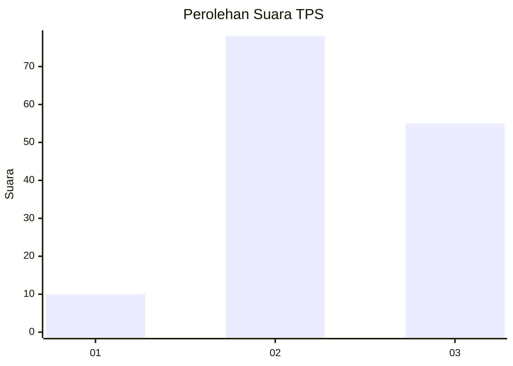
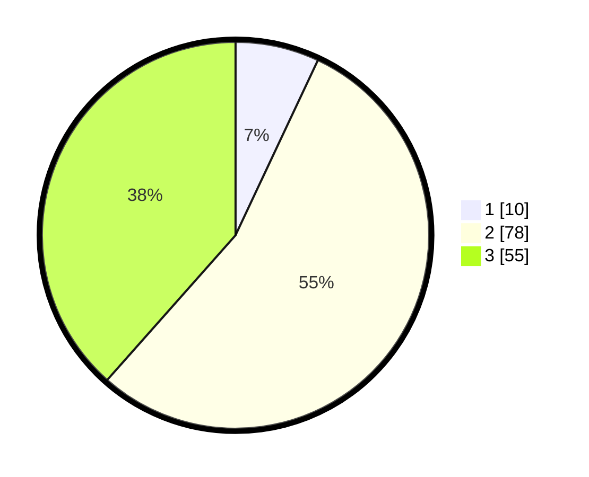

# Hasil

## Grafik

## Tabel

| No. | Nama Paslon    | Suara | Suara (raw) | Persentase |
|:--- |:-------------- | -----:| -----------:| ----------:|
| 1   | ANIES MUHAIMIN | 10    | [10][p-1]   | 6,99       |
| 2   | PRABOWO GIBRAN | 78    | [78][p-2]   | 54,55      |
| 3   | GANJAR MAHFUD  | 55    | [55][p-3]   | 38,46      |

[p-1]: https://github.com/gigit-pemilu/pemilu-2024/blob/main/pilpres/hitung-suara/sub/33-jawa-tengah/sub/07-wonosobo/sub/02-kepil/sub/2007-gadingrejo/sub/007-tps/sub/paslon-1.txt
[p-2]: https://github.com/gigit-pemilu/pemilu-2024/blob/main/pilpres/hitung-suara/sub/33-jawa-tengah/sub/07-wonosobo/sub/02-kepil/sub/2007-gadingrejo/sub/007-tps/sub/paslon-2.txt
[p-3]: https://github.com/gigit-pemilu/pemilu-2024/blob/main/pilpres/hitung-suara/sub/33-jawa-tengah/sub/07-wonosobo/sub/02-kepil/sub/2007-gadingrejo/sub/007-tps/sub/paslon-3.txt

## Foto C Plano

https://sirekap-obj-formc.kpu.go.id/bb3b/pemilu/ppwp/33/07/02/20/07/3307022007007-20240215-003500--712306a1-a749-4fe3-8808-5fdc4e8f46c6.jpg

https://sirekap-obj-formc.kpu.go.id/bb3b/pemilu/ppwp/33/07/02/20/07/3307022007007-20240215-003701--c2719560-c2a8-4656-b4d5-3981bd63b7ef.jpg

https://sirekap-obj-formc.kpu.go.id/bb3b/pemilu/ppwp/33/07/02/20/07/3307022007007-20240215-003849--4ceead64-90d9-4d63-a717-a9cd22bbfa07.jpg

## Metadata

| Key        | Value               |
| ---------- | ------------------- |
| Time Stamp | 2024-02-15 15:00:29 |

