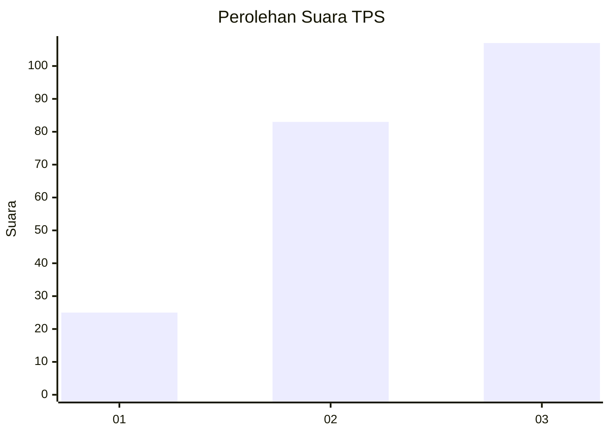
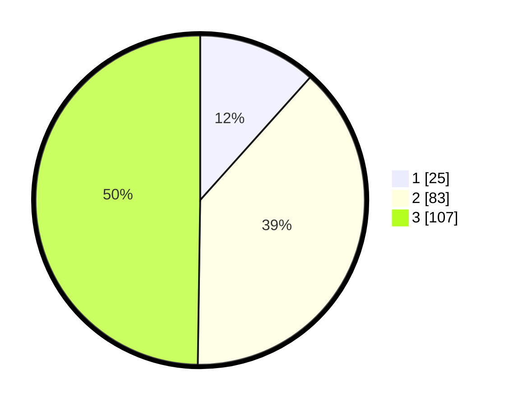

# Hasil

## Grafik

## Tabel

| No. | Nama Paslon    | Suara | Suara (raw) | Persentase |
|:--- |:-------------- | -----:| -----------:| ----------:|
| 1   | ANIES MUHAIMIN | 25    | [25][p-1]   | 11,63      |
| 2   | PRABOWO GIBRAN | 83    | [83][p-2]   | 38,60      |
| 3   | GANJAR MAHFUD  | 107   | [107][p-3]  | 49,77      |

[p-1]: https://github.com/gigit-pemilu/pemilu-2024-33-jawa-tengah/blob/main/pilpres/hitung-suara/sub/33-jawa-tengah/sub/07-wonosobo/sub/02-kepil/sub/2007-gadingrejo/sub/017-tps/sub/paslon-1.txt
[p-2]: https://github.com/gigit-pemilu/pemilu-2024-33-jawa-tengah/blob/main/pilpres/hitung-suara/sub/33-jawa-tengah/sub/07-wonosobo/sub/02-kepil/sub/2007-gadingrejo/sub/017-tps/sub/paslon-2.txt
[p-3]: https://github.com/gigit-pemilu/pemilu-2024-33-jawa-tengah/blob/main/pilpres/hitung-suara/sub/33-jawa-tengah/sub/07-wonosobo/sub/02-kepil/sub/2007-gadingrejo/sub/017-tps/sub/paslon-3.txt

## Foto C Plano

https://sirekap-obj-formc.kpu.go.id/deae/pemilu/ppwp/33/07/02/20/07/3307022007017-20240215-010036--97c5ef93-3002-44af-8d3b-871f4852ffa7.jpg

https://sirekap-obj-formc.kpu.go.id/deae/pemilu/ppwp/33/07/02/20/07/3307022007017-20240215-010236--67c8abfd-9b33-4cb9-8cd7-268059ef7670.jpg

https://sirekap-obj-formc.kpu.go.id/deae/pemilu/ppwp/33/07/02/20/07/3307022007017-20240215-010557--e75e0859-6de8-49af-b2f4-0c06ae0a6e6c.jpg

## Metadata

| Key        | Value               |
| ---------- | ------------------- |
| Time Stamp | 2024-02-15 20:30:46 |

