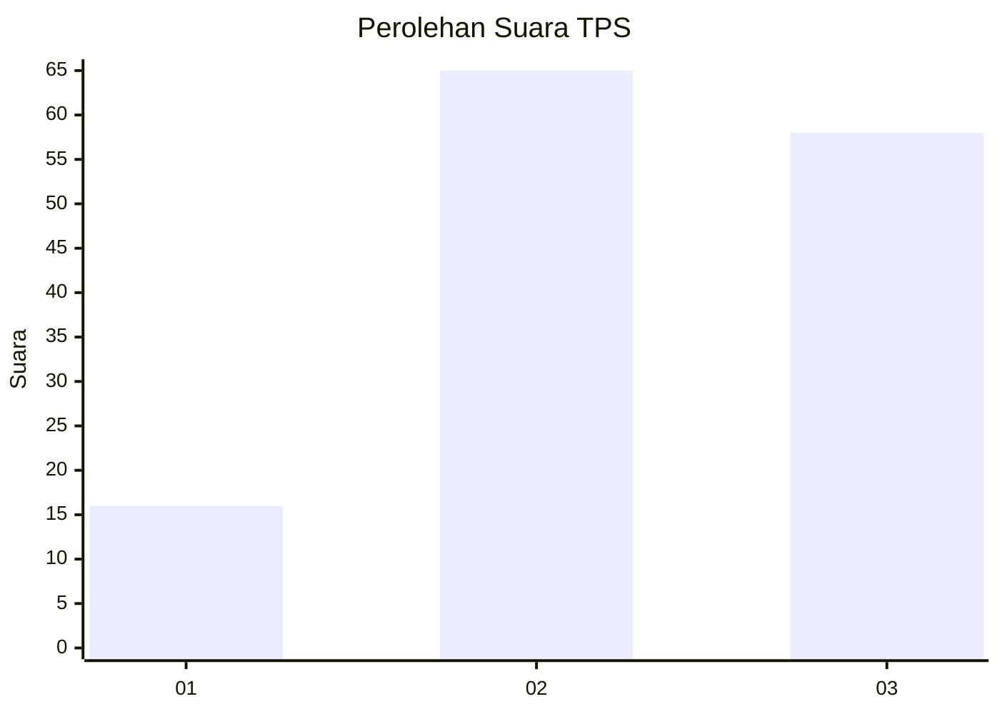
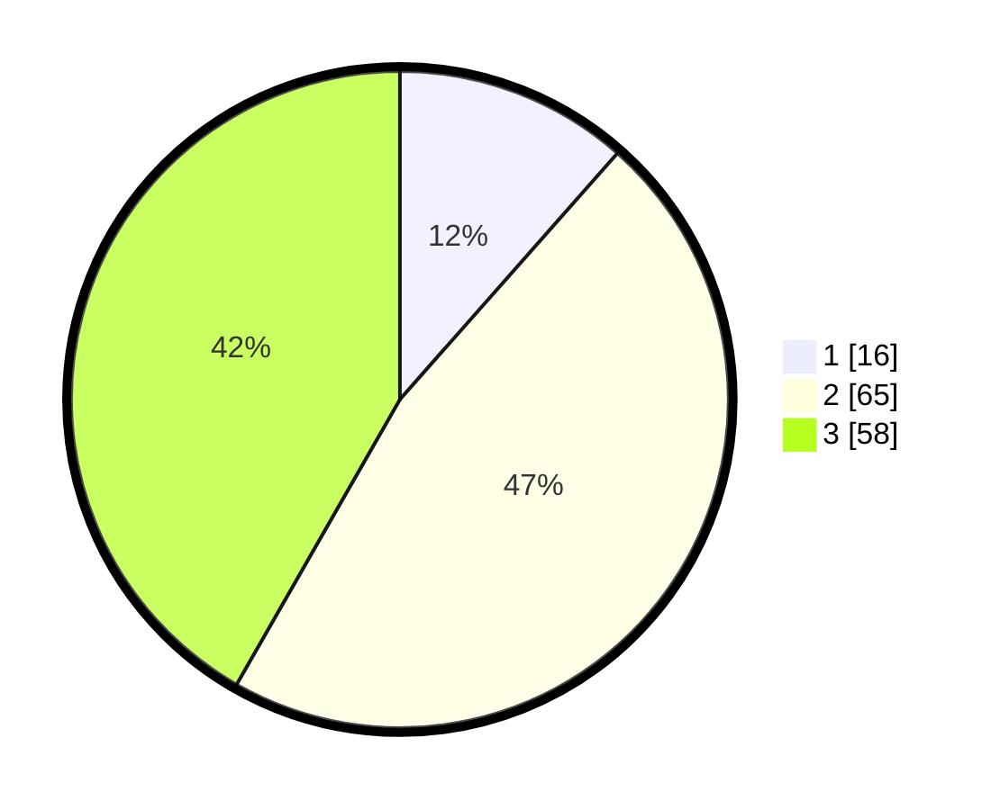

# Hasil

## Grafik

## Tabel

| No. | Nama Paslon    | Suara | Suara (raw) | Persentase |
|:--- |:-------------- | -----:| -----------:| ----------:|
| 1   | ANIES MUHAIMIN | 16    | [16][p-1]   | 11,51      |
| 2   | PRABOWO GIBRAN | 65    | [65][p-2]   | 46,76      |
| 3   | GANJAR MAHFUD  | 58    | [58][p-3]   | 41,73      |

[p-1]: https://github.com/gigit-pemilu/pemilu-2024-33-jawa-tengah/blob/main/pilpres/hitung-suara/sub/33-jawa-tengah/sub/07-wonosobo/sub/02-kepil/sub/2007-gadingrejo/sub/018-tps/sub/paslon-1.txt
[p-2]: https://github.com/gigit-pemilu/pemilu-2024-33-jawa-tengah/blob/main/pilpres/hitung-suara/sub/33-jawa-tengah/sub/07-wonosobo/sub/02-kepil/sub/2007-gadingrejo/sub/018-tps/sub/paslon-2.txt
[p-3]: https://github.com/gigit-pemilu/pemilu-2024-33-jawa-tengah/blob/main/pilpres/hitung-suara/sub/33-jawa-tengah/sub/07-wonosobo/sub/02-kepil/sub/2007-gadingrejo/sub/018-tps/sub/paslon-3.txt

## Foto C Plano

https://sirekap-obj-formc.kpu.go.id/45b2/pemilu/ppwp/33/07/02/20/07/3307022007018-20240214-224732--2920a1e1-7ca2-45a0-a090-a1037b693b65.jpg

https://sirekap-obj-formc.kpu.go.id/45b2/pemilu/ppwp/33/07/02/20/07/3307022007018-20240214-225724--70c7232b-fbc6-4de9-9c69-930cd9602c10.jpg

https://sirekap-obj-formc.kpu.go.id/45b2/pemilu/ppwp/33/07/02/20/07/3307022007018-20240214-225937--d0af8c8f-7ca2-4d9a-873a-f384f5e72a03.jpg

## Metadata

| Key        | Value               |
| ---------- | ------------------- |
| Time Stamp | 2024-02-25 17:00:00 |

