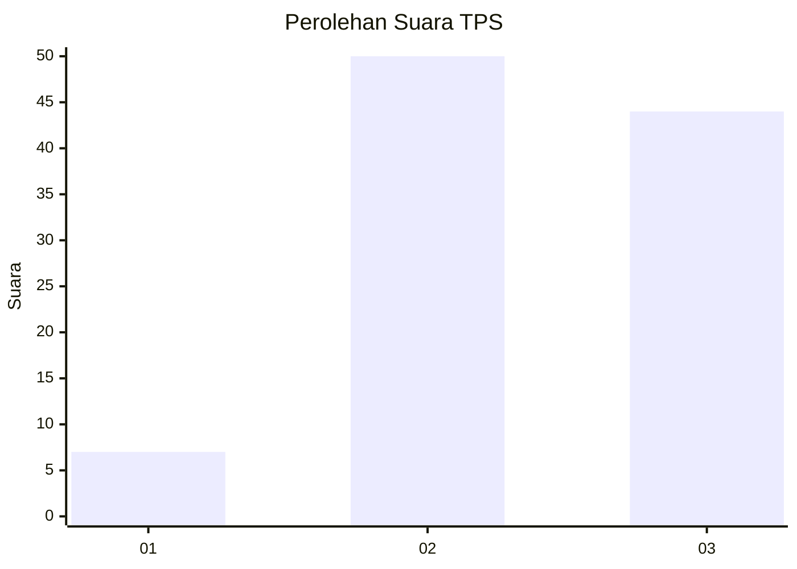
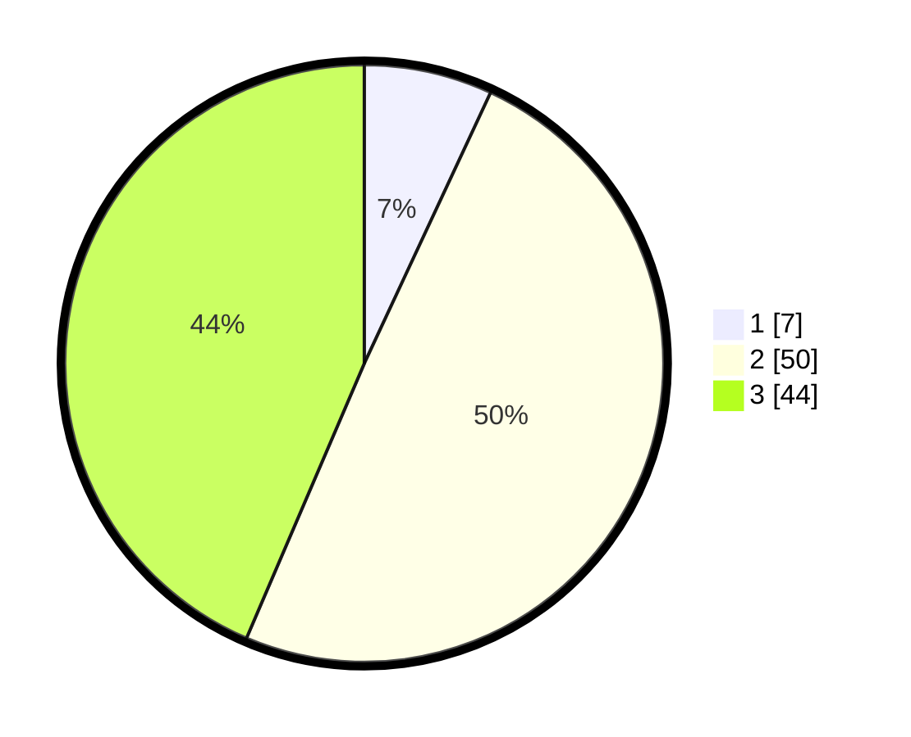

# Hasil

## Grafik

## Tabel

| No. | Nama Paslon    | Suara | Suara (raw) | Persentase |
|:--- |:-------------- | -----:| -----------:| ----------:|
| 1   | ANIES MUHAIMIN | 7     | [7][p-1]    | 6,93       |
| 2   | PRABOWO GIBRAN | 50    | [50][p-2]   | 49,50      |
| 3   | GANJAR MAHFUD  | 44    | [44][p-3]   | 43,56      |

[p-1]: https://github.com/gigit-pemilu/pemilu-2024-33-jawa-tengah/blob/main/pilpres/hitung-suara/sub/33-jawa-tengah/sub/07-wonosobo/sub/02-kepil/sub/2012-randusari/sub/002-tps/sub/paslon-1.txt
[p-2]: https://github.com/gigit-pemilu/pemilu-2024-33-jawa-tengah/blob/main/pilpres/hitung-suara/sub/33-jawa-tengah/sub/07-wonosobo/sub/02-kepil/sub/2012-randusari/sub/002-tps/sub/paslon-2.txt
[p-3]: https://github.com/gigit-pemilu/pemilu-2024-33-jawa-tengah/blob/main/pilpres/hitung-suara/sub/33-jawa-tengah/sub/07-wonosobo/sub/02-kepil/sub/2012-randusari/sub/002-tps/sub/paslon-3.txt

## Foto C Plano

https://sirekap-obj-formc.kpu.go.id/5159/pemilu/ppwp/33/07/02/20/12/3307022012002-20240217-153630--18aa24af-407d-4b15-bdfd-99512390fae9.jpg

https://sirekap-obj-formc.kpu.go.id/5159/pemilu/ppwp/33/07/02/20/12/3307022012002-20240217-154726--e271dc60-bd58-4e37-b4eb-7f42ccbe71cf.jpg

https://sirekap-obj-formc.kpu.go.id/5159/pemilu/ppwp/33/07/02/20/12/3307022012002-20240215-153555--2a32539a-a570-4911-808e-8fd019406487.jpg

## Metadata

| Key        | Value               |
| ---------- | ------------------- |
| Time Stamp | 2024-02-25 13:00:00 |

