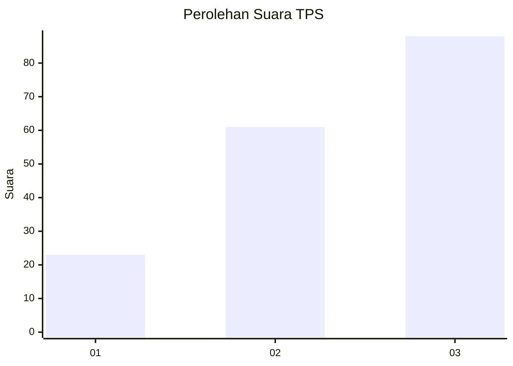
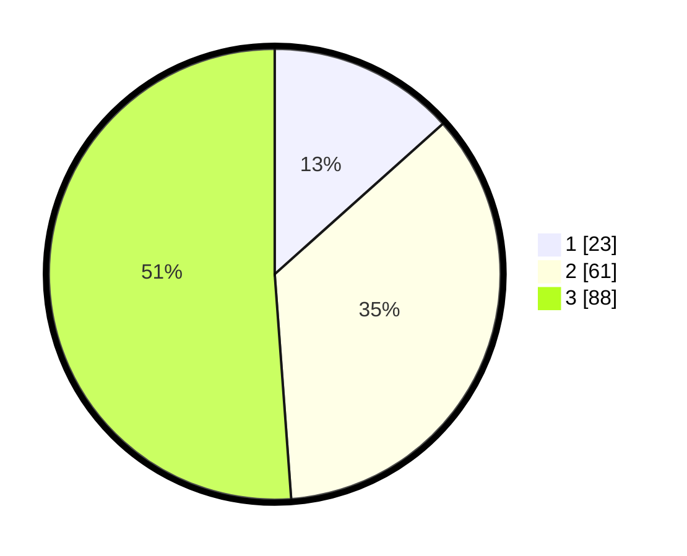

# Hasil

## Grafik

## Tabel

| No. | Nama Paslon    | Suara | Suara (raw) | Persentase |
|:--- |:-------------- | -----:| -----------:| ----------:|
| 1   | ANIES MUHAIMIN | 23    | [23][p-1]   | 13,37      |
| 2   | PRABOWO GIBRAN | 61    | [61][p-2]   | 35,47      |
| 3   | GANJAR MAHFUD  | 88    | [88][p-3]   | 51,16      |

[p-1]: https://github.com/gigit-pemilu/pemilu-2024-33-jawa-tengah/blob/main/pilpres/hitung-suara/sub/33-jawa-tengah/sub/07-wonosobo/sub/02-kepil/sub/2017-kaliwuluh/sub/009-tps/sub/paslon-1.txt
[p-2]: https://github.com/gigit-pemilu/pemilu-2024-33-jawa-tengah/blob/main/pilpres/hitung-suara/sub/33-jawa-tengah/sub/07-wonosobo/sub/02-kepil/sub/2017-kaliwuluh/sub/009-tps/sub/paslon-2.txt
[p-3]: https://github.com/gigit-pemilu/pemilu-2024-33-jawa-tengah/blob/main/pilpres/hitung-suara/sub/33-jawa-tengah/sub/07-wonosobo/sub/02-kepil/sub/2017-kaliwuluh/sub/009-tps/sub/paslon-3.txt

## Foto C Plano

https://sirekap-obj-formc.kpu.go.id/8141/pemilu/ppwp/33/07/02/20/17/3307022017009-20240216-170059--fa14cd50-a7c3-4564-b78c-eda7f0016879.jpg

https://sirekap-obj-formc.kpu.go.id/8141/pemilu/ppwp/33/07/02/20/17/3307022017009-20240216-075900--adc19fc8-2601-44e1-bc6a-9026b3143008.jpg

https://sirekap-obj-formc.kpu.go.id/8141/pemilu/ppwp/33/07/02/20/17/3307022017009-20240216-170257--81878192-7437-4309-bcd1-766146b9e741.jpg

## Metadata

| Key        | Value               |
| ---------- | ------------------- |
| Time Stamp | 2024-02-24 22:31:28 |

