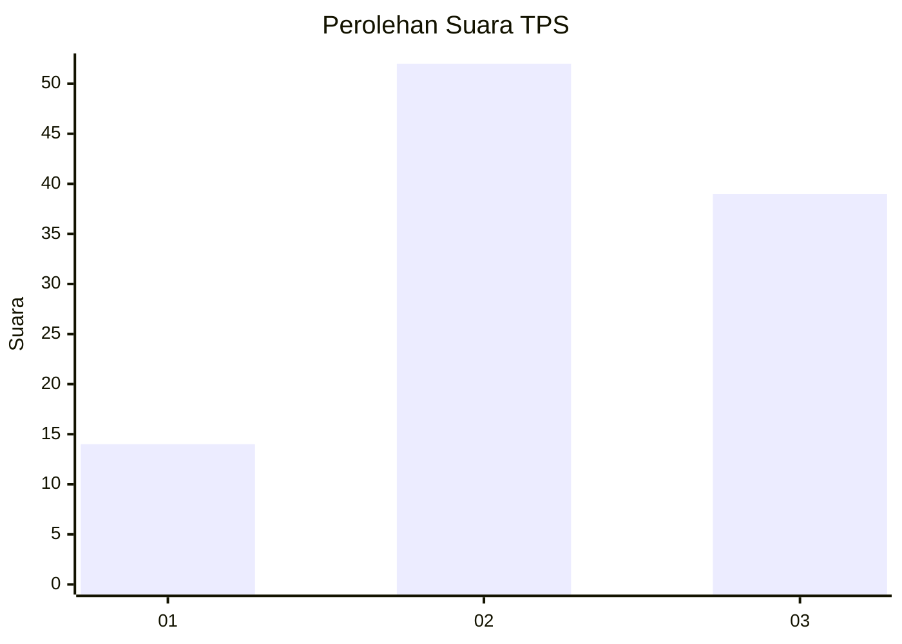
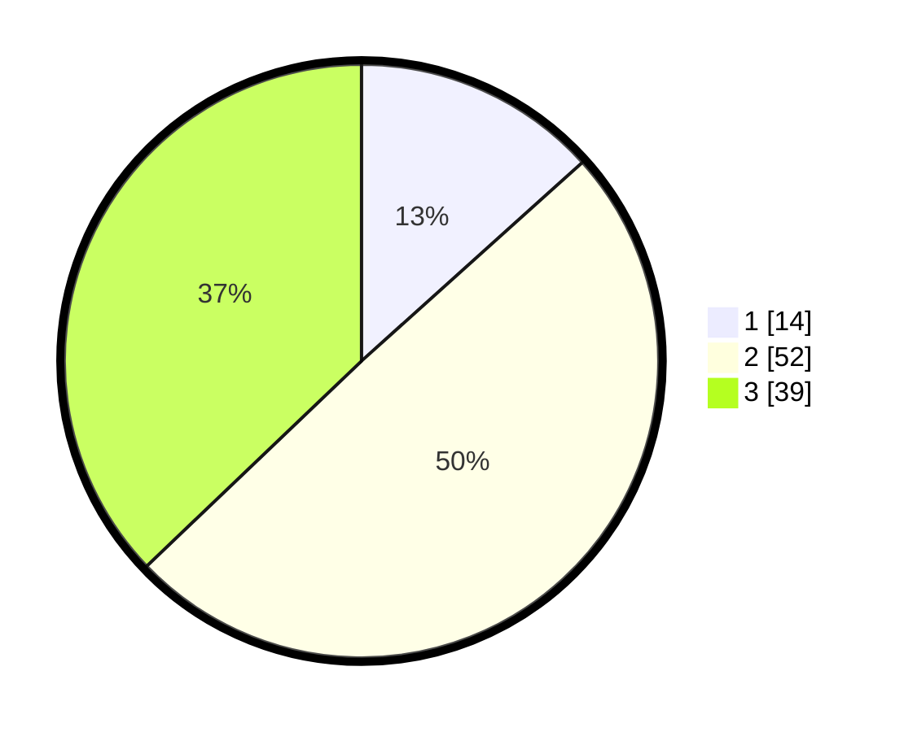

# Hasil

## Grafik

## Tabel

| No. | Nama Paslon    | Suara | Suara (raw) | Persentase |
|:--- |:-------------- | -----:| -----------:| ----------:|
| 1   | ANIES MUHAIMIN | 14    | [14][p-1]   | 13,33      |
| 2   | PRABOWO GIBRAN | 52    | [52][p-2]   | 49,52      |
| 3   | GANJAR MAHFUD  | 39    | [39][p-3]   | 37,14      |

[p-1]: https://github.com/gigit-pemilu/pemilu-2024/blob/main/pilpres/hitung-suara/sub/33-jawa-tengah/sub/07-wonosobo/sub/02-kepil/sub/2018-tegalgot/sub/003-tps/sub/paslon-1.txt
[p-2]: https://github.com/gigit-pemilu/pemilu-2024/blob/main/pilpres/hitung-suara/sub/33-jawa-tengah/sub/07-wonosobo/sub/02-kepil/sub/2018-tegalgot/sub/003-tps/sub/paslon-2.txt
[p-3]: https://github.com/gigit-pemilu/pemilu-2024/blob/main/pilpres/hitung-suara/sub/33-jawa-tengah/sub/07-wonosobo/sub/02-kepil/sub/2018-tegalgot/sub/003-tps/sub/paslon-3.txt

## Foto C Plano

https://sirekap-obj-formc.kpu.go.id/d988/pemilu/ppwp/33/07/02/20/18/3307022018003-20240214-162222--20540b8f-a6a8-4c95-b1b5-dad6547fdb0c.jpg

https://sirekap-obj-formc.kpu.go.id/d988/pemilu/ppwp/33/07/02/20/18/3307022018003-20240214-162228--13959a44-24df-42f8-bd76-b86224299c41.jpg

https://sirekap-obj-formc.kpu.go.id/d988/pemilu/ppwp/33/07/02/20/18/3307022018003-20240214-175309--ed6e06ac-227a-4bef-b473-a2c2be4c2389.jpg

## Metadata

| Key        | Value               |
| ---------- | ------------------- |
| Time Stamp | 2024-02-15 00:41:44 |

