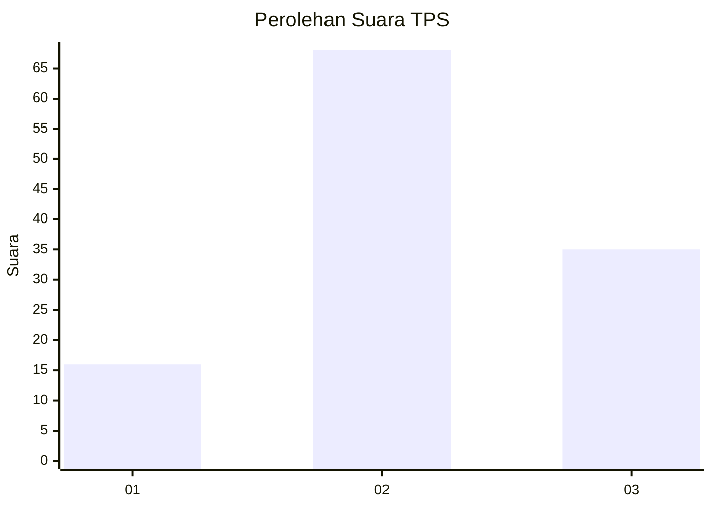
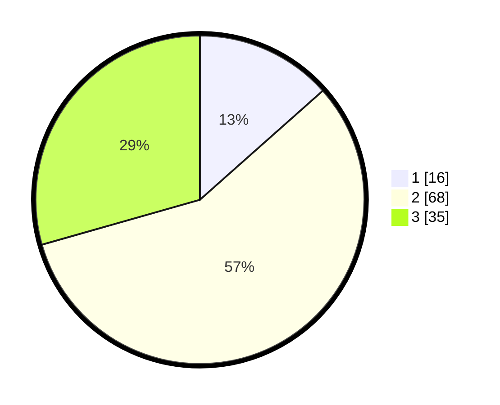

# Hasil

## Grafik

## Tabel

| No. | Nama Paslon    | Suara | Suara (raw) | Persentase |
|:--- |:-------------- | -----:| -----------:| ----------:|
| 1   | ANIES MUHAIMIN | 16    | [16][p-1]   | 13,45      |
| 2   | PRABOWO GIBRAN | 68    | [68][p-2]   | 57,14      |
| 3   | GANJAR MAHFUD  | 35    | [35][p-3]   | 29,41      |

[p-1]: https://github.com/gigit-pemilu/pemilu-2024-33-jawa-tengah/blob/main/pilpres/hitung-suara/sub/33-jawa-tengah/sub/07-wonosobo/sub/02-kepil/sub/2018-tegalgot/sub/005-tps/sub/paslon-1.txt
[p-2]: https://github.com/gigit-pemilu/pemilu-2024-33-jawa-tengah/blob/main/pilpres/hitung-suara/sub/33-jawa-tengah/sub/07-wonosobo/sub/02-kepil/sub/2018-tegalgot/sub/005-tps/sub/paslon-2.txt
[p-3]: https://github.com/gigit-pemilu/pemilu-2024-33-jawa-tengah/blob/main/pilpres/hitung-suara/sub/33-jawa-tengah/sub/07-wonosobo/sub/02-kepil/sub/2018-tegalgot/sub/005-tps/sub/paslon-3.txt

## Foto C Plano

https://sirekap-obj-formc.kpu.go.id/ead9/pemilu/ppwp/33/07/02/20/18/3307022018005-20240214-223358--466b2185-368c-466a-a9c4-29720c09ff83.jpg

https://sirekap-obj-formc.kpu.go.id/ead9/pemilu/ppwp/33/07/02/20/18/3307022018005-20240214-141250--b537f624-579b-40f2-b2a9-cc477489c0f4.jpg

https://sirekap-obj-formc.kpu.go.id/ead9/pemilu/ppwp/33/07/02/20/18/3307022018005-20240214-214253--61dcc6cf-9f33-41c8-9af5-2da0833be0fa.jpg

## Metadata

| Key        | Value               |
| ---------- | ------------------- |
| Time Stamp | 2024-02-15 15:00:29 |

