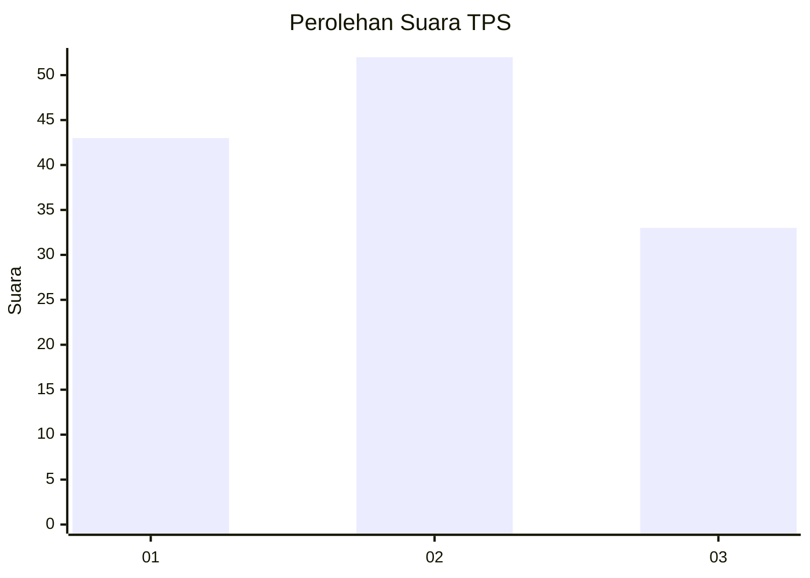
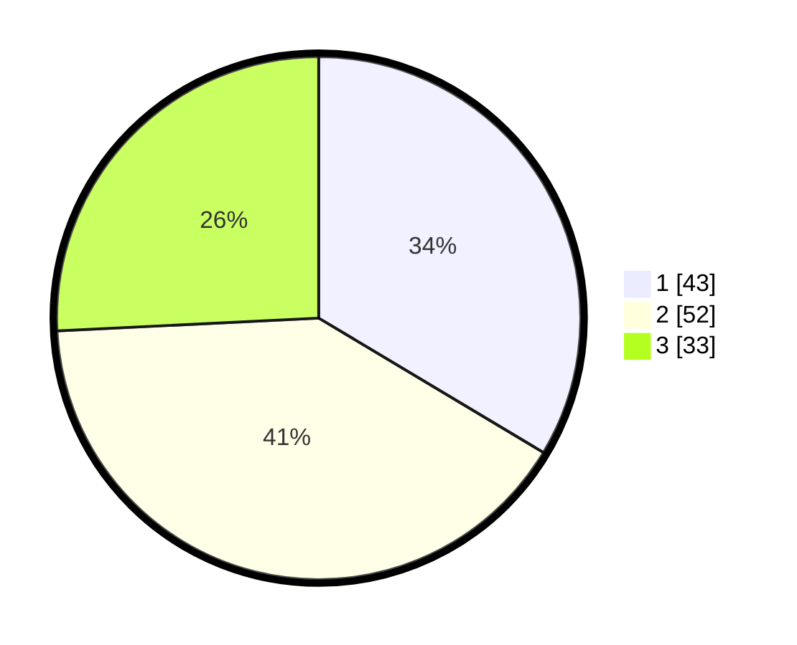

# Hasil

## Grafik

## Tabel

| No. | Nama Paslon    | Suara | Suara (raw) | Persentase |
|:--- |:-------------- | -----:| -----------:| ----------:|
| 1   | ANIES MUHAIMIN | 43    | [43][p-1]   | 33,59      |
| 2   | PRABOWO GIBRAN | 52    | [52][p-2]   | 40,63      |
| 3   | GANJAR MAHFUD  | 33    | [33][p-3]   | 25,78      |

[p-1]: https://github.com/gigit-pemilu/pemilu-2024-33-jawa-tengah/blob/main/pilpres/hitung-suara/sub/33-jawa-tengah/sub/07-wonosobo/sub/02-kepil/sub/2018-tegalgot/sub/006-tps/sub/paslon-1.txt
[p-2]: https://github.com/gigit-pemilu/pemilu-2024-33-jawa-tengah/blob/main/pilpres/hitung-suara/sub/33-jawa-tengah/sub/07-wonosobo/sub/02-kepil/sub/2018-tegalgot/sub/006-tps/sub/paslon-2.txt
[p-3]: https://github.com/gigit-pemilu/pemilu-2024-33-jawa-tengah/blob/main/pilpres/hitung-suara/sub/33-jawa-tengah/sub/07-wonosobo/sub/02-kepil/sub/2018-tegalgot/sub/006-tps/sub/paslon-3.txt

## Foto C Plano

https://sirekap-obj-formc.kpu.go.id/0323/pemilu/ppwp/33/07/02/20/18/3307022018006-20240214-225224--a6d9b6b8-3b47-4058-b145-8ae9a573afa0.jpg

https://sirekap-obj-formc.kpu.go.id/0323/pemilu/ppwp/33/07/02/20/18/3307022018006-20240214-225415--fc74c4bc-2c71-481d-966f-e717ae37148f.jpg

https://sirekap-obj-formc.kpu.go.id/0323/pemilu/ppwp/33/07/02/20/18/3307022018006-20240214-225525--534eaefe-7b90-451b-8d91-aff6d4af2306.jpg

## Metadata

| Key        | Value               |
| ---------- | ------------------- |
| Time Stamp | 2024-02-15 15:00:29 |

