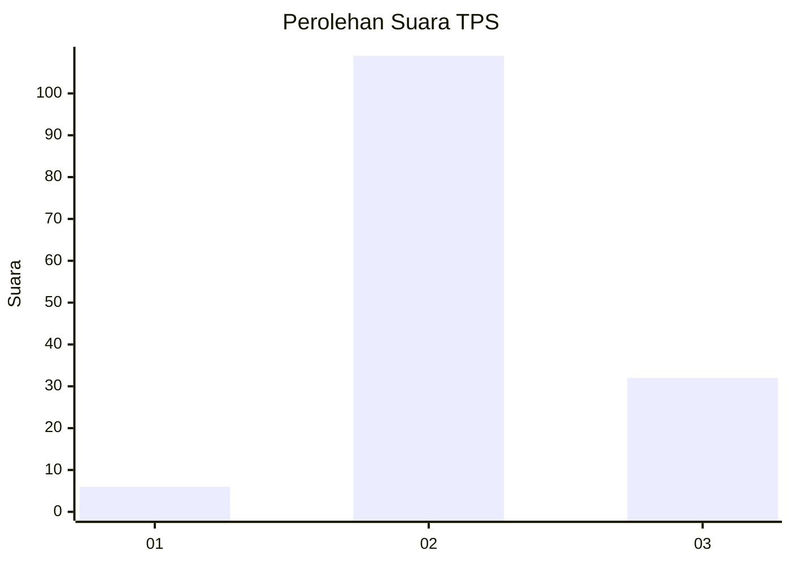

# Hasil

## Grafik

## Tabel

| No. | Nama Paslon    | Suara | Suara (raw) | Persentase |
|:--- |:-------------- | -----:| -----------:| ----------:|
| 1   | ANIES MUHAIMIN | 6     | [6][p-1]    | 4,08       |
| 2   | PRABOWO GIBRAN | 109   | [109][p-2]  | 74,15      |
| 3   | GANJAR MAHFUD  | 32    | [32][p-3]   | 21,77      |

[p-1]: https://github.com/gigit-pemilu/pemilu-2024/blob/main/pilpres/hitung-suara/sub/33-jawa-tengah/sub/07-wonosobo/sub/02-kepil/sub/2020-ropoh/sub/002-tps/sub/paslon-1.txt
[p-2]: https://github.com/gigit-pemilu/pemilu-2024/blob/main/pilpres/hitung-suara/sub/33-jawa-tengah/sub/07-wonosobo/sub/02-kepil/sub/2020-ropoh/sub/002-tps/sub/paslon-2.txt
[p-3]: https://github.com/gigit-pemilu/pemilu-2024/blob/main/pilpres/hitung-suara/sub/33-jawa-tengah/sub/07-wonosobo/sub/02-kepil/sub/2020-ropoh/sub/002-tps/sub/paslon-3.txt

## Foto C Plano

https://sirekap-obj-formc.kpu.go.id/bf98/pemilu/ppwp/33/07/02/20/20/3307022020002-20240216-180858--af4f33f3-d55b-46c2-a0bb-38b4f3e10db0.jpg

https://sirekap-obj-formc.kpu.go.id/bf98/pemilu/ppwp/33/07/02/20/20/3307022020002-20240218-205730--14990a65-1d88-4f42-874d-0e48fd31f645.jpg

https://sirekap-obj-formc.kpu.go.id/bf98/pemilu/ppwp/33/07/02/20/20/3307022020002-20240218-205940--283ab20a-0d1d-4bbe-b8e7-743c73b8f44e.jpg

## Metadata

| Key        | Value               |
| ---------- | ------------------- |
| Time Stamp | 2024-02-22 01:00:00 |

