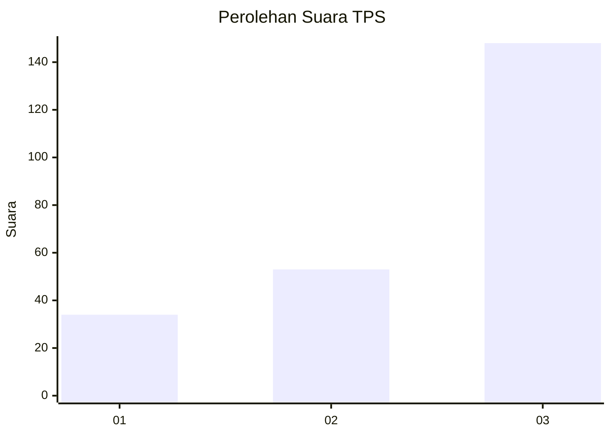
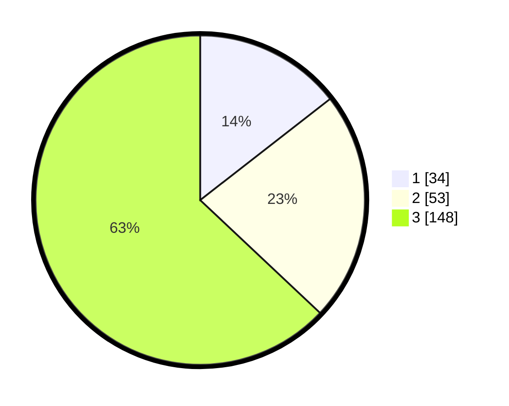

# Hasil

## Grafik

## Tabel

| No. | Nama Paslon    | Suara | Suara (raw) | Persentase |
|:--- |:-------------- | -----:| -----------:| ----------:|
| 1   | ANIES MUHAIMIN | 34    | [34][p-1]   | 14,47      |
| 2   | PRABOWO GIBRAN | 53    | [53][p-2]   | 22,55      |
| 3   | GANJAR MAHFUD  | 148   | [148][p-3]  | 62,98      |

[p-1]: https://github.com/gigit-pemilu/pemilu-2024-33-jawa-tengah/blob/main/pilpres/hitung-suara/sub/33-jawa-tengah/sub/07-wonosobo/sub/02-kepil/sub/2021-pulosaren/sub/001-tps/sub/paslon-1.txt
[p-2]: https://github.com/gigit-pemilu/pemilu-2024-33-jawa-tengah/blob/main/pilpres/hitung-suara/sub/33-jawa-tengah/sub/07-wonosobo/sub/02-kepil/sub/2021-pulosaren/sub/001-tps/sub/paslon-2.txt
[p-3]: https://github.com/gigit-pemilu/pemilu-2024-33-jawa-tengah/blob/main/pilpres/hitung-suara/sub/33-jawa-tengah/sub/07-wonosobo/sub/02-kepil/sub/2021-pulosaren/sub/001-tps/sub/paslon-3.txt

## Foto C Plano

https://sirekap-obj-formc.kpu.go.id/6bae/pemilu/ppwp/33/07/02/20/21/3307022021001-20240215-005912--6de18ae6-4cd9-450a-b802-f3385f05efbe.jpg

https://sirekap-obj-formc.kpu.go.id/6bae/pemilu/ppwp/33/07/02/20/21/3307022021001-20240218-201515--c7556138-eb6e-425a-a94d-c5c9c5e4be8b.jpg

https://sirekap-obj-formc.kpu.go.id/6bae/pemilu/ppwp/33/07/02/20/21/3307022021001-20240217-193634--b6502647-547e-4330-ac77-cbc1f0bd546d.jpg

## Metadata

| Key        | Value               |
| ---------- | ------------------- |
| Time Stamp | 2024-02-24 22:31:28 |

