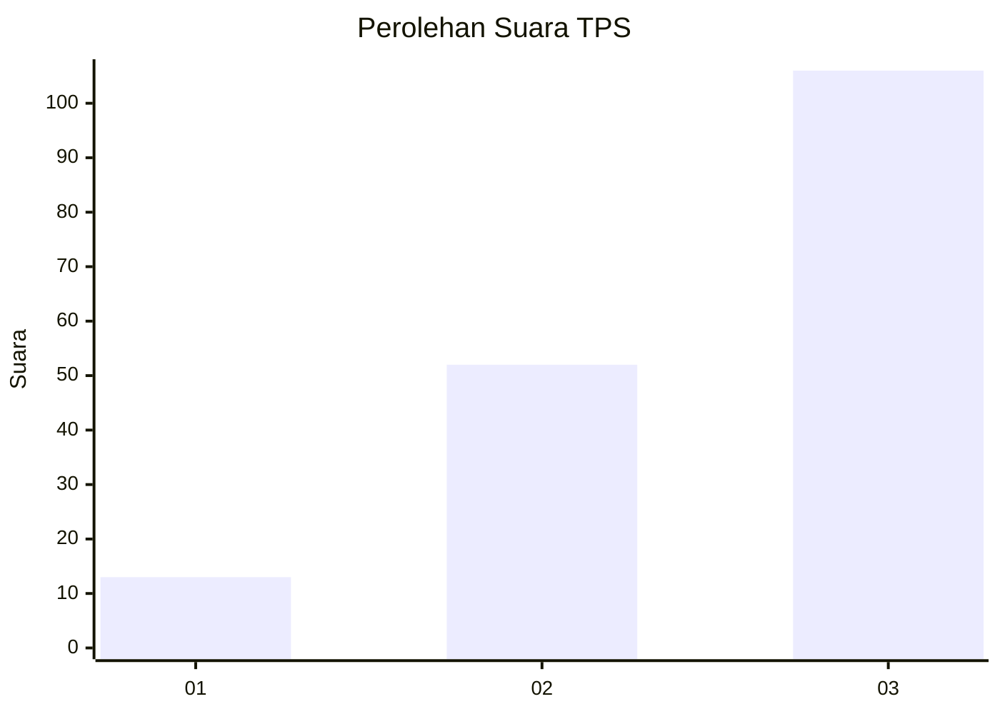
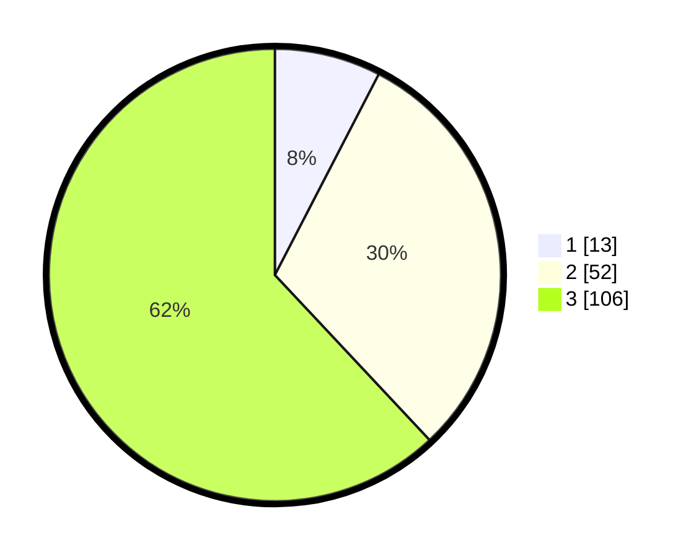

# Hasil

## Grafik

## Tabel

| No. | Nama Paslon    | Suara | Suara (raw) | Persentase |
|:--- |:-------------- | -----:| -----------:| ----------:|
| 1   | ANIES MUHAIMIN | 13    | [13][p-1]   | 7,60       |
| 2   | PRABOWO GIBRAN | 52    | [52][p-2]   | 30,41      |
| 3   | GANJAR MAHFUD  | 106   | [106][p-3]  | 61,99      |

[p-1]: https://github.com/gigit-pemilu/pemilu-2024/blob/main/pilpres/hitung-suara/sub/33-jawa-tengah/sub/07-wonosobo/sub/02-kepil/sub/2021-pulosaren/sub/003-tps/sub/paslon-1.txt
[p-2]: https://github.com/gigit-pemilu/pemilu-2024/blob/main/pilpres/hitung-suara/sub/33-jawa-tengah/sub/07-wonosobo/sub/02-kepil/sub/2021-pulosaren/sub/003-tps/sub/paslon-2.txt
[p-3]: https://github.com/gigit-pemilu/pemilu-2024/blob/main/pilpres/hitung-suara/sub/33-jawa-tengah/sub/07-wonosobo/sub/02-kepil/sub/2021-pulosaren/sub/003-tps/sub/paslon-3.txt

## Foto C Plano

https://sirekap-obj-formc.kpu.go.id/21d5/pemilu/ppwp/33/07/02/20/21/3307022021003-20240215-081626--bc5210ed-6371-4a49-b12e-063fb896ffa0.jpg

https://sirekap-obj-formc.kpu.go.id/21d5/pemilu/ppwp/33/07/02/20/21/3307022021003-20240215-141526--59a6e53d-fb90-4ec3-9a4f-dd1eb9af6fd6.jpg

https://sirekap-obj-formc.kpu.go.id/21d5/pemilu/ppwp/33/07/02/20/21/3307022021003-20240215-155003--5f18f813-8bb1-4139-8b4c-aba6dab7d6f3.jpg

## Metadata

| Key        | Value               |
| ---------- | ------------------- |
| Time Stamp | 2024-02-24 22:31:28 |

