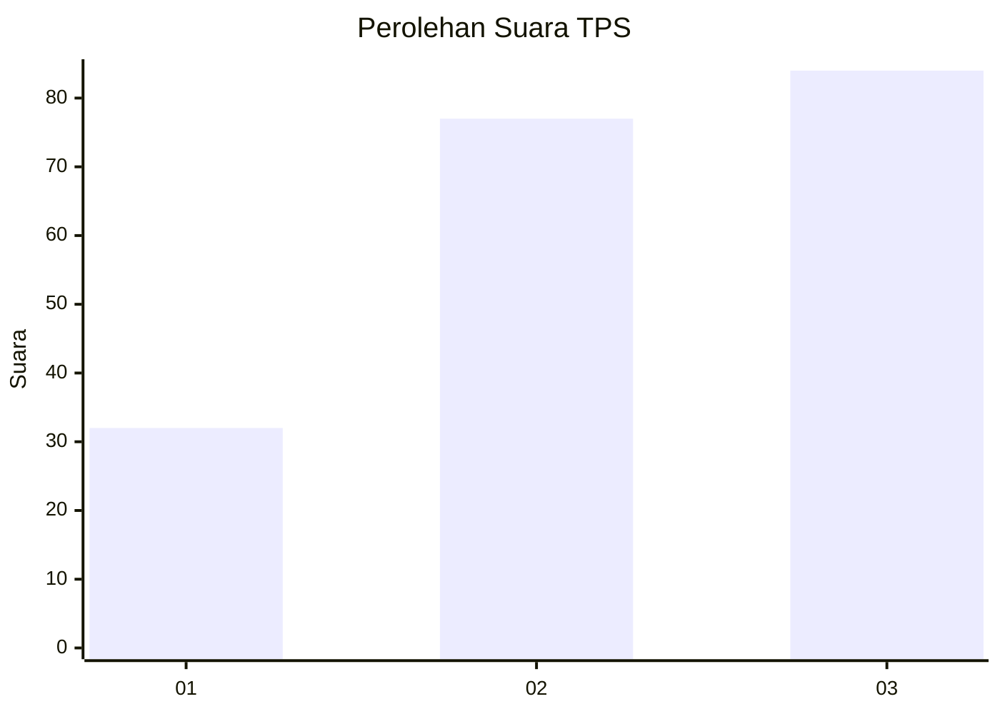
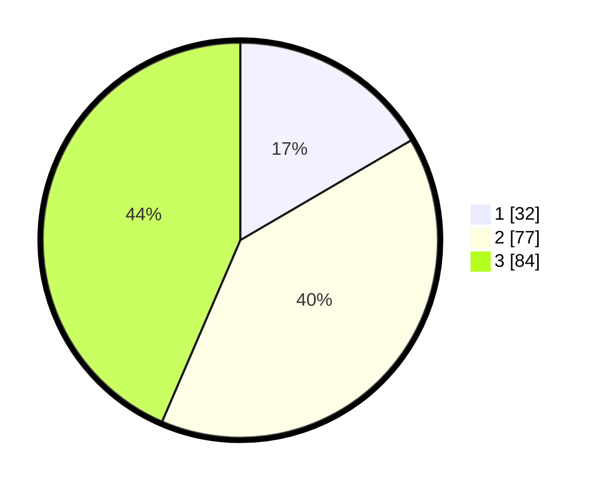

# Hasil

## Grafik

## Tabel

| No. | Nama Paslon    | Suara | Suara (raw) | Persentase |
|:--- |:-------------- | -----:| -----------:| ----------:|
| 1   | ANIES MUHAIMIN | 32    | [32][p-1]   | 16,58      |
| 2   | PRABOWO GIBRAN | 77    | [77][p-2]   | 39,90      |
| 3   | GANJAR MAHFUD  | 84    | [84][p-3]   | 43,52      |

[p-1]: https://github.com/gigit-pemilu/pemilu-2024-33-jawa-tengah/blob/main/pilpres/hitung-suara/sub/33-jawa-tengah/sub/07-wonosobo/sub/03-sapuran/sub/1008-sapuran/sub/015-tps/sub/paslon-1.txt
[p-2]: https://github.com/gigit-pemilu/pemilu-2024-33-jawa-tengah/blob/main/pilpres/hitung-suara/sub/33-jawa-tengah/sub/07-wonosobo/sub/03-sapuran/sub/1008-sapuran/sub/015-tps/sub/paslon-2.txt
[p-3]: https://github.com/gigit-pemilu/pemilu-2024-33-jawa-tengah/blob/main/pilpres/hitung-suara/sub/33-jawa-tengah/sub/07-wonosobo/sub/03-sapuran/sub/1008-sapuran/sub/015-tps/sub/paslon-3.txt

## Foto C Plano

https://sirekap-obj-formc.kpu.go.id/e3fb/pemilu/ppwp/33/07/03/10/08/3307031008015-20240216-091903--1bf69f84-ca18-450c-9cbe-35903114929f.jpg

https://sirekap-obj-formc.kpu.go.id/e3fb/pemilu/ppwp/33/07/03/10/08/3307031008015-20240214-223135--de835877-f485-49c9-ab44-752a2ac6f69c.jpg

https://sirekap-obj-formc.kpu.go.id/e3fb/pemilu/ppwp/33/07/03/10/08/3307031008015-20240214-223305--3f630c77-c35d-4ddb-9cce-f75d6f2bd18c.jpg

## Metadata

| Key        | Value               |
| ---------- | ------------------- |
| Time Stamp | 2024-02-16 09:30:28 |

