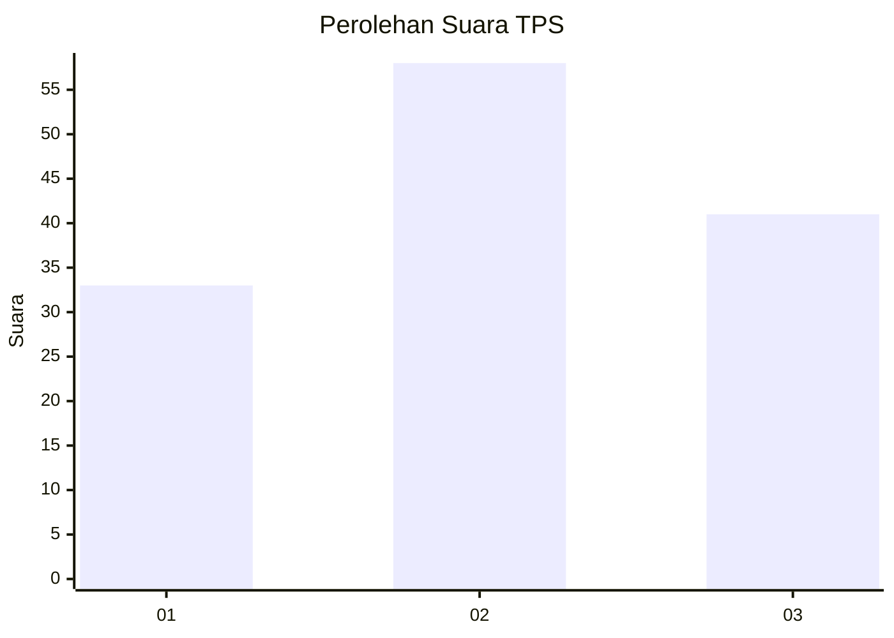
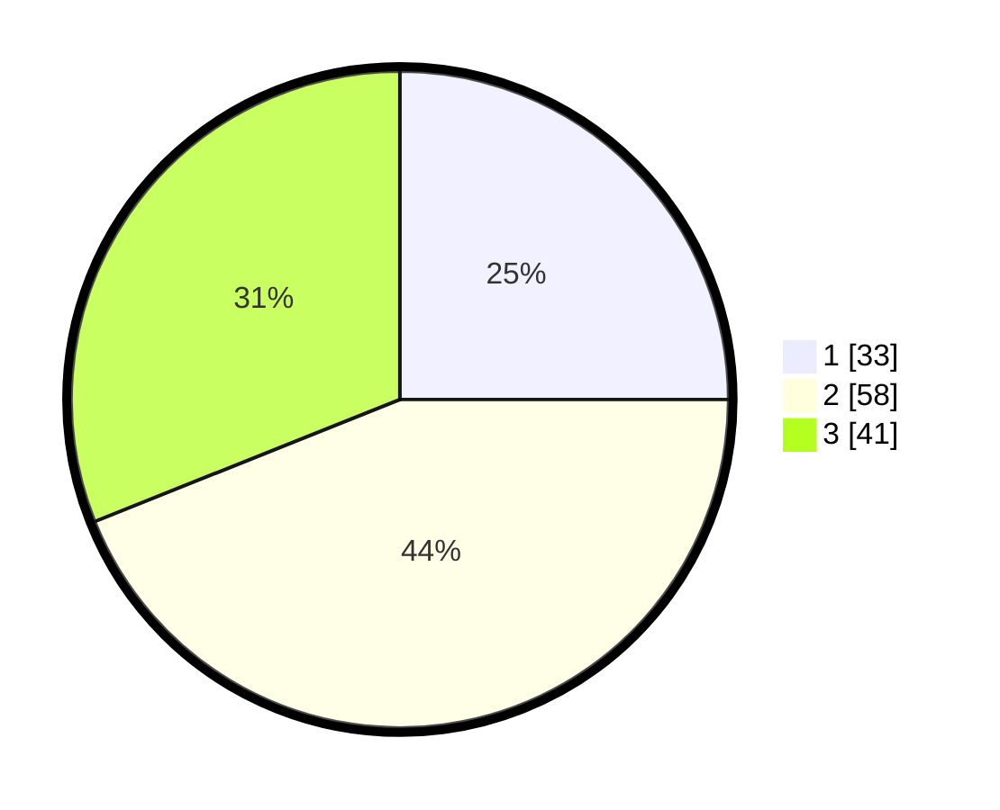

# Hasil

## Grafik

## Tabel

| No. | Nama Paslon    | Suara | Suara (raw) | Persentase |
|:--- |:-------------- | -----:| -----------:| ----------:|
| 1   | ANIES MUHAIMIN | 33    | [33][p-1]   | 25,00      |
| 2   | PRABOWO GIBRAN | 58    | [58][p-2]   | 43,94      |
| 3   | GANJAR MAHFUD  | 41    | [41][p-3]   | 31,06      |

[p-1]: https://github.com/gigit-pemilu/pemilu-2024/blob/main/pilpres/hitung-suara/sub/33-jawa-tengah/sub/07-wonosobo/sub/03-sapuran/sub/1008-sapuran/sub/016-tps/sub/paslon-1.txt
[p-2]: https://github.com/gigit-pemilu/pemilu-2024/blob/main/pilpres/hitung-suara/sub/33-jawa-tengah/sub/07-wonosobo/sub/03-sapuran/sub/1008-sapuran/sub/016-tps/sub/paslon-2.txt
[p-3]: https://github.com/gigit-pemilu/pemilu-2024/blob/main/pilpres/hitung-suara/sub/33-jawa-tengah/sub/07-wonosobo/sub/03-sapuran/sub/1008-sapuran/sub/016-tps/sub/paslon-3.txt

## Foto C Plano

https://sirekap-obj-formc.kpu.go.id/d341/pemilu/ppwp/33/07/03/10/08/3307031008016-20240215-020740--f57be20b-5bc5-4e2d-b45f-5821a54a263d.jpg

https://sirekap-obj-formc.kpu.go.id/d341/pemilu/ppwp/33/07/03/10/08/3307031008016-20240215-021102--6aed2e2f-77fc-46ea-a577-cb618c80fa92.jpg

https://sirekap-obj-formc.kpu.go.id/d341/pemilu/ppwp/33/07/03/10/08/3307031008016-20240215-021207--76e1abfa-3fb8-4f47-827c-a9dd00473576.jpg

## Metadata

| Key        | Value               |
| ---------- | ------------------- |
| Time Stamp | 2024-02-15 16:30:25 |

