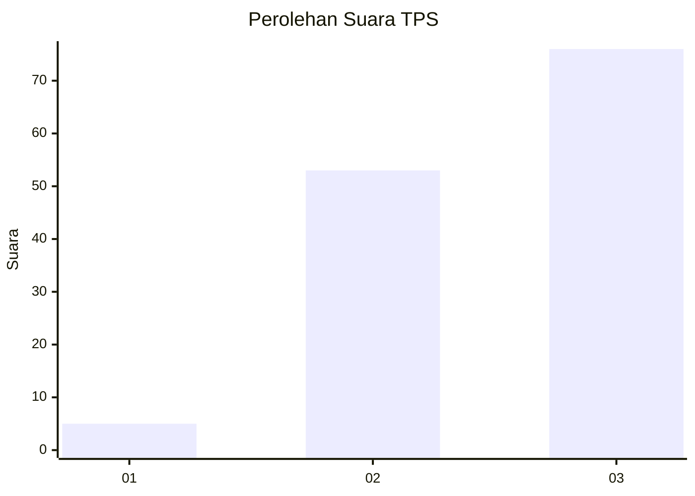
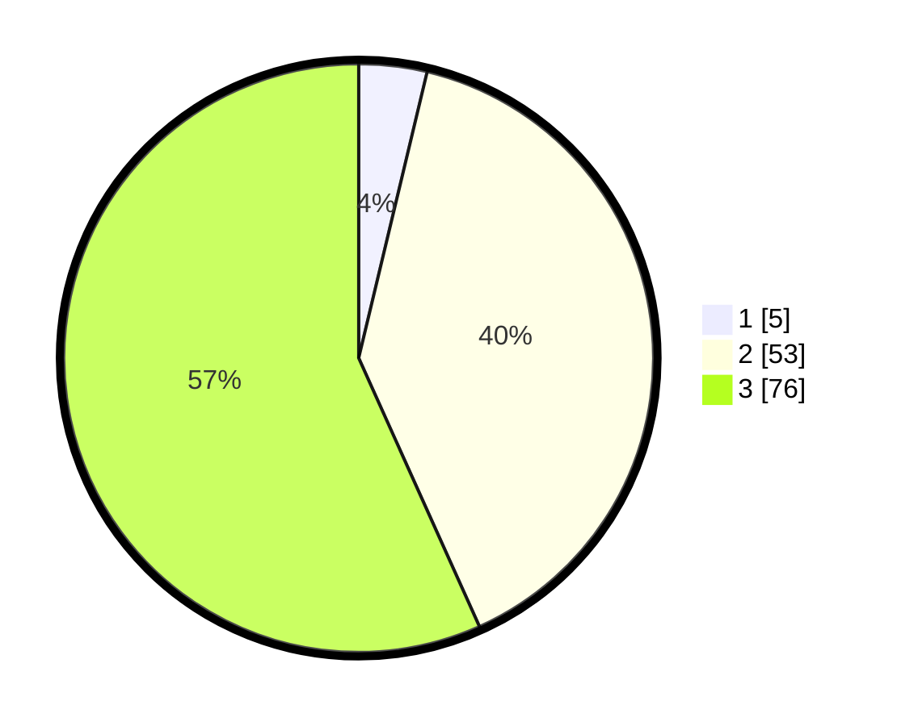

# Hasil

## Grafik

## Tabel

| No. | Nama Paslon    | Suara | Suara (raw) | Persentase |
|:--- |:-------------- | -----:| -----------:| ----------:|
| 1   | ANIES MUHAIMIN | 5     | [5][p-1]    | 3,73       |
| 2   | PRABOWO GIBRAN | 53    | [53][p-2]   | 39,55      |
| 3   | GANJAR MAHFUD  | 76    | [76][p-3]   | 56,72      |

[p-1]: https://github.com/gigit-pemilu/pemilu-2024/blob/main/pilpres/hitung-suara/sub/33-jawa-tengah/sub/07-wonosobo/sub/03-sapuran/sub/2002-karangsari/sub/008-tps/sub/paslon-1.txt
[p-2]: https://github.com/gigit-pemilu/pemilu-2024/blob/main/pilpres/hitung-suara/sub/33-jawa-tengah/sub/07-wonosobo/sub/03-sapuran/sub/2002-karangsari/sub/008-tps/sub/paslon-2.txt
[p-3]: https://github.com/gigit-pemilu/pemilu-2024/blob/main/pilpres/hitung-suara/sub/33-jawa-tengah/sub/07-wonosobo/sub/03-sapuran/sub/2002-karangsari/sub/008-tps/sub/paslon-3.txt

## Foto C Plano

https://sirekap-obj-formc.kpu.go.id/cae2/pemilu/ppwp/33/07/03/20/02/3307032002008-20240215-003644--0e70fc70-41f3-48c4-bb28-16f4edcd491f.jpg

https://sirekap-obj-formc.kpu.go.id/cae2/pemilu/ppwp/33/07/03/20/02/3307032002008-20240215-003754--2ca9a05b-d1b5-4543-9028-a8e2584d8fbc.jpg

https://sirekap-obj-formc.kpu.go.id/cae2/pemilu/ppwp/33/07/03/20/02/3307032002008-20240215-003905--1f212cbf-af0b-4ff9-95f7-d95e02a8c9f7.jpg

## Metadata

| Key        | Value               |
| ---------- | ------------------- |
| Time Stamp | 2024-02-15 21:30:27 |

