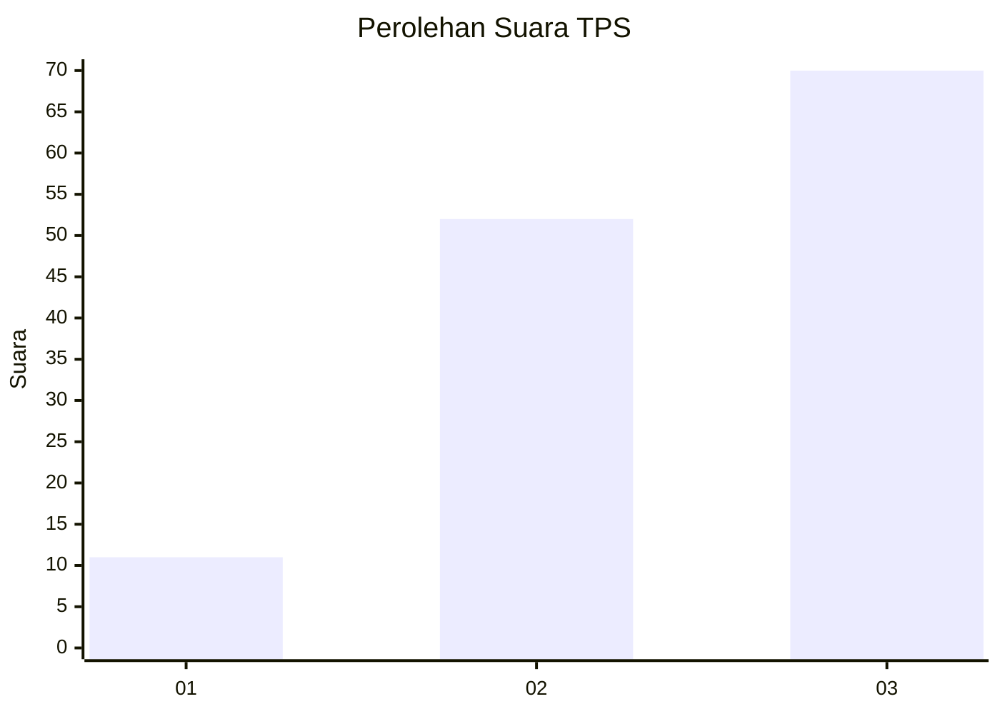
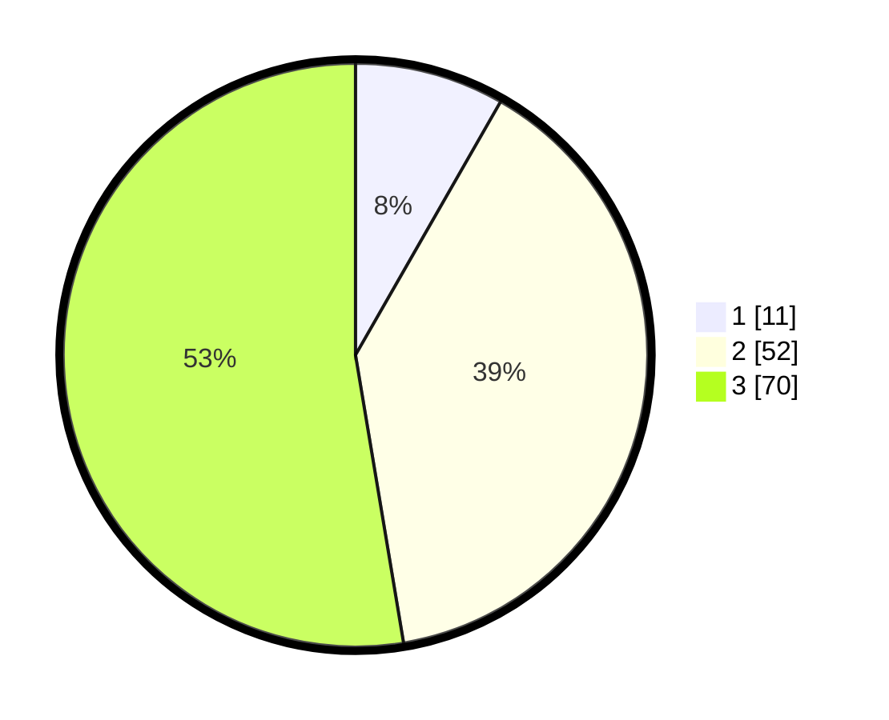

# Hasil

## Grafik

## Tabel

| No. | Nama Paslon    | Suara | Suara (raw) | Persentase |
|:--- |:-------------- | -----:| -----------:| ----------:|
| 1   | ANIES MUHAIMIN | 11    | [11][p-1]   | 8,27       |
| 2   | PRABOWO GIBRAN | 52    | [52][p-2]   | 39,10      |
| 3   | GANJAR MAHFUD  | 70    | [70][p-3]   | 52,63      |

[p-1]: https://github.com/gigit-pemilu/pemilu-2024-33-jawa-tengah/blob/main/pilpres/hitung-suara/sub/33-jawa-tengah/sub/07-wonosobo/sub/03-sapuran/sub/2002-karangsari/sub/009-tps/sub/paslon-1.txt
[p-2]: https://github.com/gigit-pemilu/pemilu-2024-33-jawa-tengah/blob/main/pilpres/hitung-suara/sub/33-jawa-tengah/sub/07-wonosobo/sub/03-sapuran/sub/2002-karangsari/sub/009-tps/sub/paslon-2.txt
[p-3]: https://github.com/gigit-pemilu/pemilu-2024-33-jawa-tengah/blob/main/pilpres/hitung-suara/sub/33-jawa-tengah/sub/07-wonosobo/sub/03-sapuran/sub/2002-karangsari/sub/009-tps/sub/paslon-3.txt

## Foto C Plano

https://sirekap-obj-formc.kpu.go.id/57da/pemilu/ppwp/33/07/03/20/02/3307032002009-20240214-221038--73a4af60-83cc-4d10-aa1f-93897b25b69d.jpg

https://sirekap-obj-formc.kpu.go.id/57da/pemilu/ppwp/33/07/03/20/02/3307032002009-20240214-221048--fa7bc197-a48b-4fda-a5c3-79ad9c607c84.jpg

https://sirekap-obj-formc.kpu.go.id/57da/pemilu/ppwp/33/07/03/20/02/3307032002009-20240214-221110--dd265219-6b3b-483b-8e44-ac4519d6b698.jpg

## Metadata

| Key        | Value               |
| ---------- | ------------------- |
| Time Stamp | 2024-02-15 02:10:27 |

