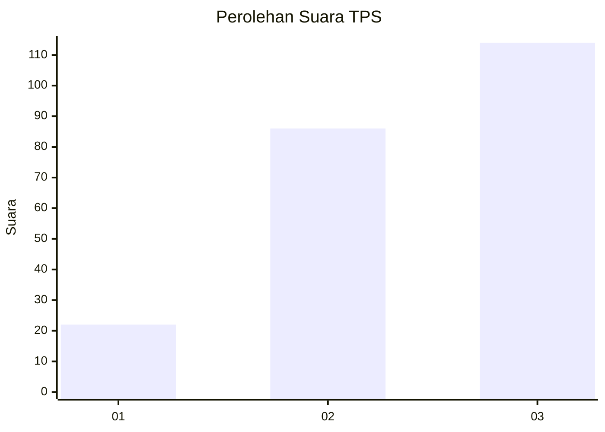
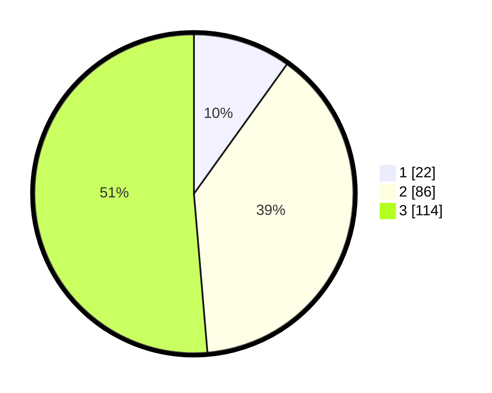

# Hasil

## Grafik

## Tabel

| No. | Nama Paslon    | Suara | Suara (raw) | Persentase |
|:--- |:-------------- | -----:| -----------:| ----------:|
| 1   | ANIES MUHAIMIN | 22    | [22][p-1]   | 9,91       |
| 2   | PRABOWO GIBRAN | 86    | [86][p-2]   | 38,74      |
| 3   | GANJAR MAHFUD  | 114   | [114][p-3]  | 51,35      |

[p-1]: https://github.com/gigit-pemilu/pemilu-2024/blob/main/pilpres/hitung-suara/sub/33-jawa-tengah/sub/07-wonosobo/sub/03-sapuran/sub/2003-pecekelan/sub/002-tps/sub/paslon-1.txt
[p-2]: https://github.com/gigit-pemilu/pemilu-2024/blob/main/pilpres/hitung-suara/sub/33-jawa-tengah/sub/07-wonosobo/sub/03-sapuran/sub/2003-pecekelan/sub/002-tps/sub/paslon-2.txt
[p-3]: https://github.com/gigit-pemilu/pemilu-2024/blob/main/pilpres/hitung-suara/sub/33-jawa-tengah/sub/07-wonosobo/sub/03-sapuran/sub/2003-pecekelan/sub/002-tps/sub/paslon-3.txt

## Foto C Plano

https://sirekap-obj-formc.kpu.go.id/7978/pemilu/ppwp/33/07/03/20/03/3307032003002-20240215-051224--cd07f936-8d26-4ceb-8a03-d18210f8203a.jpg

https://sirekap-obj-formc.kpu.go.id/7978/pemilu/ppwp/33/07/03/20/03/3307032003002-20240215-051415--794e9856-de2d-433f-8fcb-75d97a759539.jpg

https://sirekap-obj-formc.kpu.go.id/7978/pemilu/ppwp/33/07/03/20/03/3307032003002-20240215-051548--9c3a7999-1f9d-4d9e-ac29-9fbb4b7acc02.jpg

## Metadata

| Key        | Value               |
| ---------- | ------------------- |
| Time Stamp | 2024-02-15 21:30:27 |

