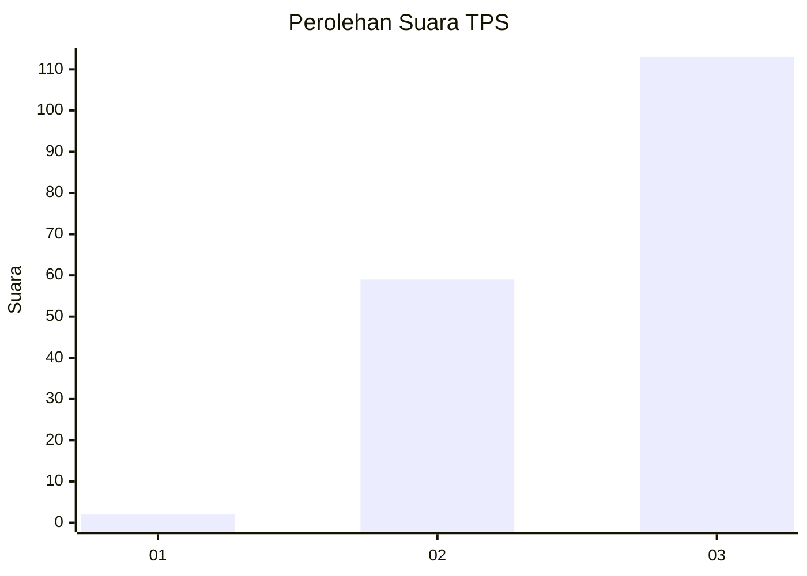
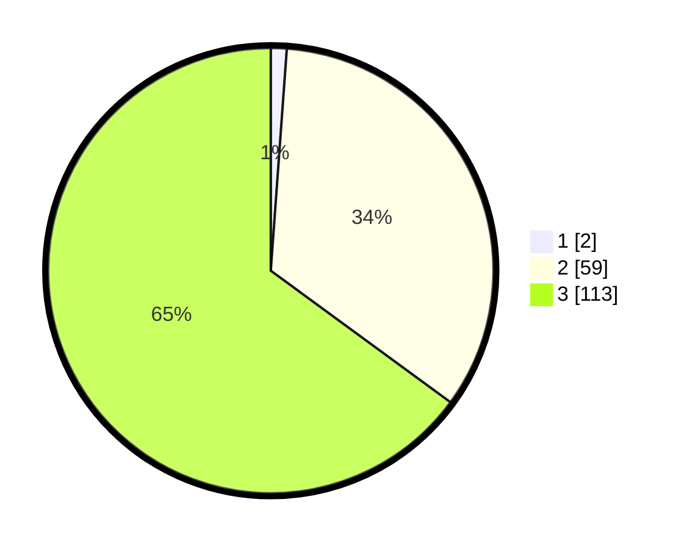

# Hasil

## Grafik

## Tabel

| No. | Nama Paslon    | Suara | Suara (raw) | Persentase |
|:--- |:-------------- | -----:| -----------:| ----------:|
| 1   | ANIES MUHAIMIN | 2     | [2][p-1]    | 1,15       |
| 2   | PRABOWO GIBRAN | 59    | [59][p-2]   | 33,91      |
| 3   | GANJAR MAHFUD  | 113   | [113][p-3]  | 64,94      |

[p-1]: https://github.com/gigit-pemilu/pemilu-2024/blob/main/pilpres/hitung-suara/sub/33-jawa-tengah/sub/07-wonosobo/sub/03-sapuran/sub/2003-pecekelan/sub/014-tps/sub/paslon-1.txt
[p-2]: https://github.com/gigit-pemilu/pemilu-2024/blob/main/pilpres/hitung-suara/sub/33-jawa-tengah/sub/07-wonosobo/sub/03-sapuran/sub/2003-pecekelan/sub/014-tps/sub/paslon-2.txt
[p-3]: https://github.com/gigit-pemilu/pemilu-2024/blob/main/pilpres/hitung-suara/sub/33-jawa-tengah/sub/07-wonosobo/sub/03-sapuran/sub/2003-pecekelan/sub/014-tps/sub/paslon-3.txt

## Foto C Plano

https://sirekap-obj-formc.kpu.go.id/ffd6/pemilu/ppwp/33/07/03/20/03/3307032003014-20240215-044416--c3470894-2f1b-492b-885f-026c3bd2c263.jpg

https://sirekap-obj-formc.kpu.go.id/ffd6/pemilu/ppwp/33/07/03/20/03/3307032003014-20240215-044516--d620dc71-5b87-4d67-ab7b-613054cec7ee.jpg

https://sirekap-obj-formc.kpu.go.id/ffd6/pemilu/ppwp/33/07/03/20/03/3307032003014-20240215-044713--db86bc39-44ab-47a3-af58-e32ded892d4e.jpg

## Metadata

| Key        | Value               |
| ---------- | ------------------- |
| Time Stamp | 2024-02-15 21:01:18 |

