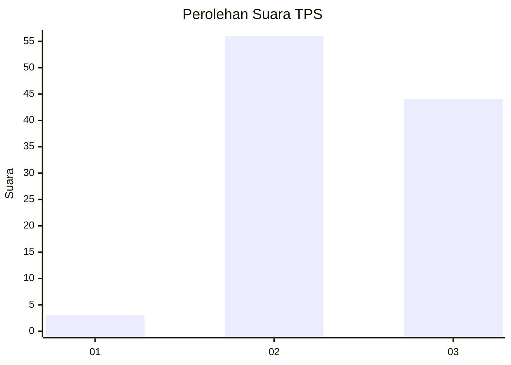
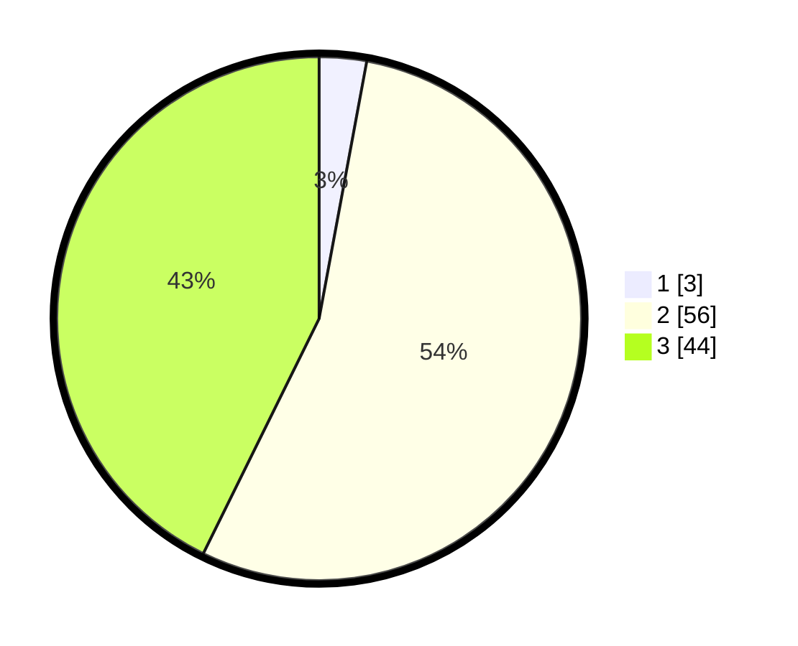

# Hasil

## Grafik

## Tabel

| No. | Nama Paslon    | Suara | Suara (raw) | Persentase |
|:--- |:-------------- | -----:| -----------:| ----------:|
| 1   | ANIES MUHAIMIN | 3     | [3][p-1]    | 2,91       |
| 2   | PRABOWO GIBRAN | 56    | [56][p-2]   | 54,37      |
| 3   | GANJAR MAHFUD  | 44    | [44][p-3]   | 42,72      |

[p-1]: https://github.com/gigit-pemilu/pemilu-2024/blob/main/pilpres/hitung-suara/sub/33-jawa-tengah/sub/07-wonosobo/sub/03-sapuran/sub/2004-glagah/sub/007-tps/sub/paslon-1.txt
[p-2]: https://github.com/gigit-pemilu/pemilu-2024/blob/main/pilpres/hitung-suara/sub/33-jawa-tengah/sub/07-wonosobo/sub/03-sapuran/sub/2004-glagah/sub/007-tps/sub/paslon-2.txt
[p-3]: https://github.com/gigit-pemilu/pemilu-2024/blob/main/pilpres/hitung-suara/sub/33-jawa-tengah/sub/07-wonosobo/sub/03-sapuran/sub/2004-glagah/sub/007-tps/sub/paslon-3.txt

## Foto C Plano

https://sirekap-obj-formc.kpu.go.id/98f5/pemilu/ppwp/33/07/03/20/04/3307032004007-20240214-233220--7303e92b-b461-4b84-9032-6f84a3bc8d5b.jpg

https://sirekap-obj-formc.kpu.go.id/98f5/pemilu/ppwp/33/07/03/20/04/3307032004007-20240214-233342--64206795-3d60-449a-983e-60eb0fa3e2fb.jpg

https://sirekap-obj-formc.kpu.go.id/98f5/pemilu/ppwp/33/07/03/20/04/3307032004007-20240215-015019--b54475a0-cf42-4b60-b1ad-f6268bfa9020.jpg

## Metadata

| Key        | Value               |
| ---------- | ------------------- |
| Time Stamp | 2024-02-15 21:30:27 |

