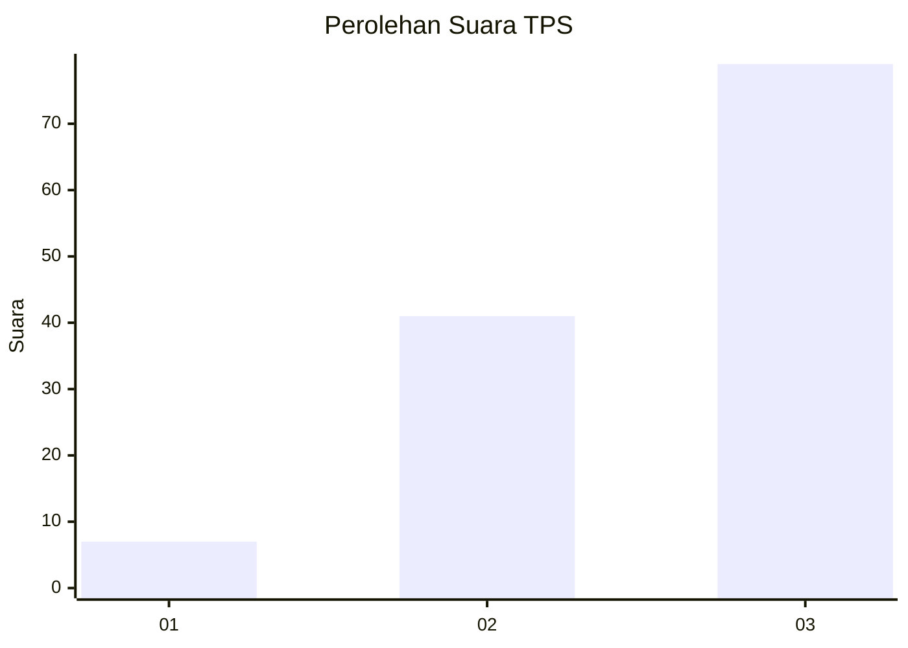
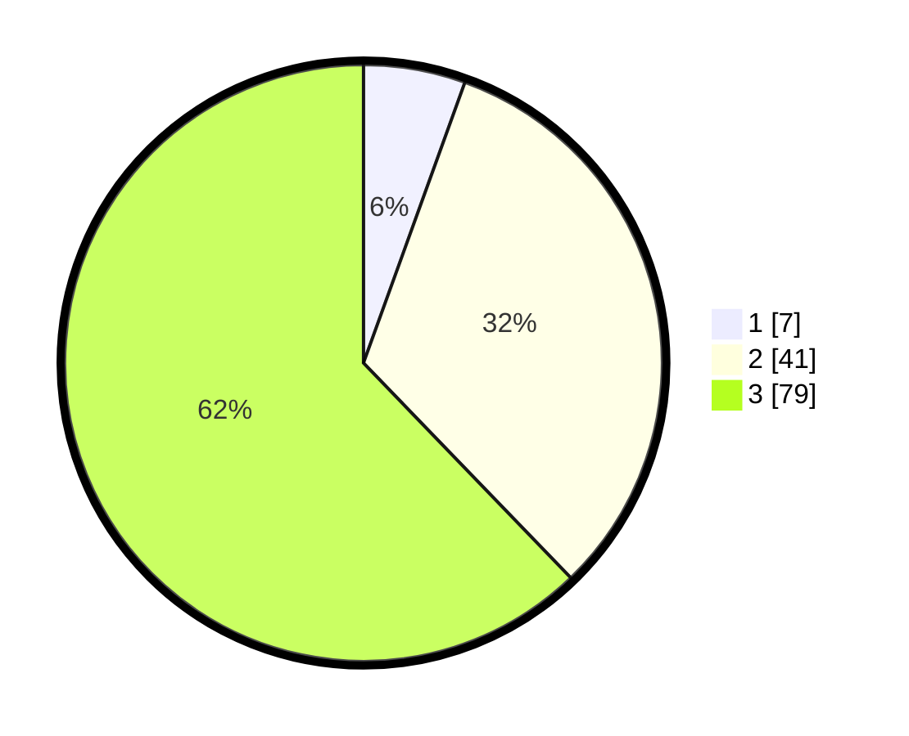

# Hasil

## Grafik

## Tabel

| No. | Nama Paslon    | Suara | Suara (raw) | Persentase |
|:--- |:-------------- | -----:| -----------:| ----------:|
| 1   | ANIES MUHAIMIN | 7     | [7][p-1]    | 5,51       |
| 2   | PRABOWO GIBRAN | 41    | [41][p-2]   | 32,28      |
| 3   | GANJAR MAHFUD  | 79    | [79][p-3]   | 62,20      |

[p-1]: https://github.com/gigit-pemilu/pemilu-2024-33-jawa-tengah/blob/main/pilpres/hitung-suara/sub/33-jawa-tengah/sub/07-wonosobo/sub/03-sapuran/sub/2005-surojoyo/sub/001-tps/sub/paslon-1.txt
[p-2]: https://github.com/gigit-pemilu/pemilu-2024-33-jawa-tengah/blob/main/pilpres/hitung-suara/sub/33-jawa-tengah/sub/07-wonosobo/sub/03-sapuran/sub/2005-surojoyo/sub/001-tps/sub/paslon-2.txt
[p-3]: https://github.com/gigit-pemilu/pemilu-2024-33-jawa-tengah/blob/main/pilpres/hitung-suara/sub/33-jawa-tengah/sub/07-wonosobo/sub/03-sapuran/sub/2005-surojoyo/sub/001-tps/sub/paslon-3.txt

## Foto C Plano

https://sirekap-obj-formc.kpu.go.id/f807/pemilu/ppwp/33/07/03/20/05/3307032005001-20240214-203001--7b2a7a6a-6c96-43bc-9912-14f80b130246.jpg

https://sirekap-obj-formc.kpu.go.id/f807/pemilu/ppwp/33/07/03/20/05/3307032005001-20240214-203046--895de582-a0af-40c0-b2c4-7da8002c05d2.jpg

https://sirekap-obj-formc.kpu.go.id/f807/pemilu/ppwp/33/07/03/20/05/3307032005001-20240214-203140--bad7ac7a-39eb-41eb-ba01-27748522afea.jpg

## Metadata

| Key        | Value               |
| ---------- | ------------------- |
| Time Stamp | 2024-02-16 08:00:28 |

