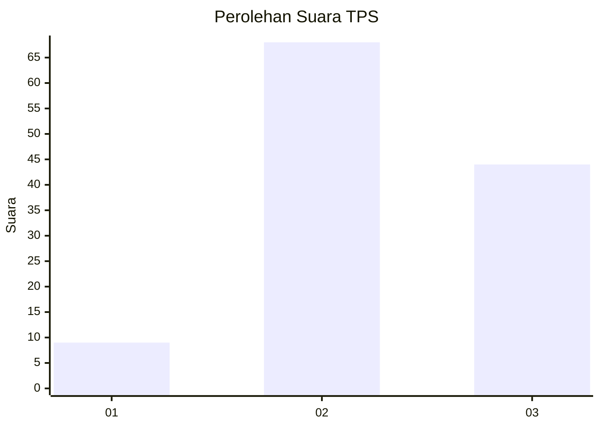
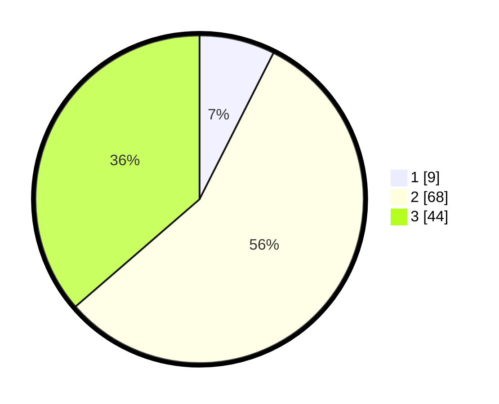

# Hasil

## Grafik

## Tabel

| No. | Nama Paslon    | Suara | Suara (raw) | Persentase |
|:--- |:-------------- | -----:| -----------:| ----------:|
| 1   | ANIES MUHAIMIN | 9     | [9][p-1]    | 7,44       |
| 2   | PRABOWO GIBRAN | 68    | [68][p-2]   | 56,20      |
| 3   | GANJAR MAHFUD  | 44    | [44][p-3]   | 36,36      |

[p-1]: https://github.com/gigit-pemilu/pemilu-2024/blob/main/pilpres/hitung-suara/sub/33-jawa-tengah/sub/07-wonosobo/sub/03-sapuran/sub/2005-surojoyo/sub/005-tps/sub/paslon-1.txt
[p-2]: https://github.com/gigit-pemilu/pemilu-2024/blob/main/pilpres/hitung-suara/sub/33-jawa-tengah/sub/07-wonosobo/sub/03-sapuran/sub/2005-surojoyo/sub/005-tps/sub/paslon-2.txt
[p-3]: https://github.com/gigit-pemilu/pemilu-2024/blob/main/pilpres/hitung-suara/sub/33-jawa-tengah/sub/07-wonosobo/sub/03-sapuran/sub/2005-surojoyo/sub/005-tps/sub/paslon-3.txt

## Foto C Plano

https://sirekap-obj-formc.kpu.go.id/7574/pemilu/ppwp/33/07/03/20/05/3307032005005-20240215-012725--3bb1acdf-269d-4d20-8d0f-4e0462ca467d.jpg

https://sirekap-obj-formc.kpu.go.id/7574/pemilu/ppwp/33/07/03/20/05/3307032005005-20240214-225326--06f62a9c-e948-48e4-9157-27c97a9884ce.jpg

https://sirekap-obj-formc.kpu.go.id/7574/pemilu/ppwp/33/07/03/20/05/3307032005005-20240214-225511--6824868d-c087-442c-b89d-c2483f67bc51.jpg

## Metadata

| Key        | Value               |
| ---------- | ------------------- |
| Time Stamp | 2024-02-15 21:30:27 |

