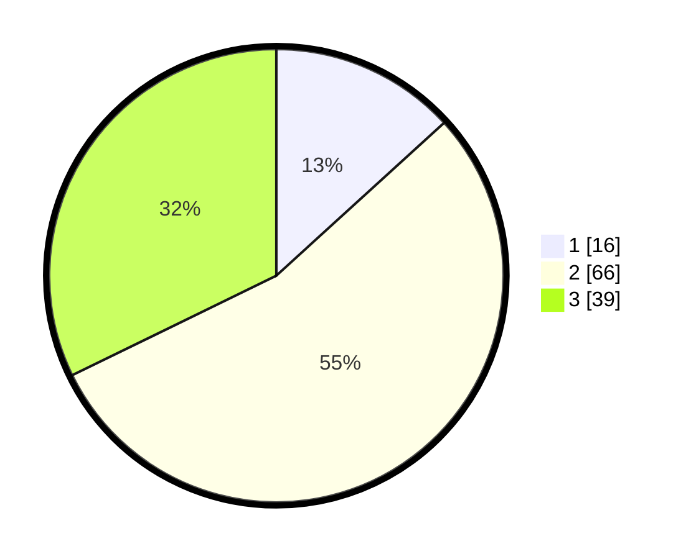

# Hasil

## Grafik

## Tabel

| No. | Nama Paslon    | Suara | Suara (raw) | Persentase |
|:--- |:-------------- | -----:| -----------:| ----------:|
| 1   | ANIES MUHAIMIN | 16    | [16][p-1]   | 13,22      |
| 2   | PRABOWO GIBRAN | 66    | [66][p-2]   | 54,55      |
| 3   | GANJAR MAHFUD  | 39    | [39][p-3]   | 32,23      |

[p-1]: https://github.com/gigit-pemilu/pemilu-2024/blob/main/pilpres/hitung-suara/sub/33-jawa-tengah/sub/07-wonosobo/sub/03-sapuran/sub/2005-surojoyo/sub/006-tps/sub/paslon-1.txt
[p-2]: https://github.com/gigit-pemilu/pemilu-2024/blob/main/pilpres/hitung-suara/sub/33-jawa-tengah/sub/07-wonosobo/sub/03-sapuran/sub/2005-surojoyo/sub/006-tps/sub/paslon-2.txt
[p-3]: https://github.com/gigit-pemilu/pemilu-2024/blob/main/pilpres/hitung-suara/sub/33-jawa-tengah/sub/07-wonosobo/sub/03-sapuran/sub/2005-surojoyo/sub/006-tps/sub/paslon-3.txt

## Foto C Plano

https://sirekap-obj-formc.kpu.go.id/ec6e/pemilu/ppwp/33/07/03/20/05/3307032005006-20240214-222707--b2e61151-9cca-4fdf-b2c5-70d880f201bb.jpg

https://sirekap-obj-formc.kpu.go.id/ec6e/pemilu/ppwp/33/07/03/20/05/3307032005006-20240214-223057--96fb2801-d151-4917-8555-8f9f8ca6a2ea.jpg

https://sirekap-obj-formc.kpu.go.id/ec6e/pemilu/ppwp/33/07/03/20/05/3307032005006-20240214-223253--dac20078-e264-4435-9328-503ade81267a.jpg

## Metadata

| Key        | Value               |
| ---------- | ------------------- |
| Time Stamp | 2024-02-15 21:30:27 |

