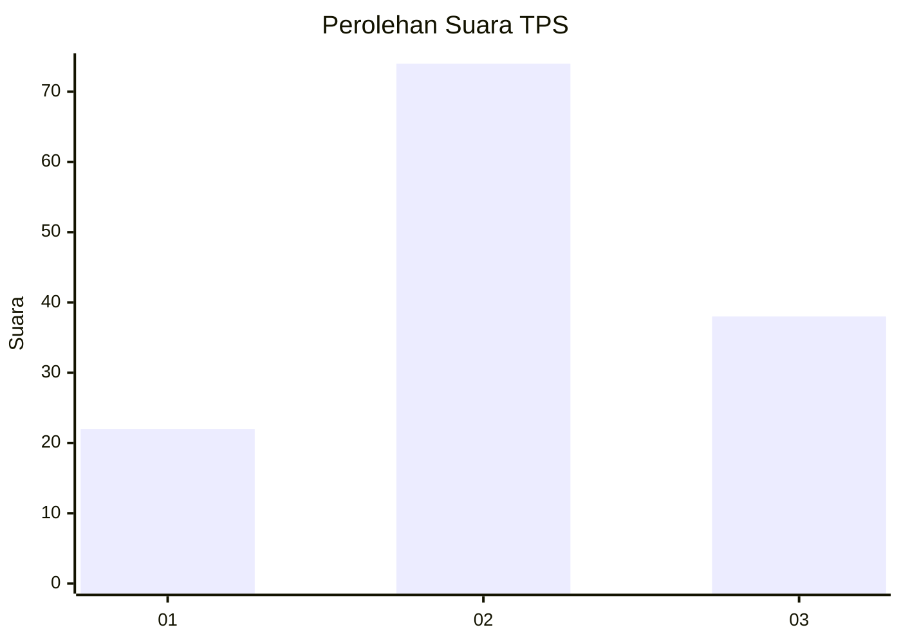
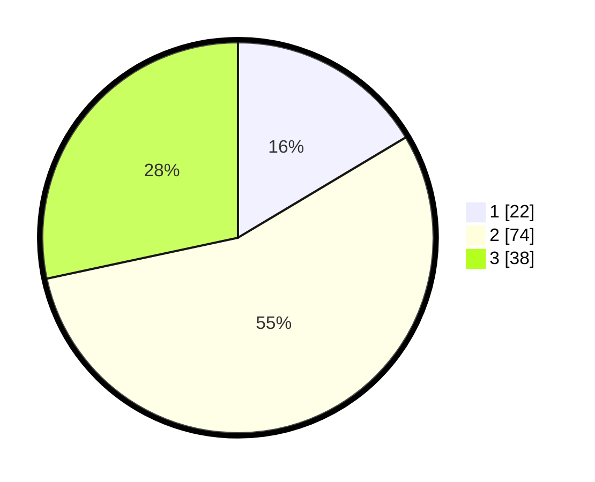

# Hasil

## Grafik

## Tabel

| No. | Nama Paslon    | Suara | Suara (raw) | Persentase |
|:--- |:-------------- | -----:| -----------:| ----------:|
| 1   | ANIES MUHAIMIN | 22    | [22][p-1]   | 16,42      |
| 2   | PRABOWO GIBRAN | 74    | [74][p-2]   | 55,22      |
| 3   | GANJAR MAHFUD  | 38    | [38][p-3]   | 28,36      |

[p-1]: https://github.com/gigit-pemilu/pemilu-2024-33-jawa-tengah/blob/main/pilpres/hitung-suara/sub/33-jawa-tengah/sub/07-wonosobo/sub/03-sapuran/sub/2005-surojoyo/sub/009-tps/sub/paslon-1.txt
[p-2]: https://github.com/gigit-pemilu/pemilu-2024-33-jawa-tengah/blob/main/pilpres/hitung-suara/sub/33-jawa-tengah/sub/07-wonosobo/sub/03-sapuran/sub/2005-surojoyo/sub/009-tps/sub/paslon-2.txt
[p-3]: https://github.com/gigit-pemilu/pemilu-2024-33-jawa-tengah/blob/main/pilpres/hitung-suara/sub/33-jawa-tengah/sub/07-wonosobo/sub/03-sapuran/sub/2005-surojoyo/sub/009-tps/sub/paslon-3.txt

## Foto C Plano

https://sirekap-obj-formc.kpu.go.id/630a/pemilu/ppwp/33/07/03/20/05/3307032005009-20240214-231037--30c2ca1e-4723-4707-b5cb-be3dae6baa3c.jpg

https://sirekap-obj-formc.kpu.go.id/630a/pemilu/ppwp/33/07/03/20/05/3307032005009-20240214-195806--fece33d5-4251-4579-8378-a75961923dcf.jpg

https://sirekap-obj-formc.kpu.go.id/630a/pemilu/ppwp/33/07/03/20/05/3307032005009-20240214-195843--061c3ebf-db4e-4c62-b260-6316e7e8ab87.jpg

## Metadata

| Key        | Value               |
| ---------- | ------------------- |
| Time Stamp | 2024-02-15 12:00:28 |

