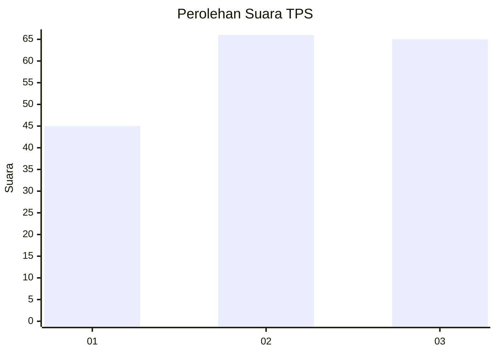
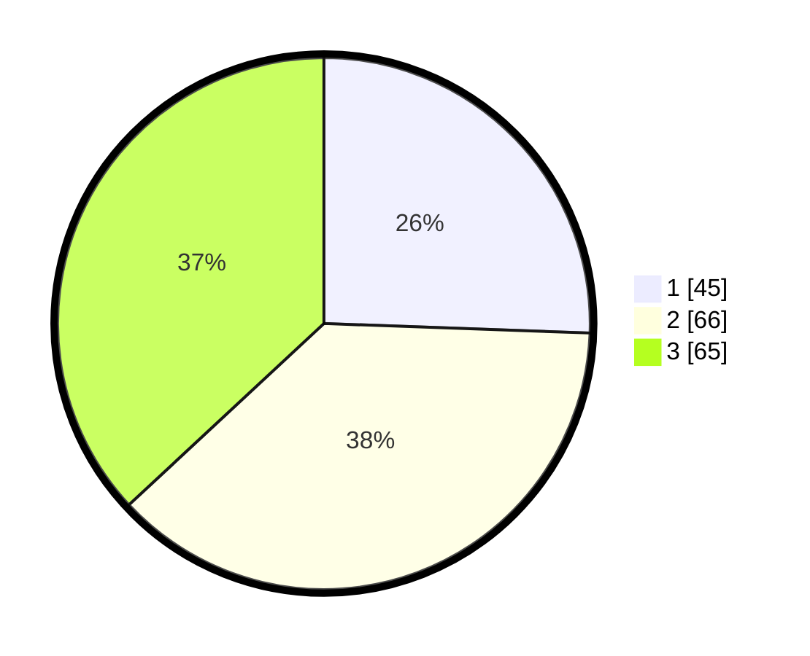

# Hasil

## Grafik

## Tabel

| No. | Nama Paslon    | Suara | Suara (raw) | Persentase |
|:--- |:-------------- | -----:| -----------:| ----------:|
| 1   | ANIES MUHAIMIN | 45    | [45][p-1]   | 25,57      |
| 2   | PRABOWO GIBRAN | 66    | [66][p-2]   | 37,50      |
| 3   | GANJAR MAHFUD  | 65    | [65][p-3]   | 36,93      |

[p-1]: https://github.com/gigit-pemilu/pemilu-2024-33-jawa-tengah/blob/main/pilpres/hitung-suara/sub/33-jawa-tengah/sub/07-wonosobo/sub/03-sapuran/sub/2009-jolontoro/sub/007-tps/sub/paslon-1.txt
[p-2]: https://github.com/gigit-pemilu/pemilu-2024-33-jawa-tengah/blob/main/pilpres/hitung-suara/sub/33-jawa-tengah/sub/07-wonosobo/sub/03-sapuran/sub/2009-jolontoro/sub/007-tps/sub/paslon-2.txt
[p-3]: https://github.com/gigit-pemilu/pemilu-2024-33-jawa-tengah/blob/main/pilpres/hitung-suara/sub/33-jawa-tengah/sub/07-wonosobo/sub/03-sapuran/sub/2009-jolontoro/sub/007-tps/sub/paslon-3.txt

## Foto C Plano

https://sirekap-obj-formc.kpu.go.id/da8b/pemilu/ppwp/33/07/03/20/09/3307032009007-20240214-233438--1f912dc9-c19a-4adb-b2c4-1f2d6beedc52.jpg

https://sirekap-obj-formc.kpu.go.id/da8b/pemilu/ppwp/33/07/03/20/09/3307032009007-20240214-233444--906f9924-affb-457c-b583-756822a879ab.jpg

https://sirekap-obj-formc.kpu.go.id/da8b/pemilu/ppwp/33/07/03/20/09/3307032009007-20240214-233655--303ec20f-a25c-4be6-ba7a-a687fd3cf243.jpg

## Metadata

| Key        | Value               |
| ---------- | ------------------- |
| Time Stamp | 2024-02-15 21:30:27 |

