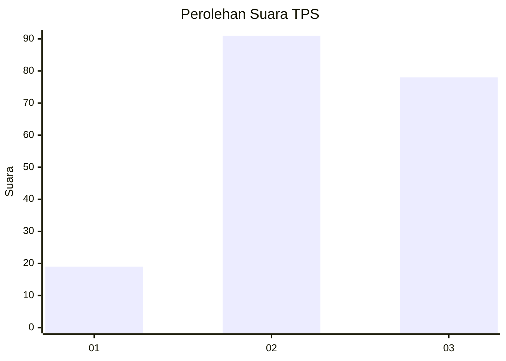
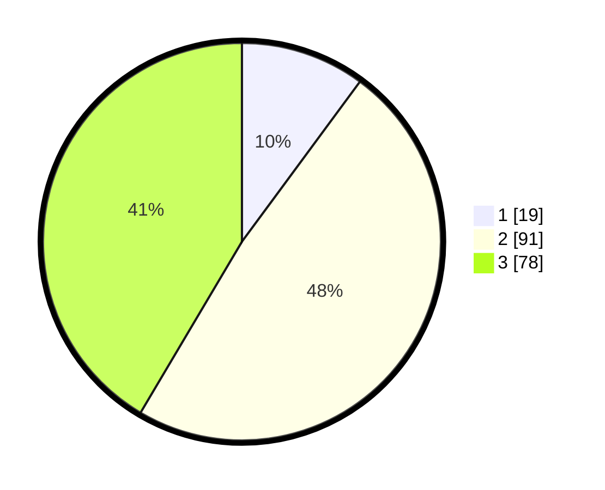

# Hasil

## Grafik

## Tabel

| No. | Nama Paslon    | Suara | Suara (raw) | Persentase |
|:--- |:-------------- | -----:| -----------:| ----------:|
| 1   | ANIES MUHAIMIN | 19    | [19][p-1]   | 10,11      |
| 2   | PRABOWO GIBRAN | 91    | [91][p-2]   | 48,40      |
| 3   | GANJAR MAHFUD  | 78    | [78][p-3]   | 41,49      |

[p-1]: https://github.com/gigit-pemilu/pemilu-2024/blob/main/pilpres/hitung-suara/sub/33-jawa-tengah/sub/07-wonosobo/sub/03-sapuran/sub/2010-sedayu/sub/003-tps/sub/paslon-1.txt
[p-2]: https://github.com/gigit-pemilu/pemilu-2024/blob/main/pilpres/hitung-suara/sub/33-jawa-tengah/sub/07-wonosobo/sub/03-sapuran/sub/2010-sedayu/sub/003-tps/sub/paslon-2.txt
[p-3]: https://github.com/gigit-pemilu/pemilu-2024/blob/main/pilpres/hitung-suara/sub/33-jawa-tengah/sub/07-wonosobo/sub/03-sapuran/sub/2010-sedayu/sub/003-tps/sub/paslon-3.txt

## Foto C Plano

https://sirekap-obj-formc.kpu.go.id/5a84/pemilu/ppwp/33/07/03/20/10/3307032010003-20240214-233918--63a588cd-3ec7-4cdc-8f8b-b4be8f38c027.jpg

https://sirekap-obj-formc.kpu.go.id/5a84/pemilu/ppwp/33/07/03/20/10/3307032010003-20240214-234026--616a6e2e-01e8-4338-8f76-2b6bfa1839c2.jpg

https://sirekap-obj-formc.kpu.go.id/5a84/pemilu/ppwp/33/07/03/20/10/3307032010003-20240214-234159--5cfdc141-eb97-4954-a4a4-9ab9f21657fa.jpg

## Metadata

| Key        | Value               |
| ---------- | ------------------- |
| Time Stamp | 2024-02-15 22:00:27 |

