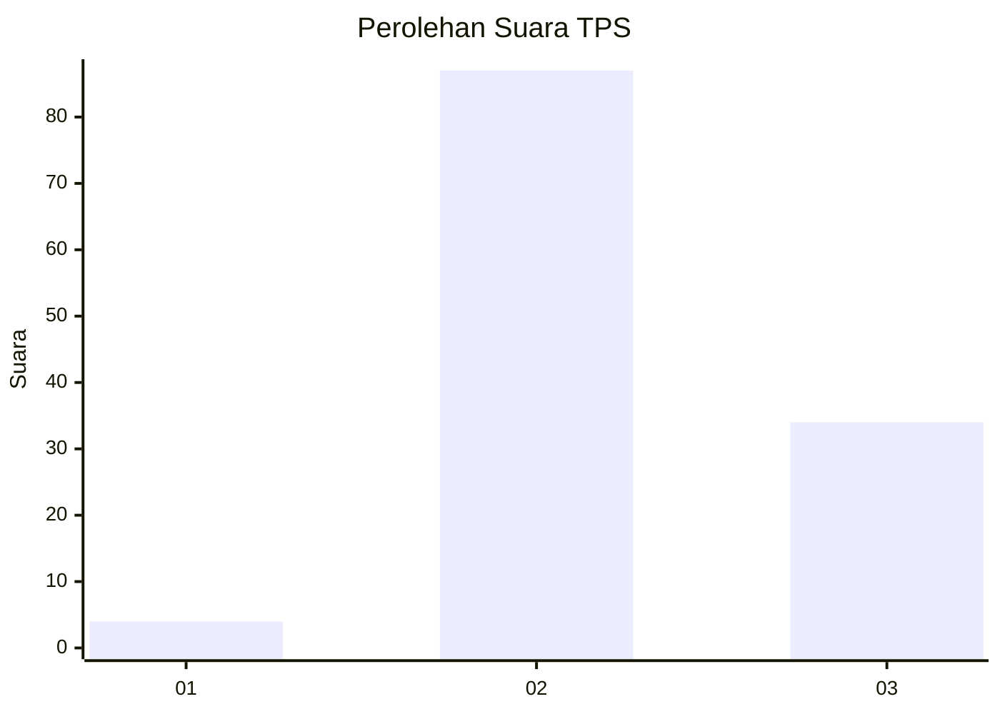
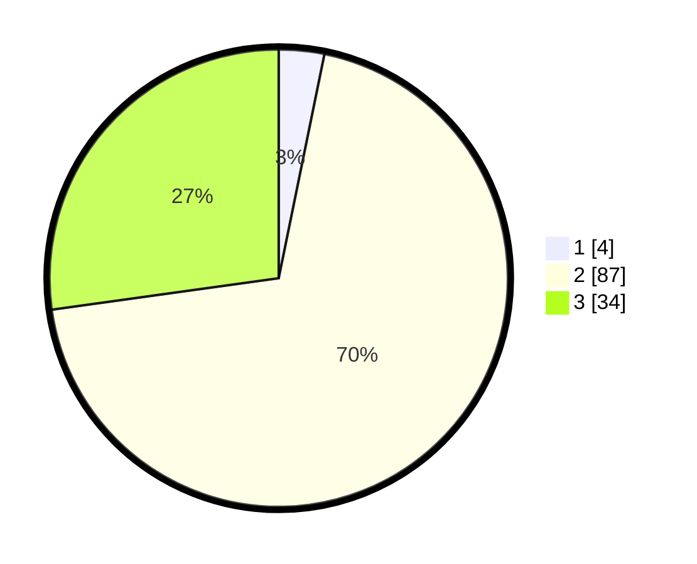

# Hasil

## Grafik

## Tabel

| No. | Nama Paslon    | Suara | Suara (raw) | Persentase |
|:--- |:-------------- | -----:| -----------:| ----------:|
| 1   | ANIES MUHAIMIN | 4     | [4][p-1]    | 3,20       |
| 2   | PRABOWO GIBRAN | 87    | [87][p-2]   | 69,60      |
| 3   | GANJAR MAHFUD  | 34    | [34][p-3]   | 27,20      |

[p-1]: https://github.com/gigit-pemilu/pemilu-2024-33-jawa-tengah/blob/main/pilpres/hitung-suara/sub/33-jawa-tengah/sub/07-wonosobo/sub/03-sapuran/sub/2010-sedayu/sub/022-tps/sub/paslon-1.txt
[p-2]: https://github.com/gigit-pemilu/pemilu-2024-33-jawa-tengah/blob/main/pilpres/hitung-suara/sub/33-jawa-tengah/sub/07-wonosobo/sub/03-sapuran/sub/2010-sedayu/sub/022-tps/sub/paslon-2.txt
[p-3]: https://github.com/gigit-pemilu/pemilu-2024-33-jawa-tengah/blob/main/pilpres/hitung-suara/sub/33-jawa-tengah/sub/07-wonosobo/sub/03-sapuran/sub/2010-sedayu/sub/022-tps/sub/paslon-3.txt

## Foto C Plano

https://sirekap-obj-formc.kpu.go.id/7f17/pemilu/ppwp/33/07/03/20/10/3307032010022-20240214-194235--837d912b-84d5-4a0e-868d-cd442e171998.jpg

https://sirekap-obj-formc.kpu.go.id/7f17/pemilu/ppwp/33/07/03/20/10/3307032010022-20240214-194249--dbaae054-8f23-419d-9414-21cd86a508b0.jpg

https://sirekap-obj-formc.kpu.go.id/7f17/pemilu/ppwp/33/07/03/20/10/3307032010022-20240214-194259--8660b2b9-e44f-4ef2-aeec-14afd0ec50e2.jpg

## Metadata

| Key        | Value               |
| ---------- | ------------------- |
| Time Stamp | 2024-02-15 00:41:44 |

