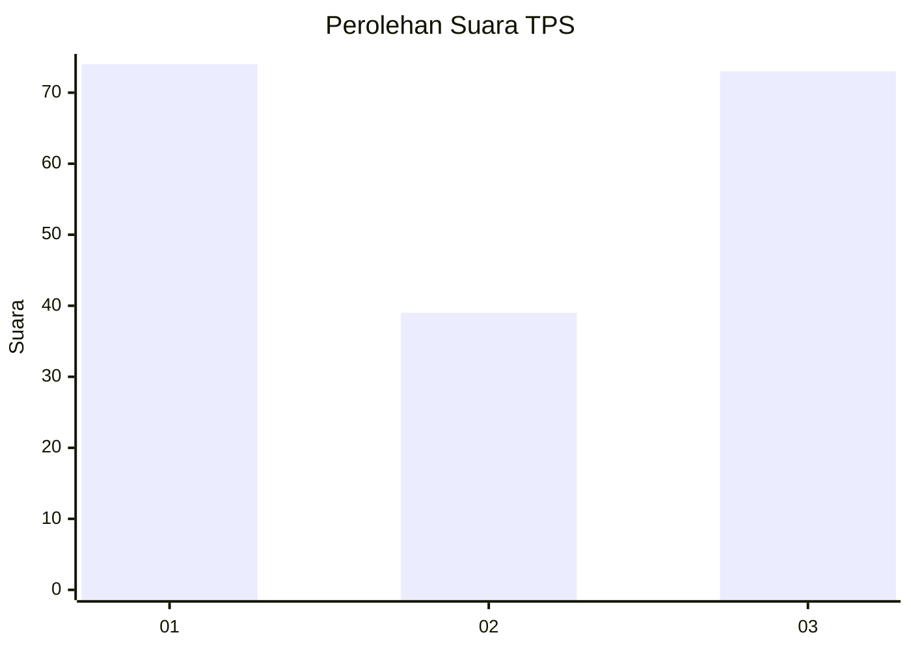
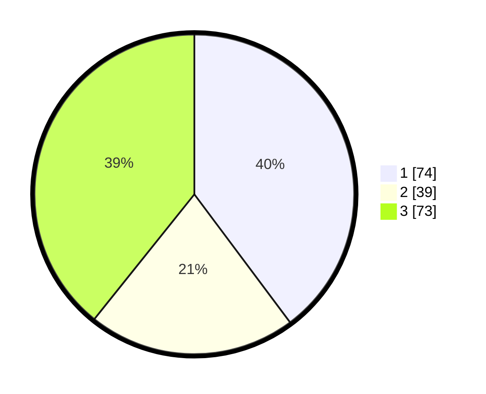

# Hasil

## Grafik

## Tabel

| No. | Nama Paslon    | Suara | Suara (raw) | Persentase |
|:--- |:-------------- | -----:| -----------:| ----------:|
| 1   | ANIES MUHAIMIN | 74    | [74][p-1]   | 39,78      |
| 2   | PRABOWO GIBRAN | 39    | [39][p-2]   | 20,97      |
| 3   | GANJAR MAHFUD  | 73    | [73][p-3]   | 39,25      |

[p-1]: https://github.com/gigit-pemilu/pemilu-2024/blob/main/pilpres/hitung-suara/sub/33-jawa-tengah/sub/07-wonosobo/sub/03-sapuran/sub/2015-banyumudal/sub/018-tps/sub/paslon-1.txt
[p-2]: https://github.com/gigit-pemilu/pemilu-2024/blob/main/pilpres/hitung-suara/sub/33-jawa-tengah/sub/07-wonosobo/sub/03-sapuran/sub/2015-banyumudal/sub/018-tps/sub/paslon-2.txt
[p-3]: https://github.com/gigit-pemilu/pemilu-2024/blob/main/pilpres/hitung-suara/sub/33-jawa-tengah/sub/07-wonosobo/sub/03-sapuran/sub/2015-banyumudal/sub/018-tps/sub/paslon-3.txt

## Foto C Plano

https://sirekap-obj-formc.kpu.go.id/db4c/pemilu/ppwp/33/07/03/20/15/3307032015018-20240214-204812--78ca5880-11d9-4d2f-bb1a-956ebc644817.jpg

https://sirekap-obj-formc.kpu.go.id/db4c/pemilu/ppwp/33/07/03/20/15/3307032015018-20240214-205119--837128b2-32de-420b-8ce0-3d7bb73d2c66.jpg

https://sirekap-obj-formc.kpu.go.id/db4c/pemilu/ppwp/33/07/03/20/15/3307032015018-20240214-205718--a9dee159-755b-4a92-8b39-0e9cdf84cf0f.jpg

## Metadata

| Key        | Value               |
| ---------- | ------------------- |
| Time Stamp | 2024-02-15 12:00:28 |

