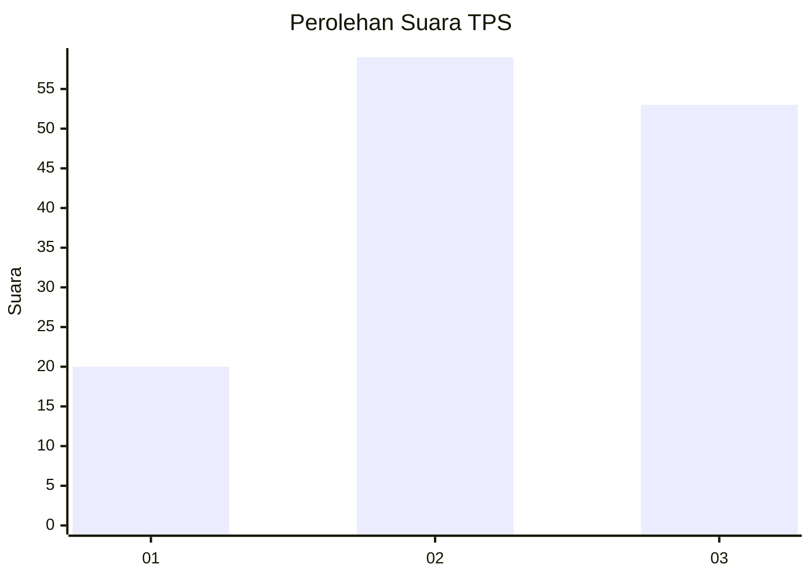
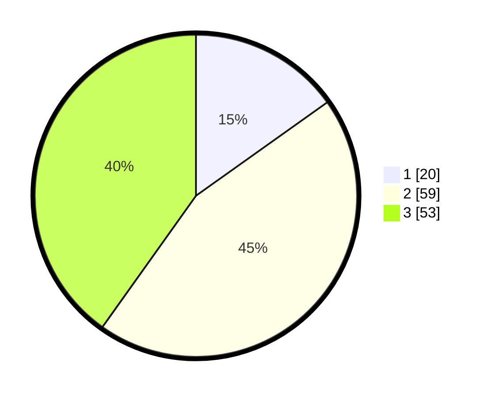

# Hasil

## Grafik

## Tabel

| No. | Nama Paslon    | Suara | Suara (raw) | Persentase |
|:--- |:-------------- | -----:| -----------:| ----------:|
| 1   | ANIES MUHAIMIN | 20    | [20][p-1]   | 15,15      |
| 2   | PRABOWO GIBRAN | 59    | [59][p-2]   | 44,70      |
| 3   | GANJAR MAHFUD  | 53    | [53][p-3]   | 40,15      |

[p-1]: https://github.com/gigit-pemilu/pemilu-2024/blob/main/pilpres/hitung-suara/sub/33-jawa-tengah/sub/07-wonosobo/sub/03-sapuran/sub/2016-ngadikerso/sub/001-tps/sub/paslon-1.txt
[p-2]: https://github.com/gigit-pemilu/pemilu-2024/blob/main/pilpres/hitung-suara/sub/33-jawa-tengah/sub/07-wonosobo/sub/03-sapuran/sub/2016-ngadikerso/sub/001-tps/sub/paslon-2.txt
[p-3]: https://github.com/gigit-pemilu/pemilu-2024/blob/main/pilpres/hitung-suara/sub/33-jawa-tengah/sub/07-wonosobo/sub/03-sapuran/sub/2016-ngadikerso/sub/001-tps/sub/paslon-3.txt

## Foto C Plano

https://sirekap-obj-formc.kpu.go.id/d8ce/pemilu/ppwp/33/07/03/20/16/3307032016001-20240214-140956--16673d52-f3a7-484d-a31e-8068d86de3a1.jpg

https://sirekap-obj-formc.kpu.go.id/d8ce/pemilu/ppwp/33/07/03/20/16/3307032016001-20240214-141101--4521f7a8-6e36-451b-bc00-765a97c748db.jpg

https://sirekap-obj-formc.kpu.go.id/d8ce/pemilu/ppwp/33/07/03/20/16/3307032016001-20240214-141129--a216bf13-8351-4ffb-9d81-57374cb51186.jpg

## Metadata

| Key        | Value               |
| ---------- | ------------------- |
| Time Stamp | 2024-02-15 00:41:44 |

