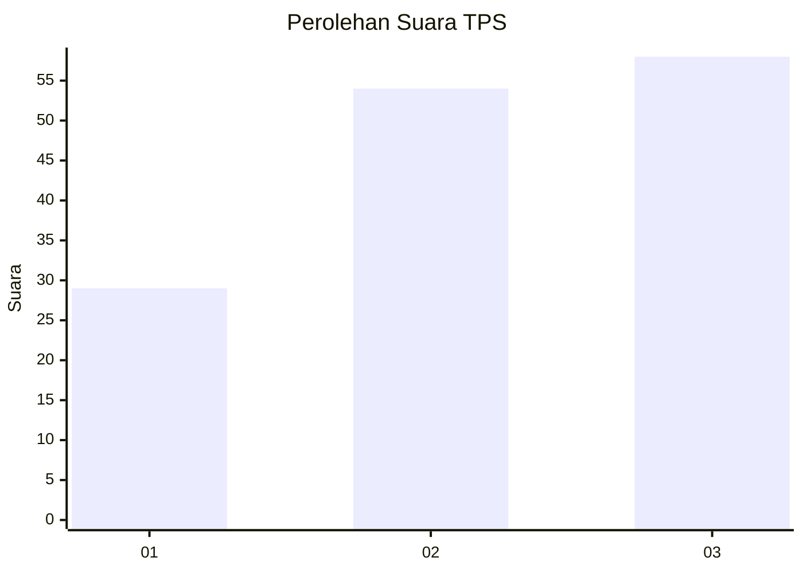
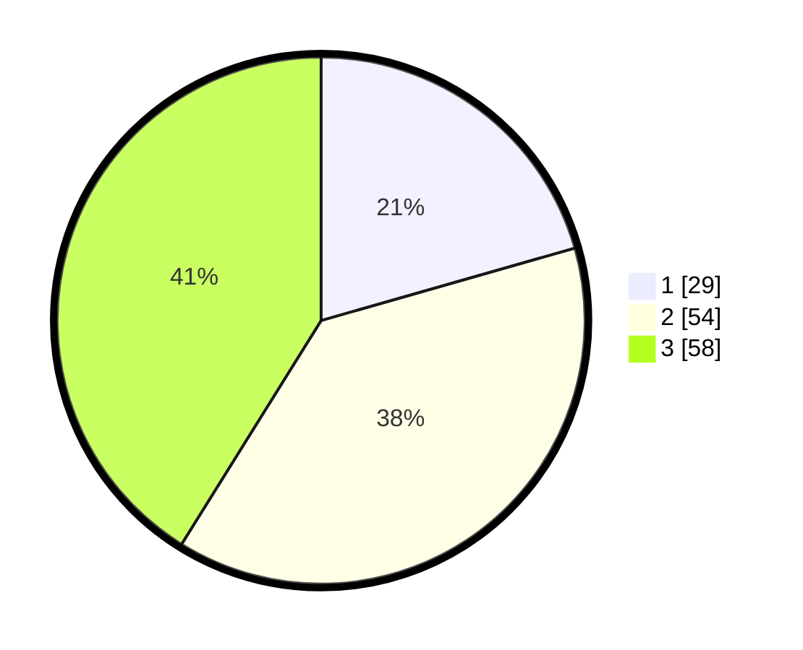

# Hasil

## Grafik

## Tabel

| No. | Nama Paslon    | Suara | Suara (raw) | Persentase |
|:--- |:-------------- | -----:| -----------:| ----------:|
| 1   | ANIES MUHAIMIN | 29    | [29][p-1]   | 20,57      |
| 2   | PRABOWO GIBRAN | 54    | [54][p-2]   | 38,30      |
| 3   | GANJAR MAHFUD  | 58    | [58][p-3]   | 41,13      |

[p-1]: https://github.com/gigit-pemilu/pemilu-2024-33-jawa-tengah/blob/main/pilpres/hitung-suara/sub/33-jawa-tengah/sub/07-wonosobo/sub/03-sapuran/sub/2016-ngadikerso/sub/008-tps/sub/paslon-1.txt
[p-2]: https://github.com/gigit-pemilu/pemilu-2024-33-jawa-tengah/blob/main/pilpres/hitung-suara/sub/33-jawa-tengah/sub/07-wonosobo/sub/03-sapuran/sub/2016-ngadikerso/sub/008-tps/sub/paslon-2.txt
[p-3]: https://github.com/gigit-pemilu/pemilu-2024-33-jawa-tengah/blob/main/pilpres/hitung-suara/sub/33-jawa-tengah/sub/07-wonosobo/sub/03-sapuran/sub/2016-ngadikerso/sub/008-tps/sub/paslon-3.txt

## Foto C Plano

https://sirekap-obj-formc.kpu.go.id/3e06/pemilu/ppwp/33/07/03/20/16/3307032016008-20240214-215231--88731c36-937e-457f-8eee-e9bfd45568a0.jpg

https://sirekap-obj-formc.kpu.go.id/3e06/pemilu/ppwp/33/07/03/20/16/3307032016008-20240214-215349--bd43797c-298b-4205-be0e-21d0241ccb92.jpg

https://sirekap-obj-formc.kpu.go.id/3e06/pemilu/ppwp/33/07/03/20/16/3307032016008-20240214-215218--8d6543cb-6764-462e-b4b5-71a5361b8083.jpg

## Metadata

| Key        | Value               |
| ---------- | ------------------- |
| Time Stamp | 2024-02-15 22:00:27 |

