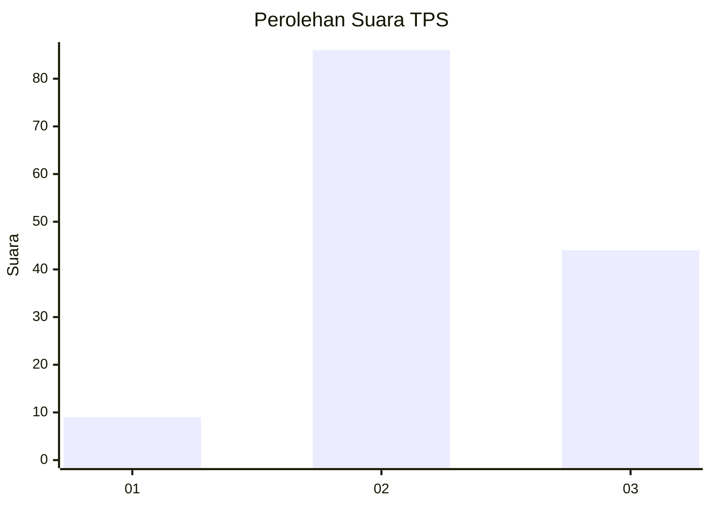
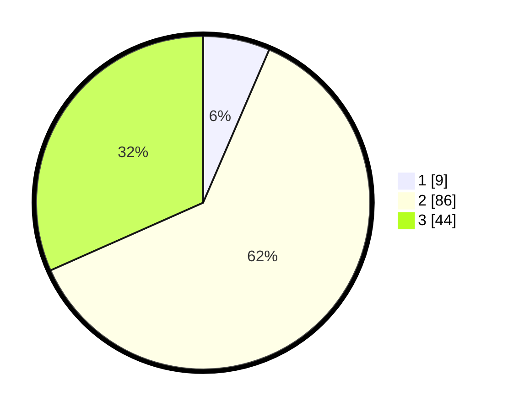

# Hasil

## Grafik

## Tabel

| No. | Nama Paslon    | Suara | Suara (raw) | Persentase |
|:--- |:-------------- | -----:| -----------:| ----------:|
| 1   | ANIES MUHAIMIN | 9     | [9][p-1]    | 6,47       |
| 2   | PRABOWO GIBRAN | 86    | [86][p-2]   | 61,87      |
| 3   | GANJAR MAHFUD  | 44    | [44][p-3]   | 31,65      |

[p-1]: https://github.com/gigit-pemilu/pemilu-2024-33-jawa-tengah/blob/main/pilpres/hitung-suara/sub/33-jawa-tengah/sub/07-wonosobo/sub/03-sapuran/sub/2017-rimpak/sub/005-tps/sub/paslon-1.txt
[p-2]: https://github.com/gigit-pemilu/pemilu-2024-33-jawa-tengah/blob/main/pilpres/hitung-suara/sub/33-jawa-tengah/sub/07-wonosobo/sub/03-sapuran/sub/2017-rimpak/sub/005-tps/sub/paslon-2.txt
[p-3]: https://github.com/gigit-pemilu/pemilu-2024-33-jawa-tengah/blob/main/pilpres/hitung-suara/sub/33-jawa-tengah/sub/07-wonosobo/sub/03-sapuran/sub/2017-rimpak/sub/005-tps/sub/paslon-3.txt

## Foto C Plano

https://sirekap-obj-formc.kpu.go.id/ae6f/pemilu/ppwp/33/07/03/20/17/3307032017005-20240215-001004--59c76cb7-dc40-455b-b219-eb934a1afc0e.jpg

https://sirekap-obj-formc.kpu.go.id/ae6f/pemilu/ppwp/33/07/03/20/17/3307032017005-20240215-001049--58001059-ce9f-437f-90dc-9aaca633c0f5.jpg

https://sirekap-obj-formc.kpu.go.id/ae6f/pemilu/ppwp/33/07/03/20/17/3307032017005-20240215-001145--1f8e46af-55b2-4cdd-a49c-b802c47290a7.jpg

## Metadata

| Key        | Value               |
| ---------- | ------------------- |
| Time Stamp | 2024-02-15 21:30:27 |

