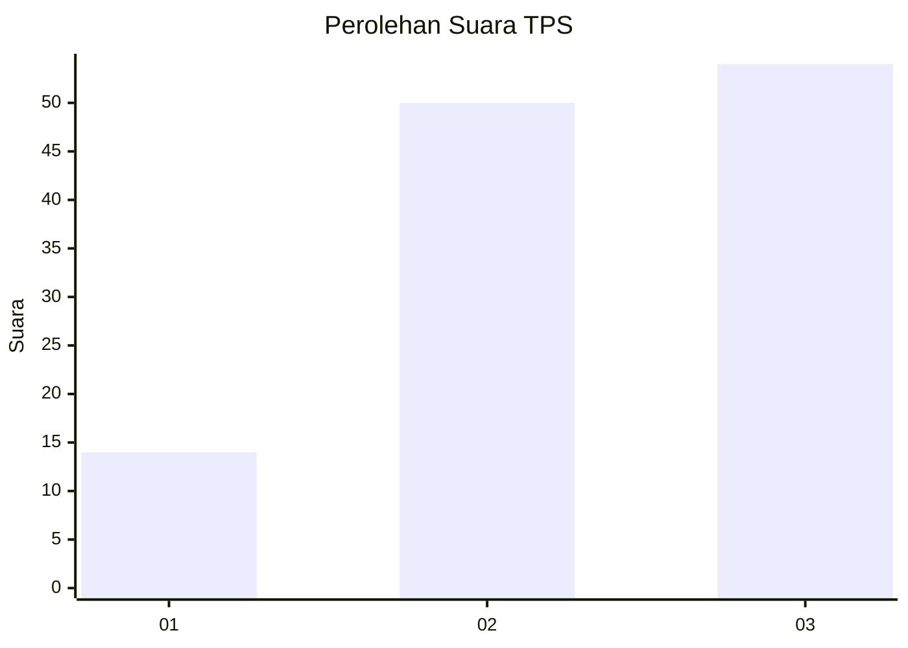
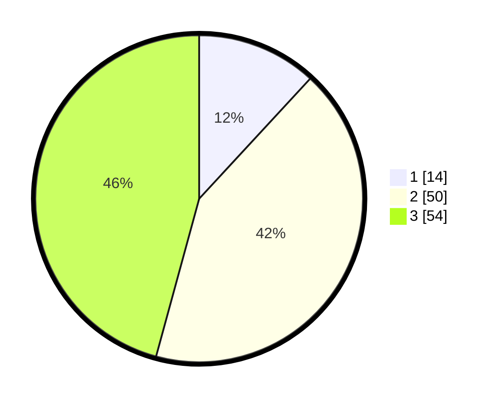

# Hasil

## Grafik

## Tabel

| No. | Nama Paslon    | Suara | Suara (raw) | Persentase |
|:--- |:-------------- | -----:| -----------:| ----------:|
| 1   | ANIES MUHAIMIN | 14    | [14][p-1]   | 11,86      |
| 2   | PRABOWO GIBRAN | 50    | [50][p-2]   | 42,37      |
| 3   | GANJAR MAHFUD  | 54    | [54][p-3]   | 45,76      |

[p-1]: https://github.com/gigit-pemilu/pemilu-2024-33-jawa-tengah/blob/main/pilpres/hitung-suara/sub/33-jawa-tengah/sub/07-wonosobo/sub/03-sapuran/sub/2017-rimpak/sub/008-tps/sub/paslon-1.txt
[p-2]: https://github.com/gigit-pemilu/pemilu-2024-33-jawa-tengah/blob/main/pilpres/hitung-suara/sub/33-jawa-tengah/sub/07-wonosobo/sub/03-sapuran/sub/2017-rimpak/sub/008-tps/sub/paslon-2.txt
[p-3]: https://github.com/gigit-pemilu/pemilu-2024-33-jawa-tengah/blob/main/pilpres/hitung-suara/sub/33-jawa-tengah/sub/07-wonosobo/sub/03-sapuran/sub/2017-rimpak/sub/008-tps/sub/paslon-3.txt

## Foto C Plano

https://sirekap-obj-formc.kpu.go.id/43f5/pemilu/ppwp/33/07/03/20/17/3307032017008-20240215-013355--ec96bf64-9461-45bf-aa66-aaa19617759e.jpg

https://sirekap-obj-formc.kpu.go.id/43f5/pemilu/ppwp/33/07/03/20/17/3307032017008-20240215-013600--a54275a0-8e96-44ee-a7b0-656cd4d4ce25.jpg

https://sirekap-obj-formc.kpu.go.id/43f5/pemilu/ppwp/33/07/03/20/17/3307032017008-20240215-013831--08c17cc5-7b22-40d3-b58d-f3e5429da91f.jpg

## Metadata

| Key        | Value               |
| ---------- | ------------------- |
| Time Stamp | 2024-02-15 21:30:27 |

