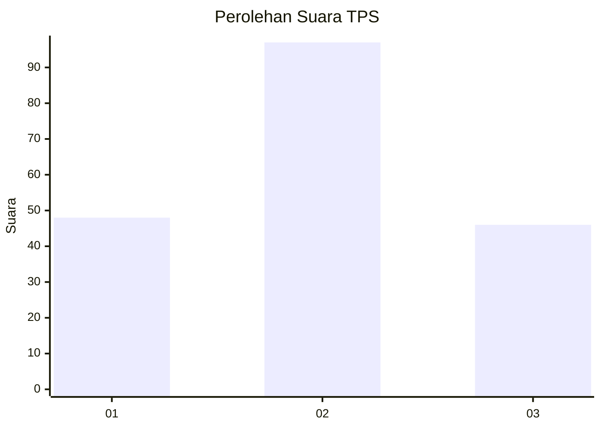
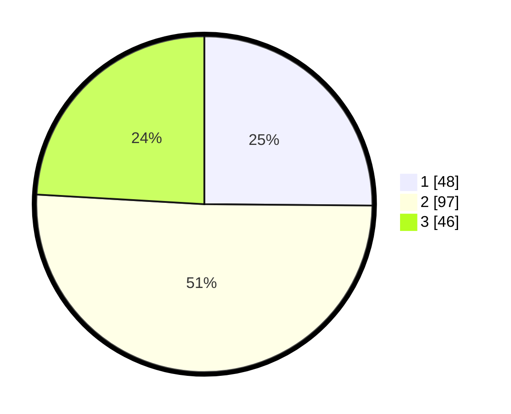

# Hasil

## Grafik

## Tabel

| No. | Nama Paslon    | Suara | Suara (raw) | Persentase |
|:--- |:-------------- | -----:| -----------:| ----------:|
| 1   | ANIES MUHAIMIN | 48    | [48][p-1]   | 25,13      |
| 2   | PRABOWO GIBRAN | 97    | [97][p-2]   | 50,79      |
| 3   | GANJAR MAHFUD  | 46    | [46][p-3]   | 24,08      |

[p-1]: https://github.com/gigit-pemilu/pemilu-2024/blob/main/pilpres/hitung-suara/sub/33-jawa-tengah/sub/07-wonosobo/sub/04-kaliwiro/sub/1015-kaliwiro/sub/005-tps/sub/paslon-1.txt
[p-2]: https://github.com/gigit-pemilu/pemilu-2024/blob/main/pilpres/hitung-suara/sub/33-jawa-tengah/sub/07-wonosobo/sub/04-kaliwiro/sub/1015-kaliwiro/sub/005-tps/sub/paslon-2.txt
[p-3]: https://github.com/gigit-pemilu/pemilu-2024/blob/main/pilpres/hitung-suara/sub/33-jawa-tengah/sub/07-wonosobo/sub/04-kaliwiro/sub/1015-kaliwiro/sub/005-tps/sub/paslon-3.txt

## Foto C Plano

https://sirekap-obj-formc.kpu.go.id/20eb/pemilu/ppwp/33/07/04/10/15/3307041015005-20240214-231714--b21ffcc7-dc2e-495e-8282-6c61ca550db9.jpg

https://sirekap-obj-formc.kpu.go.id/20eb/pemilu/ppwp/33/07/04/10/15/3307041015005-20240214-232213--d9cff5b7-85d5-499f-bafc-4cf56b00bf0c.jpg

https://sirekap-obj-formc.kpu.go.id/20eb/pemilu/ppwp/33/07/04/10/15/3307041015005-20240214-232352--4507fba7-7206-4037-aacf-c97f0ac97a9d.jpg

## Metadata

| Key        | Value               |
| ---------- | ------------------- |
| Time Stamp | 2024-02-16 14:30:33 |

