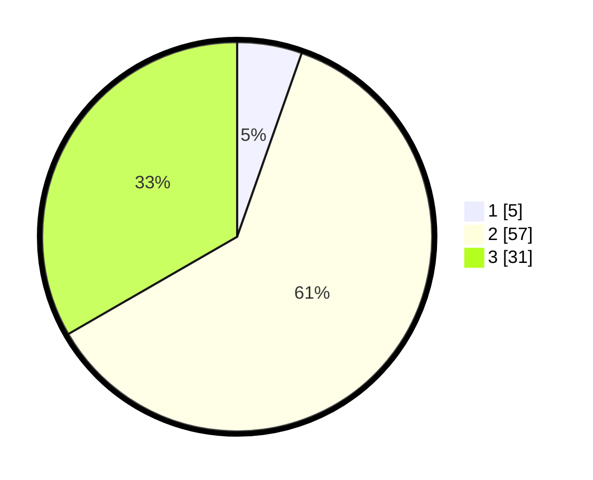

# Hasil

## Grafik

## Tabel

| No. | Nama Paslon    | Suara | Suara (raw) | Persentase |
|:--- |:-------------- | -----:| -----------:| ----------:|
| 1   | ANIES MUHAIMIN | 5     | [5][p-1]    | 5,38       |
| 2   | PRABOWO GIBRAN | 57    | [57][p-2]   | 61,29      |
| 3   | GANJAR MAHFUD  | 31    | [31][p-3]   | 33,33      |

[p-1]: https://github.com/gigit-pemilu/pemilu-2024-33-jawa-tengah/blob/main/pilpres/hitung-suara/sub/33-jawa-tengah/sub/07-wonosobo/sub/04-kaliwiro/sub/2001-selomanik/sub/008-tps/sub/paslon-1.txt
[p-2]: https://github.com/gigit-pemilu/pemilu-2024-33-jawa-tengah/blob/main/pilpres/hitung-suara/sub/33-jawa-tengah/sub/07-wonosobo/sub/04-kaliwiro/sub/2001-selomanik/sub/008-tps/sub/paslon-2.txt
[p-3]: https://github.com/gigit-pemilu/pemilu-2024-33-jawa-tengah/blob/main/pilpres/hitung-suara/sub/33-jawa-tengah/sub/07-wonosobo/sub/04-kaliwiro/sub/2001-selomanik/sub/008-tps/sub/paslon-3.txt

## Foto C Plano

https://sirekap-obj-formc.kpu.go.id/20fc/pemilu/ppwp/33/07/04/20/01/3307042001008-20240215-012755--a0e33815-d8e6-46ab-97e3-686bfccdc68a.jpg

https://sirekap-obj-formc.kpu.go.id/20fc/pemilu/ppwp/33/07/04/20/01/3307042001008-20240215-013120--f3641927-3696-4585-9212-f1763708ac03.jpg

https://sirekap-obj-formc.kpu.go.id/20fc/pemilu/ppwp/33/07/04/20/01/3307042001008-20240215-013307--94b87d12-930e-4921-a847-cca6ecbf77c8.jpg

## Metadata

| Key        | Value               |
| ---------- | ------------------- |
| Time Stamp | 2024-02-15 15:00:29 |

