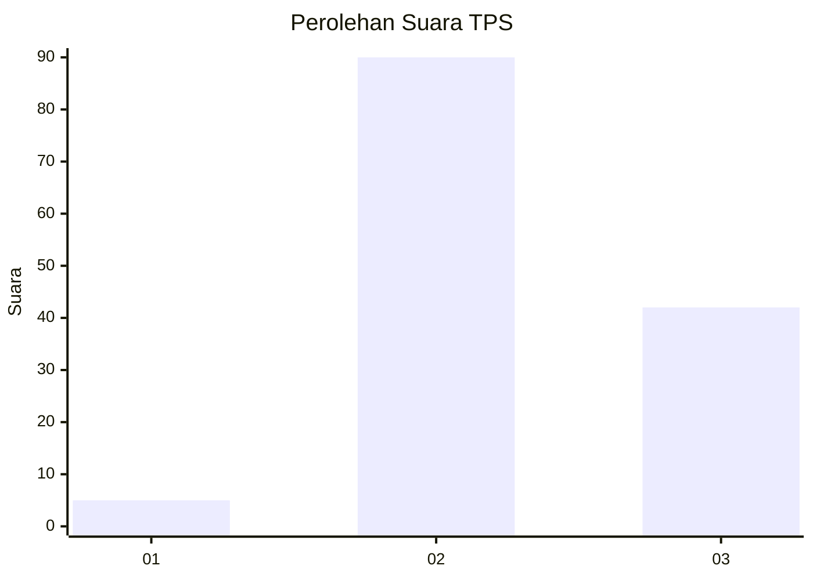
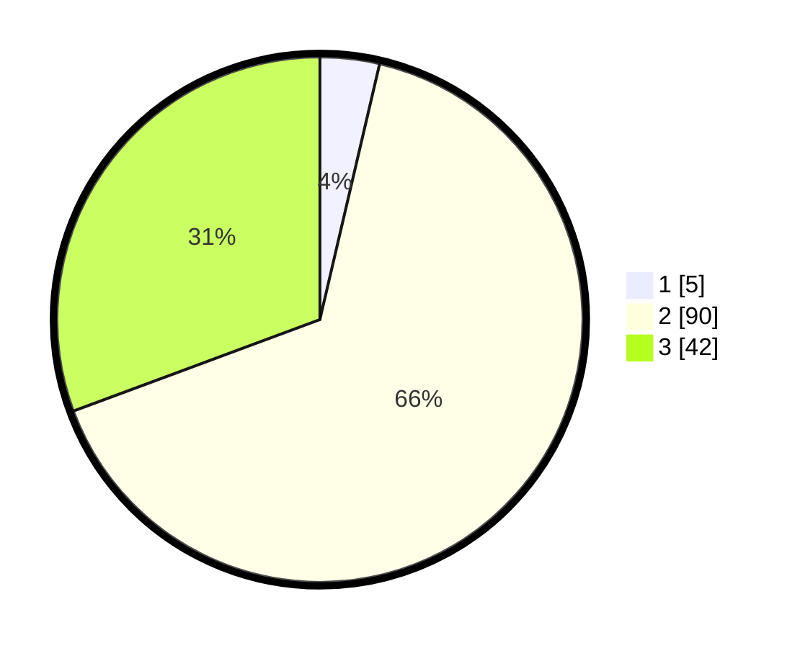

# Hasil

## Grafik

## Tabel

| No. | Nama Paslon    | Suara | Suara (raw) | Persentase |
|:--- |:-------------- | -----:| -----------:| ----------:|
| 1   | ANIES MUHAIMIN | 5     | [5][p-1]    | 3,65       |
| 2   | PRABOWO GIBRAN | 90    | [90][p-2]   | 65,69      |
| 3   | GANJAR MAHFUD  | 42    | [42][p-3]   | 30,66      |

[p-1]: https://github.com/gigit-pemilu/pemilu-2024-33-jawa-tengah/blob/main/pilpres/hitung-suara/sub/33-jawa-tengah/sub/07-wonosobo/sub/04-kaliwiro/sub/2005-lebak/sub/004-tps/sub/paslon-1.txt
[p-2]: https://github.com/gigit-pemilu/pemilu-2024-33-jawa-tengah/blob/main/pilpres/hitung-suara/sub/33-jawa-tengah/sub/07-wonosobo/sub/04-kaliwiro/sub/2005-lebak/sub/004-tps/sub/paslon-2.txt
[p-3]: https://github.com/gigit-pemilu/pemilu-2024-33-jawa-tengah/blob/main/pilpres/hitung-suara/sub/33-jawa-tengah/sub/07-wonosobo/sub/04-kaliwiro/sub/2005-lebak/sub/004-tps/sub/paslon-3.txt

## Foto C Plano

https://sirekap-obj-formc.kpu.go.id/394f/pemilu/ppwp/33/07/04/20/05/3307042005004-20240214-214133--0fc849f7-ef35-4448-8b22-102a6104f3e1.jpg

https://sirekap-obj-formc.kpu.go.id/394f/pemilu/ppwp/33/07/04/20/05/3307042005004-20240214-214234--4313acda-f2a9-4f87-b5a5-ede4817e5fc8.jpg

https://sirekap-obj-formc.kpu.go.id/394f/pemilu/ppwp/33/07/04/20/05/3307042005004-20240214-214627--d8992bf0-f071-4ea4-823b-f055ee9b30d4.jpg

## Metadata

| Key        | Value               |
| ---------- | ------------------- |
| Time Stamp | 2024-02-24 22:31:28 |

