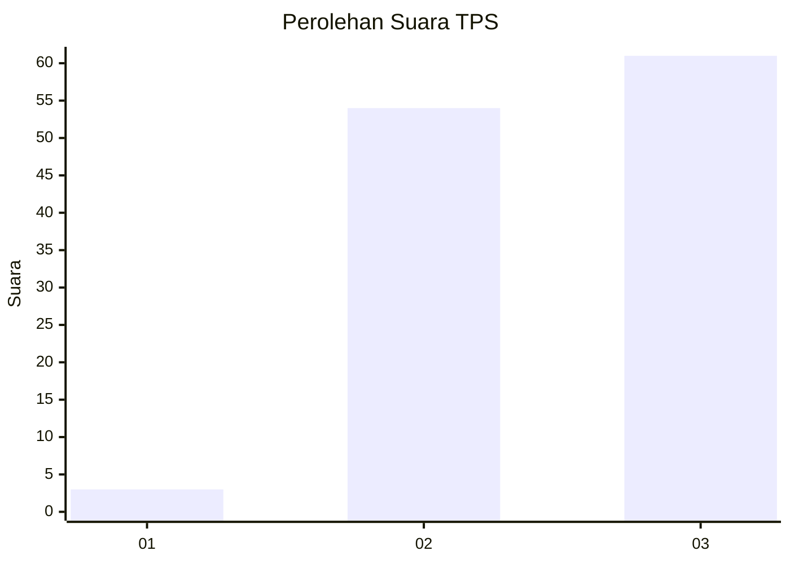
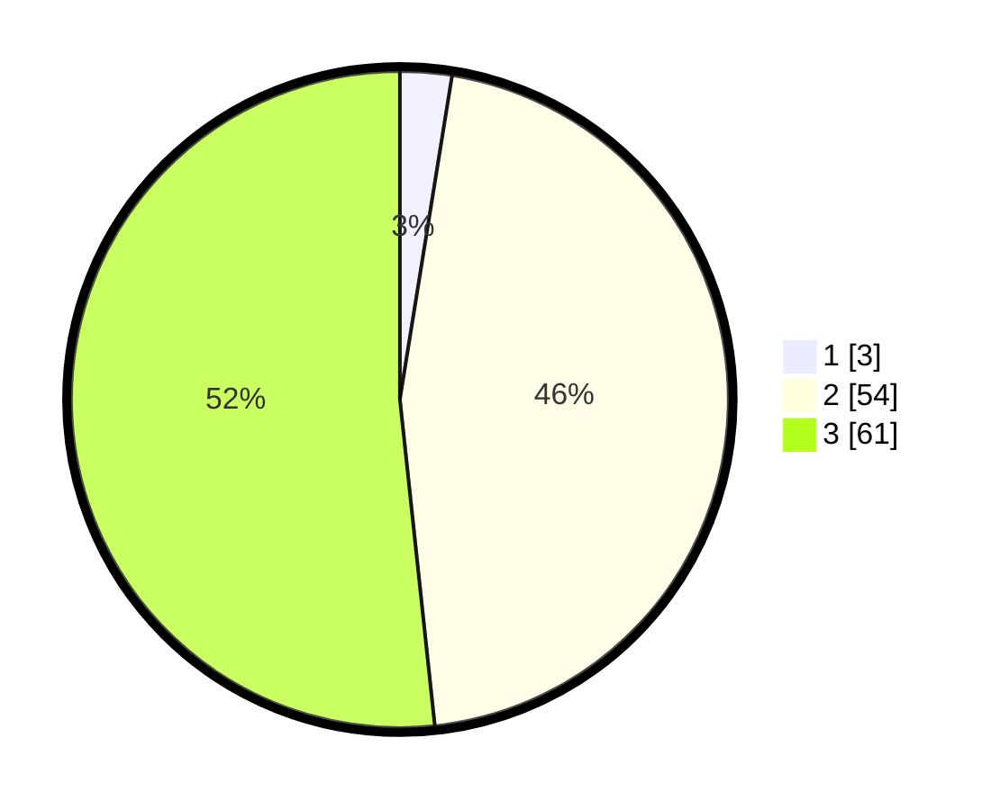

# Hasil

## Grafik

## Tabel

| No. | Nama Paslon    | Suara | Suara (raw) | Persentase |
|:--- |:-------------- | -----:| -----------:| ----------:|
| 1   | ANIES MUHAIMIN | 3     | [3][p-1]    | 2,54       |
| 2   | PRABOWO GIBRAN | 54    | [54][p-2]   | 45,76      |
| 3   | GANJAR MAHFUD  | 61    | [61][p-3]   | 51,69      |

[p-1]: https://github.com/gigit-pemilu/pemilu-2024/blob/main/pilpres/hitung-suara/sub/33-jawa-tengah/sub/07-wonosobo/sub/04-kaliwiro/sub/2008-pesodongan/sub/002-tps/sub/paslon-1.txt
[p-2]: https://github.com/gigit-pemilu/pemilu-2024/blob/main/pilpres/hitung-suara/sub/33-jawa-tengah/sub/07-wonosobo/sub/04-kaliwiro/sub/2008-pesodongan/sub/002-tps/sub/paslon-2.txt
[p-3]: https://github.com/gigit-pemilu/pemilu-2024/blob/main/pilpres/hitung-suara/sub/33-jawa-tengah/sub/07-wonosobo/sub/04-kaliwiro/sub/2008-pesodongan/sub/002-tps/sub/paslon-3.txt

## Foto C Plano

https://sirekap-obj-formc.kpu.go.id/11ce/pemilu/ppwp/33/07/04/20/08/3307042008002-20240214-141008--0a90fca3-4e0b-4b6e-8e1a-8912fdbc7165.jpg

https://sirekap-obj-formc.kpu.go.id/11ce/pemilu/ppwp/33/07/04/20/08/3307042008002-20240214-225834--e8a392a0-c86f-438c-a6ca-193ac293c7ef.jpg

https://sirekap-obj-formc.kpu.go.id/11ce/pemilu/ppwp/33/07/04/20/08/3307042008002-20240214-140953--9d50feb5-657e-43e8-89f7-ffba2ef228d1.jpg

## Metadata

| Key        | Value               |
| ---------- | ------------------- |
| Time Stamp | 2024-02-25 19:00:00 |

