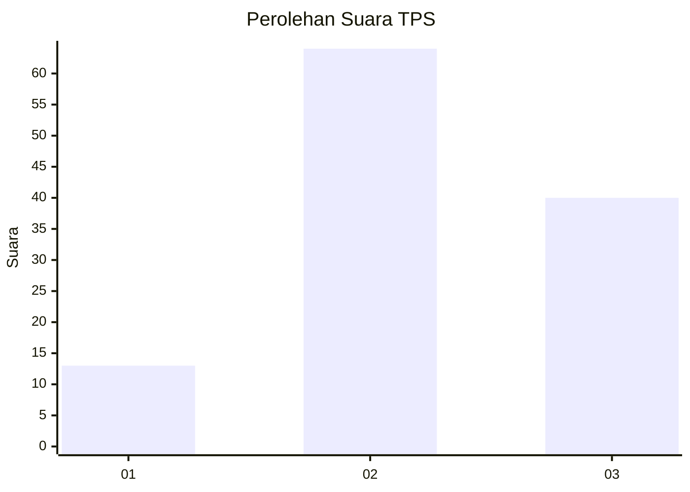
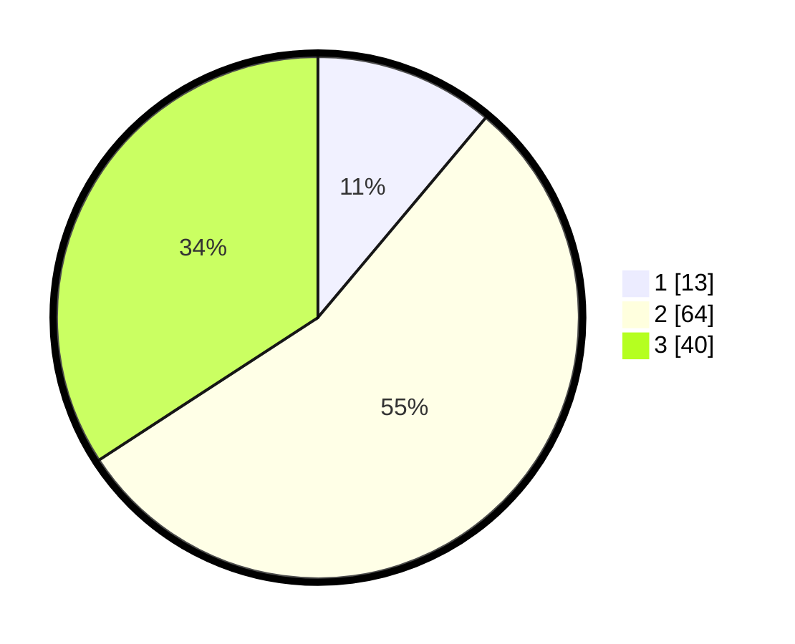

# Hasil

## Grafik

## Tabel

| No. | Nama Paslon    | Suara | Suara (raw) | Persentase |
|:--- |:-------------- | -----:| -----------:| ----------:|
| 1   | ANIES MUHAIMIN | 13    | [13][p-1]   | 11,11      |
| 2   | PRABOWO GIBRAN | 64    | [64][p-2]   | 54,70      |
| 3   | GANJAR MAHFUD  | 40    | [40][p-3]   | 34,19      |

[p-1]: https://github.com/gigit-pemilu/pemilu-2024-33-jawa-tengah/blob/main/pilpres/hitung-suara/sub/33-jawa-tengah/sub/07-wonosobo/sub/04-kaliwiro/sub/2009-lamuk/sub/001-tps/sub/paslon-1.txt
[p-2]: https://github.com/gigit-pemilu/pemilu-2024-33-jawa-tengah/blob/main/pilpres/hitung-suara/sub/33-jawa-tengah/sub/07-wonosobo/sub/04-kaliwiro/sub/2009-lamuk/sub/001-tps/sub/paslon-2.txt
[p-3]: https://github.com/gigit-pemilu/pemilu-2024-33-jawa-tengah/blob/main/pilpres/hitung-suara/sub/33-jawa-tengah/sub/07-wonosobo/sub/04-kaliwiro/sub/2009-lamuk/sub/001-tps/sub/paslon-3.txt

## Foto C Plano

https://sirekap-obj-formc.kpu.go.id/a1ac/pemilu/ppwp/33/07/04/20/09/3307042009001-20240214-160127--5b55452f-6b53-4bdb-bccc-ef6399e2cac3.jpg

https://sirekap-obj-formc.kpu.go.id/a1ac/pemilu/ppwp/33/07/04/20/09/3307042009001-20240214-191410--834b22d0-f79d-4ddc-bde9-5726ee6a9811.jpg

https://sirekap-obj-formc.kpu.go.id/a1ac/pemilu/ppwp/33/07/04/20/09/3307042009001-20240214-191517--dea73987-2aa3-40e1-a295-4f340ede3152.jpg

## Metadata

| Key        | Value               |
| ---------- | ------------------- |
| Time Stamp | 2024-02-14 21:46:01 |

