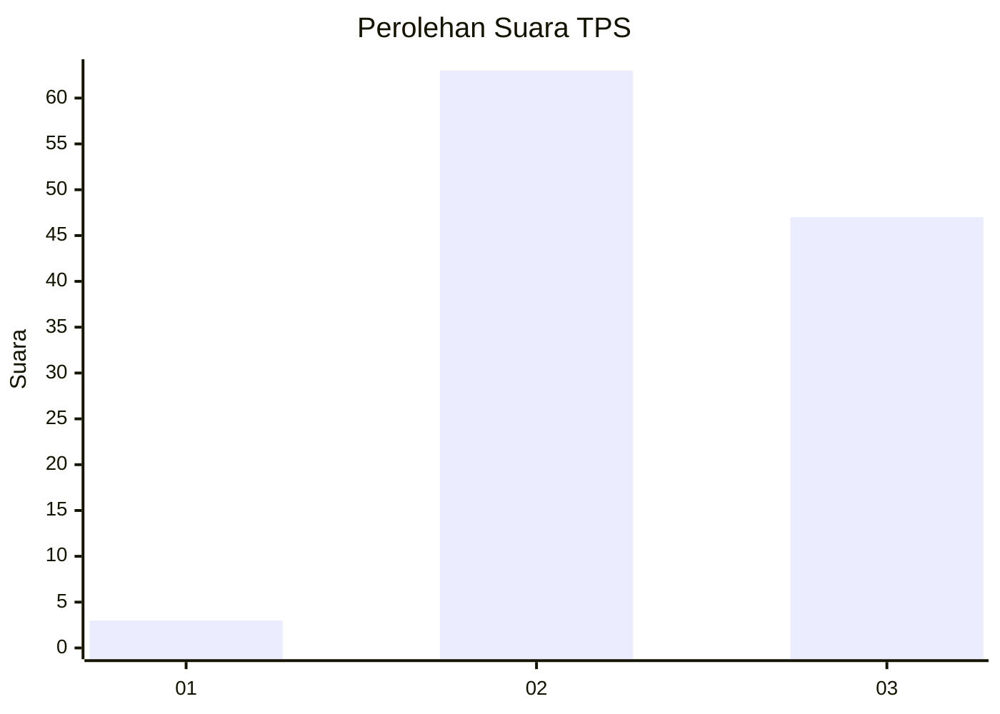
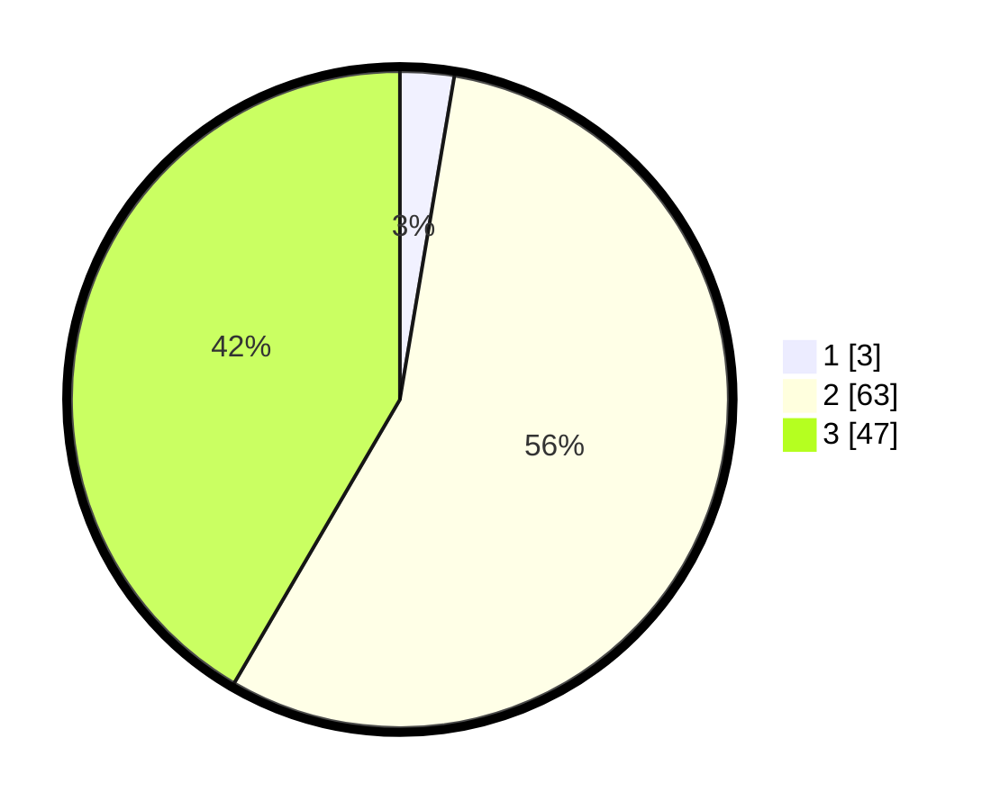

# Hasil

## Grafik

## Tabel

| No. | Nama Paslon    | Suara | Suara (raw) | Persentase |
|:--- |:-------------- | -----:| -----------:| ----------:|
| 1   | ANIES MUHAIMIN | 3     | [3][p-1]    | 2,65       |
| 2   | PRABOWO GIBRAN | 63    | [63][p-2]   | 55,75      |
| 3   | GANJAR MAHFUD  | 47    | [47][p-3]   | 41,59      |

[p-1]: https://github.com/gigit-pemilu/pemilu-2024-33-jawa-tengah/blob/main/pilpres/hitung-suara/sub/33-jawa-tengah/sub/07-wonosobo/sub/04-kaliwiro/sub/2009-lamuk/sub/014-tps/sub/paslon-1.txt
[p-2]: https://github.com/gigit-pemilu/pemilu-2024-33-jawa-tengah/blob/main/pilpres/hitung-suara/sub/33-jawa-tengah/sub/07-wonosobo/sub/04-kaliwiro/sub/2009-lamuk/sub/014-tps/sub/paslon-2.txt
[p-3]: https://github.com/gigit-pemilu/pemilu-2024-33-jawa-tengah/blob/main/pilpres/hitung-suara/sub/33-jawa-tengah/sub/07-wonosobo/sub/04-kaliwiro/sub/2009-lamuk/sub/014-tps/sub/paslon-3.txt

## Foto C Plano

https://sirekap-obj-formc.kpu.go.id/a80a/pemilu/ppwp/33/07/04/20/09/3307042009014-20240220-133311--d25d0a18-0fd3-4e6d-b6e2-11bbf9d912b4.jpg

https://sirekap-obj-formc.kpu.go.id/a80a/pemilu/ppwp/33/07/04/20/09/3307042009014-20240220-133545--04661f1f-37af-4064-b202-5eb5726eb70c.jpg

https://sirekap-obj-formc.kpu.go.id/a80a/pemilu/ppwp/33/07/04/20/09/3307042009014-20240215-010934--e65838c5-4a46-4819-afcc-7dbe5a3e9ef9.jpg

## Metadata

| Key        | Value               |
| ---------- | ------------------- |
| Time Stamp | 2024-02-20 14:00:00 |

