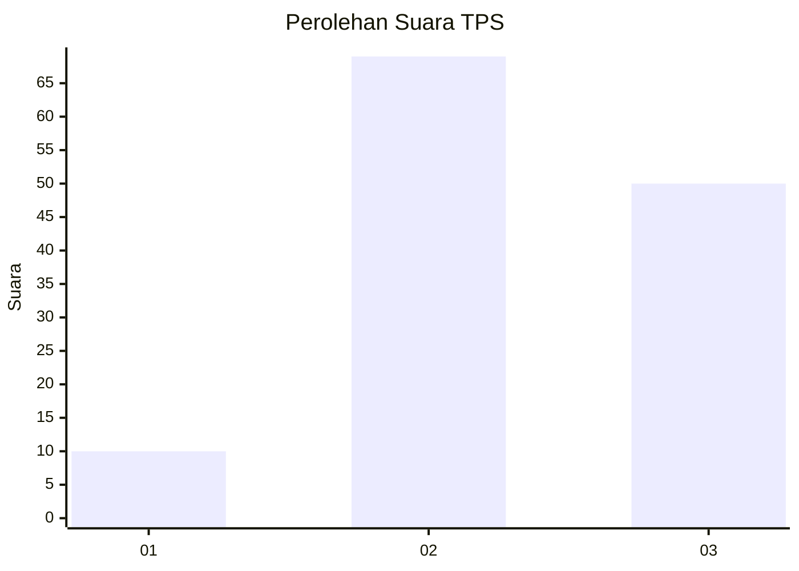
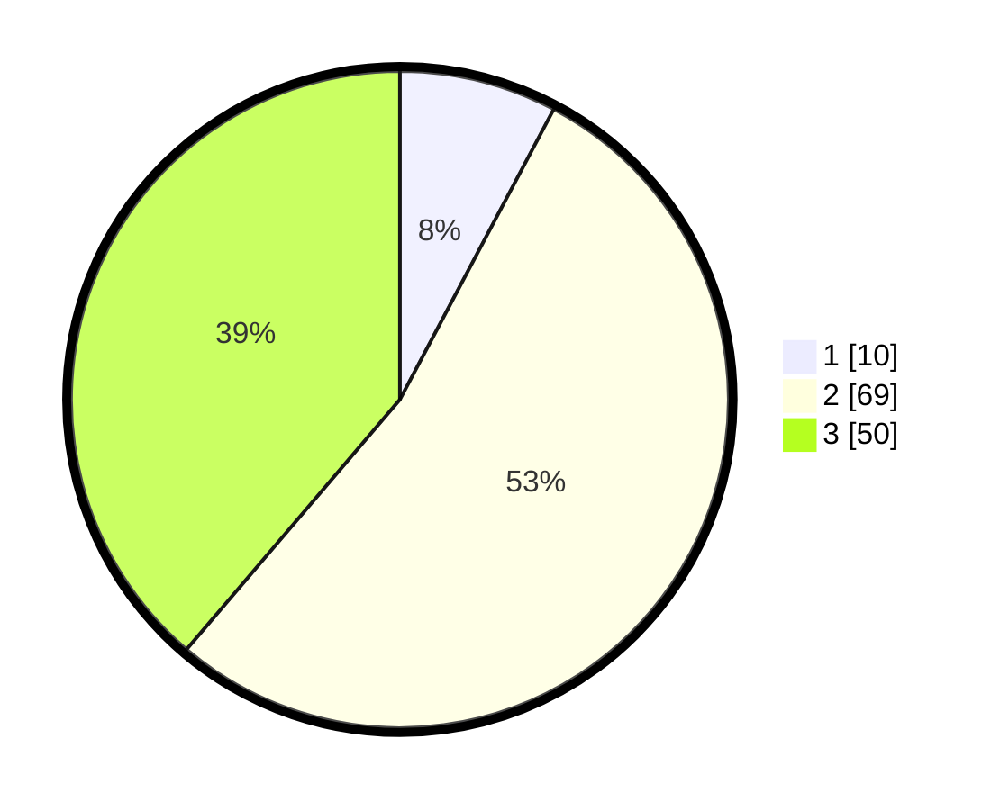

# Hasil

## Grafik

## Tabel

| No. | Nama Paslon    | Suara | Suara (raw) | Persentase |
|:--- |:-------------- | -----:| -----------:| ----------:|
| 1   | ANIES MUHAIMIN | 10    | [10][p-1]   | 7,75       |
| 2   | PRABOWO GIBRAN | 69    | [69][p-2]   | 53,49      |
| 3   | GANJAR MAHFUD  | 50    | [50][p-3]   | 38,76      |

[p-1]: https://github.com/gigit-pemilu/pemilu-2024-33-jawa-tengah/blob/main/pilpres/hitung-suara/sub/33-jawa-tengah/sub/07-wonosobo/sub/04-kaliwiro/sub/2009-lamuk/sub/015-tps/sub/paslon-1.txt
[p-2]: https://github.com/gigit-pemilu/pemilu-2024-33-jawa-tengah/blob/main/pilpres/hitung-suara/sub/33-jawa-tengah/sub/07-wonosobo/sub/04-kaliwiro/sub/2009-lamuk/sub/015-tps/sub/paslon-2.txt
[p-3]: https://github.com/gigit-pemilu/pemilu-2024-33-jawa-tengah/blob/main/pilpres/hitung-suara/sub/33-jawa-tengah/sub/07-wonosobo/sub/04-kaliwiro/sub/2009-lamuk/sub/015-tps/sub/paslon-3.txt

## Foto C Plano

https://sirekap-obj-formc.kpu.go.id/98fe/pemilu/ppwp/33/07/04/20/09/3307042009015-20240214-235731--1571ee29-5566-45be-b617-aa40de353b17.jpg

https://sirekap-obj-formc.kpu.go.id/98fe/pemilu/ppwp/33/07/04/20/09/3307042009015-20240214-193529--ecaa913d-58f9-427e-bc75-902fc98ccdcf.jpg

https://sirekap-obj-formc.kpu.go.id/98fe/pemilu/ppwp/33/07/04/20/09/3307042009015-20240214-193546--bfdfa0ae-ae51-4aa6-8540-4a38f60e0cbe.jpg

## Metadata

| Key        | Value               |
| ---------- | ------------------- |
| Time Stamp | 2024-02-15 03:06:03 |

