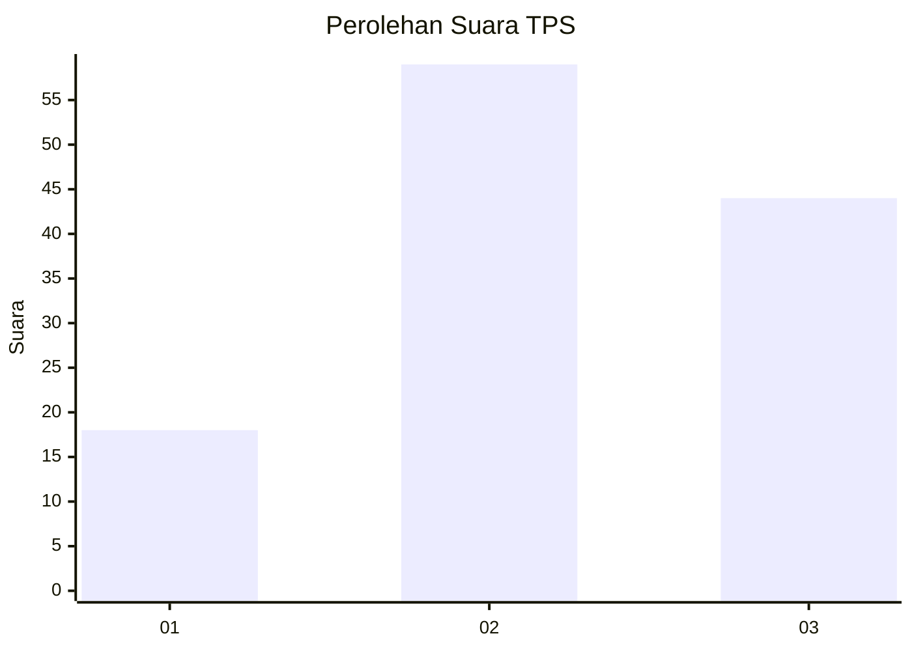
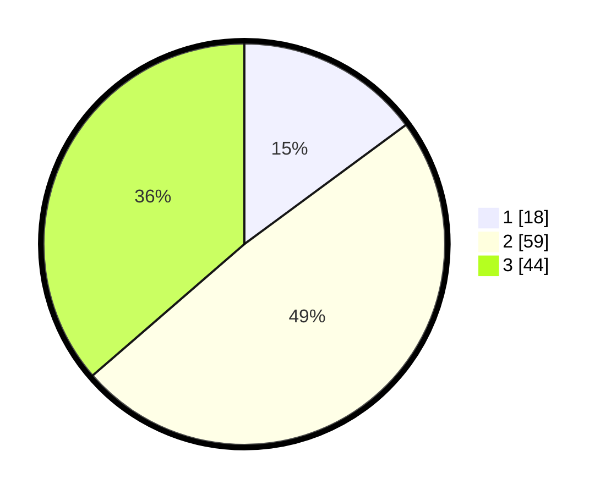

# Hasil

## Grafik

## Tabel

| No. | Nama Paslon    | Suara | Suara (raw) | Persentase |
|:--- |:-------------- | -----:| -----------:| ----------:|
| 1   | ANIES MUHAIMIN | 18    | [18][p-1]   | 14,88      |
| 2   | PRABOWO GIBRAN | 59    | [59][p-2]   | 48,76      |
| 3   | GANJAR MAHFUD  | 44    | [44][p-3]   | 36,36      |

[p-1]: https://github.com/gigit-pemilu/pemilu-2024-33-jawa-tengah/blob/main/pilpres/hitung-suara/sub/33-jawa-tengah/sub/07-wonosobo/sub/04-kaliwiro/sub/2010-pucungkerep/sub/005-tps/sub/paslon-1.txt
[p-2]: https://github.com/gigit-pemilu/pemilu-2024-33-jawa-tengah/blob/main/pilpres/hitung-suara/sub/33-jawa-tengah/sub/07-wonosobo/sub/04-kaliwiro/sub/2010-pucungkerep/sub/005-tps/sub/paslon-2.txt
[p-3]: https://github.com/gigit-pemilu/pemilu-2024-33-jawa-tengah/blob/main/pilpres/hitung-suara/sub/33-jawa-tengah/sub/07-wonosobo/sub/04-kaliwiro/sub/2010-pucungkerep/sub/005-tps/sub/paslon-3.txt

## Foto C Plano

https://sirekap-obj-formc.kpu.go.id/25e3/pemilu/ppwp/33/07/04/20/10/3307042010005-20240214-211000--d99be321-62bc-4241-aa0d-74ee159bfc2c.jpg

https://sirekap-obj-formc.kpu.go.id/25e3/pemilu/ppwp/33/07/04/20/10/3307042010005-20240214-212414--e117b35d-1309-4ab3-a7ea-775b4f1a828c.jpg

https://sirekap-obj-formc.kpu.go.id/25e3/pemilu/ppwp/33/07/04/20/10/3307042010005-20240215-001856--6a51fce2-8038-4306-a8cd-093f1bb1947f.jpg

## Metadata

| Key        | Value               |
| ---------- | ------------------- |
| Time Stamp | 2024-02-15 17:00:25 |

