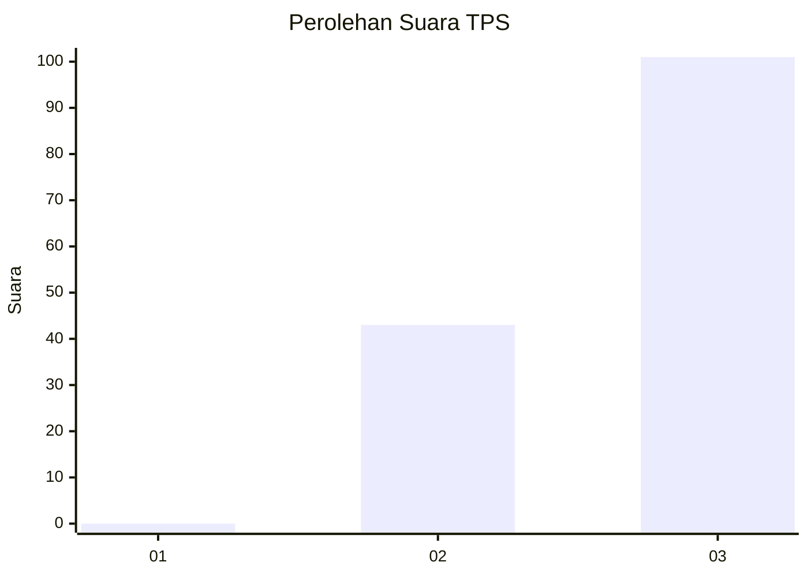
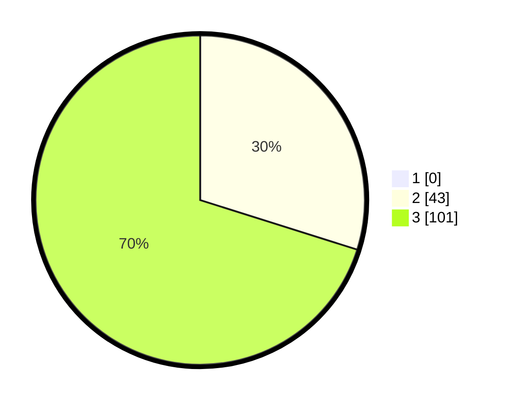

# Hasil

## Grafik

## Tabel

| No. | Nama Paslon    | Suara | Suara (raw) | Persentase |
|:--- |:-------------- | -----:| -----------:| ----------:|
| 1   | ANIES MUHAIMIN | 0     | [0][p-1]    | 0,00       |
| 2   | PRABOWO GIBRAN | 43    | [43][p-2]   | 29,86      |
| 3   | GANJAR MAHFUD  | 101   | [101][p-3]  | 70,14      |

[p-1]: https://github.com/gigit-pemilu/pemilu-2024-33-jawa-tengah/blob/main/pilpres/hitung-suara/sub/33-jawa-tengah/sub/07-wonosobo/sub/04-kaliwiro/sub/2013-grugu/sub/001-tps/sub/paslon-1.txt
[p-2]: https://github.com/gigit-pemilu/pemilu-2024-33-jawa-tengah/blob/main/pilpres/hitung-suara/sub/33-jawa-tengah/sub/07-wonosobo/sub/04-kaliwiro/sub/2013-grugu/sub/001-tps/sub/paslon-2.txt
[p-3]: https://github.com/gigit-pemilu/pemilu-2024-33-jawa-tengah/blob/main/pilpres/hitung-suara/sub/33-jawa-tengah/sub/07-wonosobo/sub/04-kaliwiro/sub/2013-grugu/sub/001-tps/sub/paslon-3.txt

## Foto C Plano

https://sirekap-obj-formc.kpu.go.id/b1f7/pemilu/ppwp/33/07/04/20/13/3307042013001-20240215-002558--f5a32114-c973-42e8-8ad3-b44028a726bb.jpg

https://sirekap-obj-formc.kpu.go.id/b1f7/pemilu/ppwp/33/07/04/20/13/3307042013001-20240215-002853--f9df910d-1c7e-4463-8cc6-addbc0cd253d.jpg

https://sirekap-obj-formc.kpu.go.id/b1f7/pemilu/ppwp/33/07/04/20/13/3307042013001-20240215-010753--a67aba36-983f-453b-8ddd-a3e86a1d5fe0.jpg

## Metadata

| Key        | Value               |
| ---------- | ------------------- |
| Time Stamp | 2024-02-24 22:31:28 |

