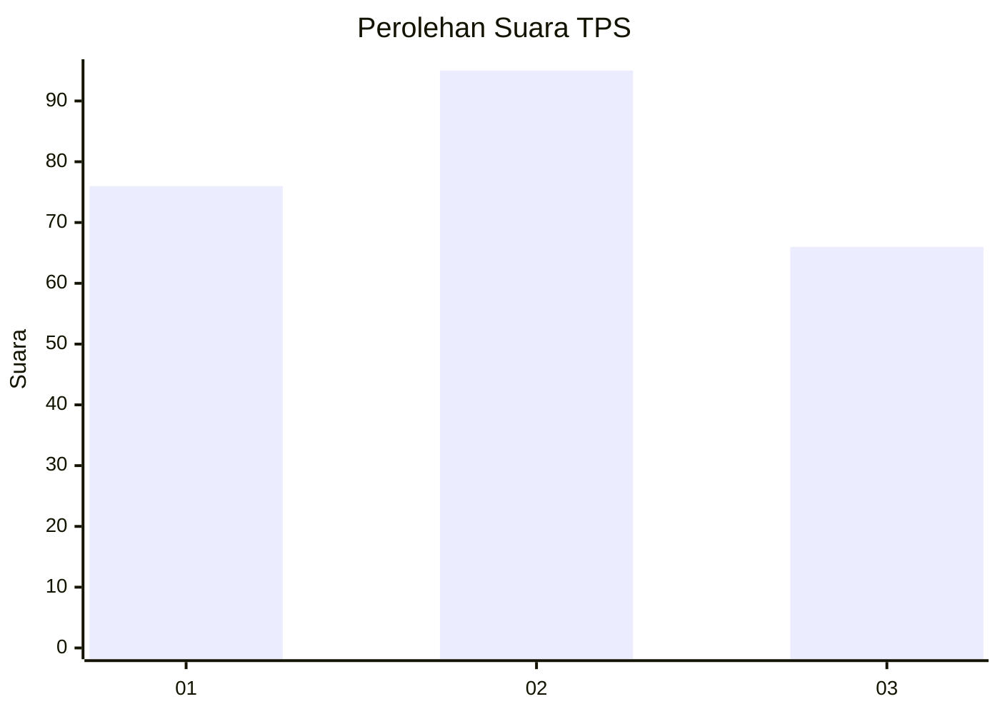
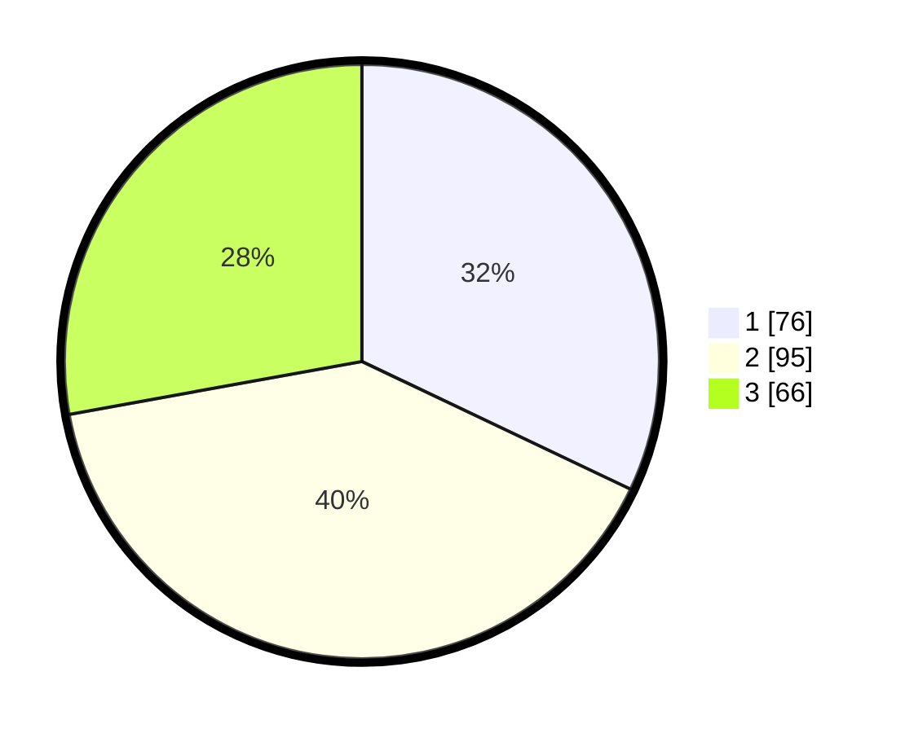

# Hasil

## Grafik

## Tabel

| No. | Nama Paslon    | Suara | Suara (raw) | Persentase |
|:--- |:-------------- | -----:| -----------:| ----------:|
| 1   | ANIES MUHAIMIN | 76    | [76][p-1]   | 32,07      |
| 2   | PRABOWO GIBRAN | 95    | [95][p-2]   | 40,08      |
| 3   | GANJAR MAHFUD  | 66    | [66][p-3]   | 27,85      |

[p-1]: https://github.com/gigit-pemilu/pemilu-2024-33-jawa-tengah/blob/main/pilpres/hitung-suara/sub/33-jawa-tengah/sub/07-wonosobo/sub/04-kaliwiro/sub/2016-kauman/sub/005-tps/sub/paslon-1.txt
[p-2]: https://github.com/gigit-pemilu/pemilu-2024-33-jawa-tengah/blob/main/pilpres/hitung-suara/sub/33-jawa-tengah/sub/07-wonosobo/sub/04-kaliwiro/sub/2016-kauman/sub/005-tps/sub/paslon-2.txt
[p-3]: https://github.com/gigit-pemilu/pemilu-2024-33-jawa-tengah/blob/main/pilpres/hitung-suara/sub/33-jawa-tengah/sub/07-wonosobo/sub/04-kaliwiro/sub/2016-kauman/sub/005-tps/sub/paslon-3.txt

## Foto C Plano

https://sirekap-obj-formc.kpu.go.id/1f8c/pemilu/ppwp/33/07/04/20/16/3307042016005-20240214-214337--e6729c4d-1060-4a82-9d2f-747d7634fc06.jpg

https://sirekap-obj-formc.kpu.go.id/1f8c/pemilu/ppwp/33/07/04/20/16/3307042016005-20240214-214541--e3baa670-ecb0-4880-b08c-2e1f67624f1a.jpg

https://sirekap-obj-formc.kpu.go.id/1f8c/pemilu/ppwp/33/07/04/20/16/3307042016005-20240214-214717--c49ec7d8-6bb0-4b01-accf-12c0bfc2982a.jpg

## Metadata

| Key        | Value               |
| ---------- | ------------------- |
| Time Stamp | 2024-02-15 12:00:28 |

