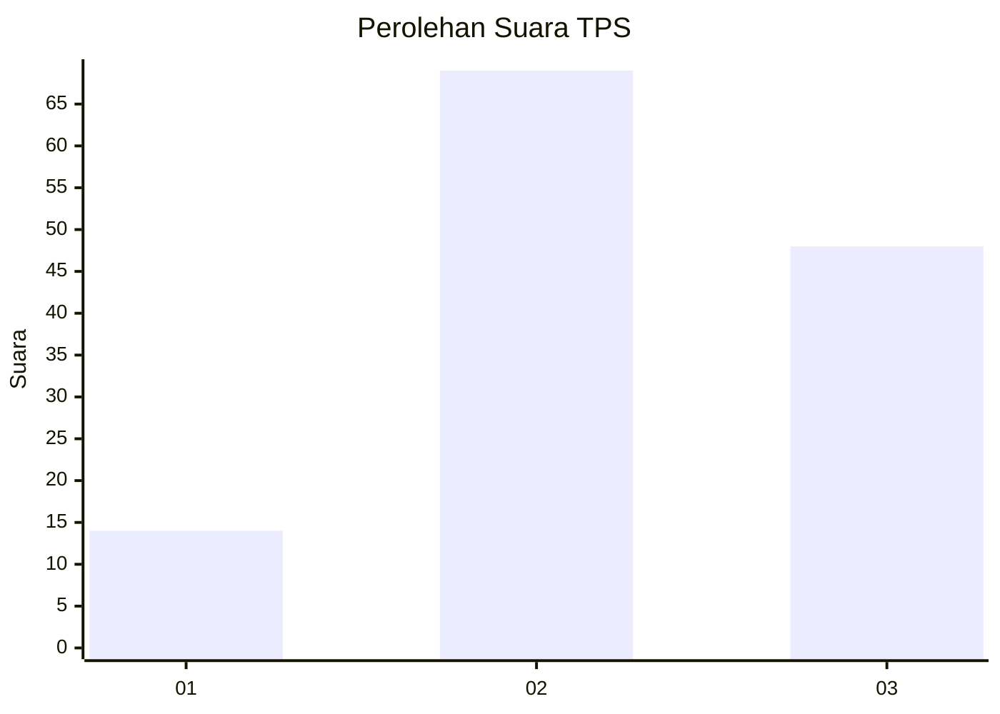
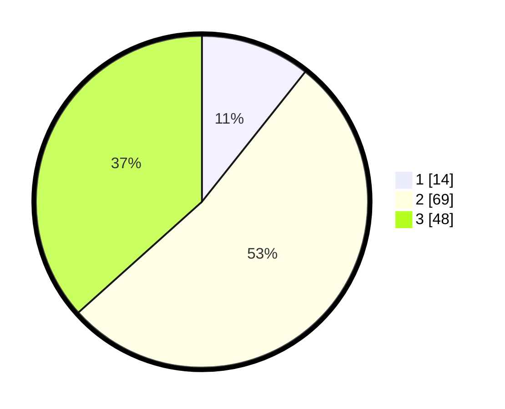

# Hasil

## Grafik

## Tabel

| No. | Nama Paslon    | Suara | Suara (raw) | Persentase |
|:--- |:-------------- | -----:| -----------:| ----------:|
| 1   | ANIES MUHAIMIN | 14    | [14][p-1]   | 10,69      |
| 2   | PRABOWO GIBRAN | 69    | [69][p-2]   | 52,67      |
| 3   | GANJAR MAHFUD  | 48    | [48][p-3]   | 36,64      |

[p-1]: https://github.com/gigit-pemilu/pemilu-2024-33-jawa-tengah/blob/main/pilpres/hitung-suara/sub/33-jawa-tengah/sub/07-wonosobo/sub/04-kaliwiro/sub/2016-kauman/sub/008-tps/sub/paslon-1.txt
[p-2]: https://github.com/gigit-pemilu/pemilu-2024-33-jawa-tengah/blob/main/pilpres/hitung-suara/sub/33-jawa-tengah/sub/07-wonosobo/sub/04-kaliwiro/sub/2016-kauman/sub/008-tps/sub/paslon-2.txt
[p-3]: https://github.com/gigit-pemilu/pemilu-2024-33-jawa-tengah/blob/main/pilpres/hitung-suara/sub/33-jawa-tengah/sub/07-wonosobo/sub/04-kaliwiro/sub/2016-kauman/sub/008-tps/sub/paslon-3.txt

## Foto C Plano

https://sirekap-obj-formc.kpu.go.id/7a25/pemilu/ppwp/33/07/04/20/16/3307042016008-20240214-214436--23b11fee-9dd5-4b9f-954c-5c220eaef77e.jpg

https://sirekap-obj-formc.kpu.go.id/7a25/pemilu/ppwp/33/07/04/20/16/3307042016008-20240214-214622--10b2a33f-d5aa-4f9f-9adc-68aba5e795bc.jpg

https://sirekap-obj-formc.kpu.go.id/7a25/pemilu/ppwp/33/07/04/20/16/3307042016008-20240214-214753--760178fb-7491-4bcc-bd5a-ffa5fecbbd9a.jpg

## Metadata

| Key        | Value               |
| ---------- | ------------------- |
| Time Stamp | 2024-02-15 12:00:28 |

