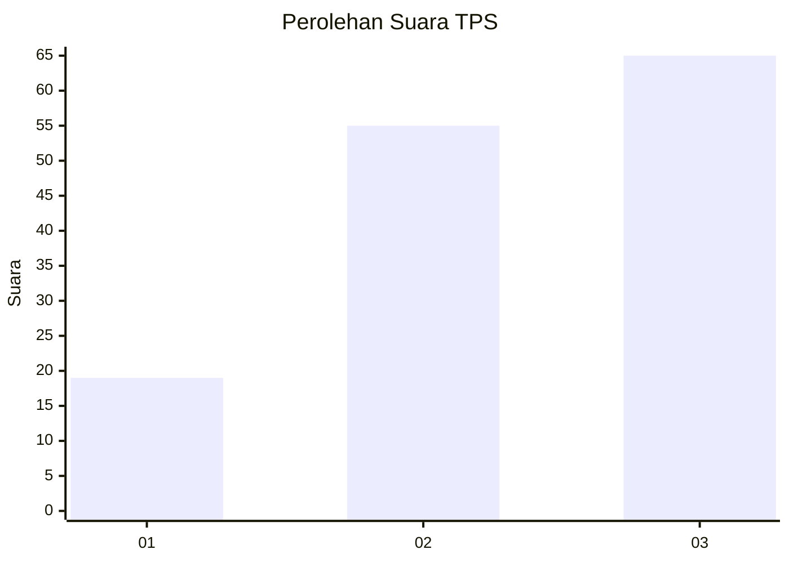
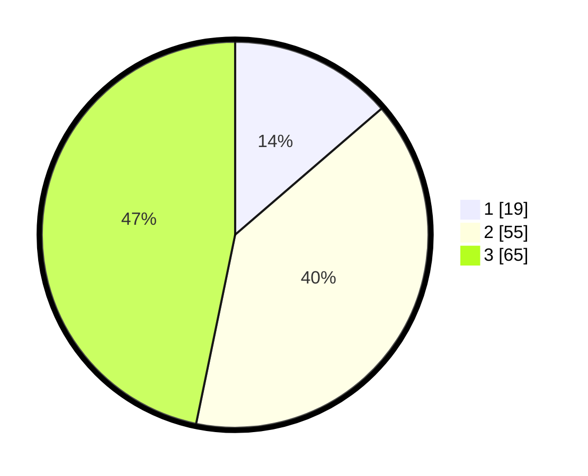

# Hasil

## Grafik

## Tabel

| No. | Nama Paslon    | Suara | Suara (raw) | Persentase |
|:--- |:-------------- | -----:| -----------:| ----------:|
| 1   | ANIES MUHAIMIN | 19    | [19][p-1]   | 13,67      |
| 2   | PRABOWO GIBRAN | 55    | [55][p-2]   | 39,57      |
| 3   | GANJAR MAHFUD  | 65    | [65][p-3]   | 46,76      |

[p-1]: https://github.com/gigit-pemilu/pemilu-2024-33-jawa-tengah/blob/main/pilpres/hitung-suara/sub/33-jawa-tengah/sub/07-wonosobo/sub/04-kaliwiro/sub/2016-kauman/sub/009-tps/sub/paslon-1.txt
[p-2]: https://github.com/gigit-pemilu/pemilu-2024-33-jawa-tengah/blob/main/pilpres/hitung-suara/sub/33-jawa-tengah/sub/07-wonosobo/sub/04-kaliwiro/sub/2016-kauman/sub/009-tps/sub/paslon-2.txt
[p-3]: https://github.com/gigit-pemilu/pemilu-2024-33-jawa-tengah/blob/main/pilpres/hitung-suara/sub/33-jawa-tengah/sub/07-wonosobo/sub/04-kaliwiro/sub/2016-kauman/sub/009-tps/sub/paslon-3.txt

## Foto C Plano

https://sirekap-obj-formc.kpu.go.id/a9e6/pemilu/ppwp/33/07/04/20/16/3307042016009-20240215-035910--c4514eee-e0c8-4d1c-a502-321bc15d39d2.jpg

https://sirekap-obj-formc.kpu.go.id/a9e6/pemilu/ppwp/33/07/04/20/16/3307042016009-20240215-040002--180971f8-e5bf-4723-ac12-236086db9286.jpg

https://sirekap-obj-formc.kpu.go.id/a9e6/pemilu/ppwp/33/07/04/20/16/3307042016009-20240215-040037--25934731-d3de-4b80-a857-87df769c901f.jpg

## Metadata

| Key        | Value               |
| ---------- | ------------------- |
| Time Stamp | 2024-02-24 22:31:28 |

